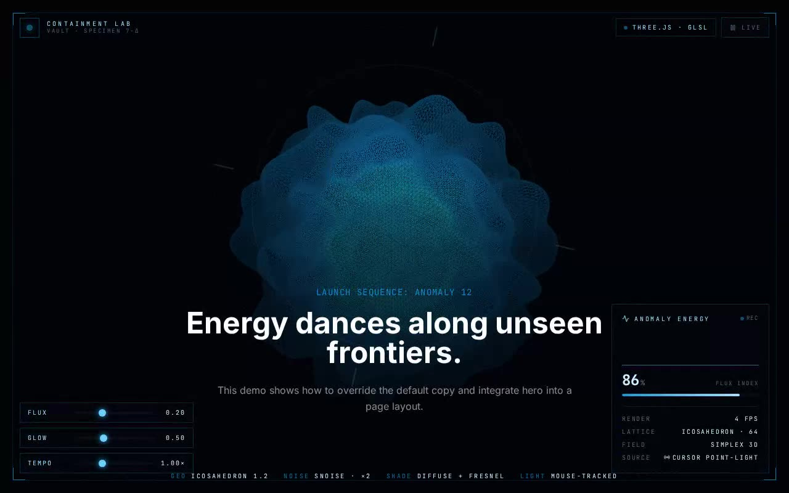

# Anomalous Matter Hero — Three.js Icosahedron Wireframe Hero Section (React + TypeScript + Three.js + Tailwind CSS)

[](./demo.mp4)

A full-viewport containment-lab observation hero built around a noise-displaced Three.js icosahedron wireframe with a fresnel rim glow and a cursor-tracked point light. The GLSL vertex shader applies Simplex noise displacement to the geometry over time, while the fragment shader computes a diffuse + fresnel composite. A control rail lets users adjust `Flux`, `Glow`, and `Tempo` faders wired directly into shader uniforms, and a live telemetry HUD reports center-pixel luminance sampled off the GPU as a rolling "anomaly energy" sparkline alongside smoothed FPS. Generated with Claude Fable 5.

The component from the prompt is integrated at
`src/components/ui/anomalous-matter-hero.tsx`, the canonical shadcn
`@/components/ui` location, and exports both `GenerativeArtScene` (the raw WebGL
field) and `AnomalousMatterHero` (the titled hero section). The demo overrides
the default copy exactly as the brief's `demo.tsx` does, then wraps the fixed
specimen in a quiet instrument:

- **Containment frame** — corner brackets, a masked surveyor's grid, a slow
  reticle scope and a film-grain pass so the wireframe never floats on flat
  black.
- **Control rail (signature element)** — `Flux`, `Glow` and `Tempo` faders wired
  *straight into the shader uniforms* (`uDisplacement`, `uGlow`, and a
  speed-scaled clock), plus a freeze toggle that parks the simulation.
- **Live telemetry HUD** — the scene reports center-pixel luminance off the GPU
  through an `onSample` probe; the panel reads it back as a rolling "anomaly
  energy" sparkline alongside a smoothed render-FPS counter and the fixed shader
  recipe (lattice, noise field, light source).

## Fixes applied to the prompt's component

The brief's snippet had two issues that would render the mesh **black**; both are
reconciled while keeping the shader, geometry and animation faithful:

1. **Uniform name mismatch** — the JS set `pointLightPos` but the fragment shader
   read `pointLightPosition`. They now agree on `pointLightPos`, so the
   mouse-tracked diffuse term actually lights the surface.
2. **Unparseable color** — `new THREE.Color("hsl(var(--sky-300))")` is not a
   string THREE can parse. The real `--sky-300` token (`203 92% 53%`) is now
   resolved off `:root` at runtime via `setHSL`, with a literal-swatch fallback.

The prompt's `fadeIn` keyframes are wired to the `animate-fade-in-long` class the
hero markup references (see `tailwind.config.js`).

## Stack

React 18, TypeScript, Vite 6, Tailwind CSS 3 (`tailwind.config.js` + PostCSS),
Three.js, `lucide-react`. shadcn-style `@/*` path alias → `./src`.

## Assets

Fully self-contained / offline-ready. The Inter, Space Grotesk and JetBrains
Mono web fonts (latin subset) are vendored locally to `src/fonts/` and referenced
via `src/fonts/fonts.css` — no remote font requests at runtime. The visual is
generated entirely on the GPU, so there are **no image assets** (no Unsplash
imagery is required).

## Run

```bash
npm install
npm run dev       # Vite dev server
npm run build     # type-check (tsc -b) + production build
npm run preview   # serve the production build
```

`verify.mjs` is a standalone headless check (canvas renders non-black,
cyan-leaning pixels; copy present; `fadeIn` keyframes resolve; no shader/WebGL
console errors). It needs Playwright + a running dev server, e.g.:

```bash
# with the dev server up on :5247 and Playwright available
URL=http://localhost:5247/ node verify.mjs
```

## Integration notes (per the prompt)

- **Project structure** — this is a Vite + React + TypeScript app with Tailwind
  CSS and the shadcn `@/components/ui` convention already wired up (the `@` alias
  is configured in both `vite.config.ts` and `tsconfig`). To drop the component
  into your own app instead, scaffold with the shadcn CLI
  (`npx shadcn@latest init`), which sets up Tailwind, TypeScript and the
  `components.json` alias map for you.
- **Why `/components/ui`** — shadcn treats `components/ui` as the home for
  primitive, copy-in UI building blocks resolved through the `@/components/ui`
  alias. Keeping the hero there means the brief's import
  (`@/components/ui/anomalous-matter-hero`) resolves unchanged and the component
  sits alongside the rest of your design-system primitives.
- **Tailwind version** — this project uses Tailwind **3** (`tailwind.config.js`
  with the `fadeIn` keyframes + the `--background/--foreground/--sky-300/--gray-300`
  tokens on `:root`). The prompt's tokens are stored space-separated (shadcn
  convention) so both `hsl(var(--x))` and the `hsl(var(--x)/opacity)` slash
  modifier resolve. On a Tailwind 4 project you'd put the same tokens and
  keyframes in your `index.css` instead.
- **Dependencies** — only `three` is required by the component itself;
  `lucide-react` is used by the surrounding demo instruments for icons.
- **Props / state** — the brief's component took only `title/subtitle/description`.
  Those are preserved; the scene gains additive, defaulted `displacement`, `glow`,
  `speed`, `paused` and `onSample` props so the demo's faders/telemetry can drive
  it without changing the default look.
- **Images** — none. The procedural shader is the entire visual.

---

Part of the [Shaders](../) collection in the [claude-directory](../../) — an open-source gallery of AI-generated UI built with Claude Fable 5. [Browse the live gallery](https://pulkitxm.com/claude-directory).
