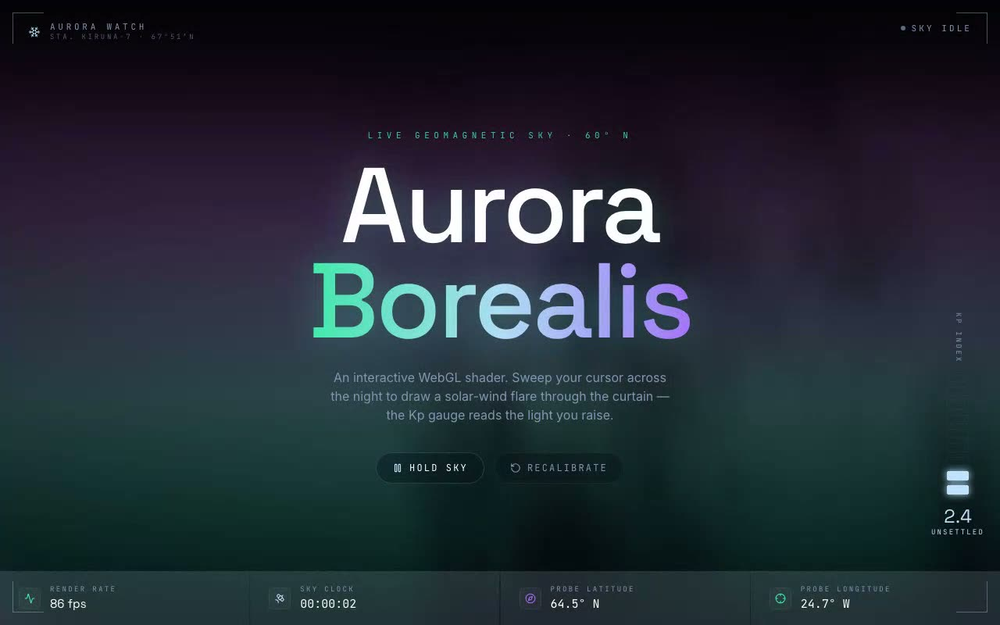

# Aurora Borealis Shader — Interactive Three.js FBM Aurora Background (React + TypeScript + Three.js + Tailwind CSS)

[](./demo.mp4)

An interactive Three.js WebGL aurora-borealis shader background featuring an FBM-noise curtain mixed green to violet up the viewport, brightened by a soft flare that tracks the cursor. Framed inside a high-latitude Aurora Watch field console with a probe reticle reporting geomagnetic latitude/longitude, and a Kp-index gauge (the real 0–9 geomagnetic-activity scale) whose lit segments are driven by aurora brightness sampled off the GPU each frame. A Hold Sky control freezes the animation clock. Built with React 18, TypeScript, Vite, Three.js, Tailwind CSS, and `lucide-react`. Generated with Claude Fable 5.

The shader component is the verbatim drop-in from the integration brief
(`src/components/ui/aurora-borealis-shader.tsx`), placed in the shadcn
`components/ui` folder and imported through the `@/` alias exactly as the brief
expects. The surrounding HUD makes the shader's two hidden behaviours legible:

- a **probe reticle** tracks the cursor flare, read out as geomagnetic
  latitude / longitude;
- a **Kp-index gauge** (the real 0–9 geomagnetic-activity scale) is the page's
  signature — its lit segments are driven by the aurora's _measured_ brightness,
  sampled straight off the GPU each frame, not a faked value.

## Integration story (the brief, answered)

The brief asks to integrate a React component into a shadcn / Tailwind /
TypeScript project. This repo is that project:

- **shadcn structure** — components live in `src/components/ui`, the `@/` alias
  resolves to `src/` (see `vite.config.ts` + `tsconfig`), and a `src/lib/utils.ts`
  `cn()` helper mirrors shadcn's. The `/components/ui` folder matters because the
  component imports itself as `@/components/ui/aurora-borealis-shader`; keeping
  that exact path is what makes the drop-in import resolve unchanged.
- **Tailwind CSS** — configured in `tailwind.config.js` + `postcss.config.js`,
  with a small cold-polar token palette.
- **TypeScript** — strict mode; the brief's JS component is ported to typed TSX
  with a proper ref type, typed uniforms, and a typed telemetry callback.

If you were starting from scratch:

```bash
npm create vite@latest my-app -- --template react-ts
cd my-app
npm install -D tailwindcss postcss autoprefixer && npx tailwindcss init -p
npx shadcn@latest init          # sets up components/ui + the @/ alias
npm install three lucide-react
npm install -D @types/three
```

### Questions the brief asks, answered

- **Props/data** — none required; `<AuroraBorealisShader />` runs exactly like
  the brief. Optional `paused`, `onFrame`, `cursorLight`, and `containerStyle`
  let the console freeze the clock and read live telemetry.
- **State** — local only (cursor position + a WebGL-unavailable fallback flag);
  no external store or context provider needed.
- **Assets** — no images. Fonts (Space Grotesk / Inter / JetBrains Mono) are
  vendored in `public/fonts`; HUD icons come from `lucide-react`.
- **Responsive** — full-viewport on every breakpoint; the gauge rail is desktop
  (`lg`) only, the telemetry strip collapses 4→2 columns on small screens.
- **Where to use it** — as a fixed full-screen ambient background behind a hero
  or splash; that is precisely what this page does.

## Stack

- React 18 + TypeScript + Vite
- Tailwind CSS (shadcn-style structure, `@/` → `src/`)
- Three.js (WebGL aurora shader background)
- lucide-react (HUD icons)
- Space Grotesk / Inter / JetBrains Mono — vendored locally in `public/fonts`

## Run

```bash
npm install
npm run dev        # http://localhost:5173
npm run build      # type-check + production build
npm run verify     # headless Chromium checks (canvas, flare, Kp, hold)
```

## Controls

- **Move the cursor** — draws a solar-wind flare through the curtain; brighter
  light pushes the Kp gauge higher.
- **Hold sky** — freezes the animation clock; the curtain holds in place.
- **Recalibrate** — resets the shader clock to zero.

Everything is self-contained and runs offline — no remote assets.

---

Part of the [Shaders](../) collection in the [claude-directory](../../) — an open-source gallery of AI-generated UI built with Claude Fable 5. [Browse the live gallery](https://pulkitxm.com/claude-directory).
