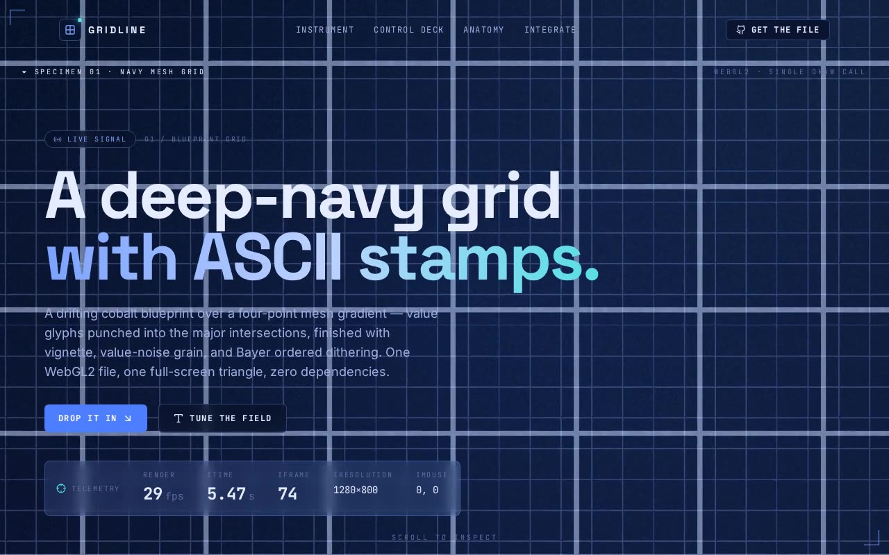

# Blueprint ASCII Grid Shader — Full-Screen WebGL2 Blueprint Background with ASCII Glyphs (React + Vite + Tailwind + shadcn/ui)

[](./demo.mp4)

A full-screen WebGL2 GLSL ES 3.00 fragment shader that renders a drifting deep-navy blueprint grid with ASCII glyphs stamped at major intersections — integrated as a drop-in shadcn/ui component (`asd.tsx`) with a live control deck, telemetry HUD, and anatomy walkthrough. The single-draw-call shader combines a four-point mesh gradient, Bayer 4×4 ordered dithering, value-noise grain, and tanh tone-mapping to produce a technical, cyberpunk-blueprint aesthetic ideal as a hero or landing-page background. Generated with Claude Fable 5.

## What's in `components/ui`

| File | Role |
|------|------|
| `asd.tsx` | The brief's component, **verbatim**. Fixed, full-screen, no props, no deps. (Two TS-only tweaks for strict mode: the unused default `React` import is dropped and the WebGL2 context is non-null-asserted — runtime + shader untouched.) |
| `demo.tsx` | The brief's `demo.tsx` — the single-usecase export importing `@/components/ui/asd`. |
| `grid-shader.tsx` | Parametric build used by the live showcase: the shader's constants become uniforms (`uGridScale`, `uAsciiAmt`, …) and it streams telemetry back via `onTelemetry`. |

## Works in any shadcn · Tailwind · TypeScript project

The component is a drop-in for a shadcn-structured codebase. If yours is missing a
piece, add it:

```bash
# shadcn structure (the @/ alias + components.json + src/components/ui)
npx shadcn@latest init

# Tailwind CSS
npm i -D tailwindcss postcss autoprefixer && npx tailwindcss init -p

# TypeScript
npm i -D typescript @types/react @types/react-dom
```

### Why `components/ui`?

shadcn maps the `ui` alias to `@/components/ui` in `components.json`. Dropping the file
there means the brief's import — `import Component from "@/components/ui/asd"` — resolves
with **no path edits**, the CLI can add or update siblings later without clobbering your
own components, and every generated UI primitive lives in one predictable, reviewable
place. If that folder doesn't exist yet, create it: the alias is convention, and breaking
it means rewriting every example import by hand.

## Use it

```tsx
// 1 · paste asd.tsx into src/components/ui/
// 2 · mount it — it's a self-contained, fixed full-screen background
import Component from "@/components/ui/asd";

export default function Page() {
  return (
    <main>
      <Component />        {/* fixed inset-0 WebGL2 shader */}
      {/* ...your hero / content sits on top */}
    </main>
  );
}
```

For live control, use the parametric variant instead:

```tsx
import GridShader from "@/components/ui/grid-shader";

<GridShader
  params={{ asciiAmt: 0.4, gridScale: 24 }}  // Partial<GridParams>
  onTelemetry={(t) => setHud(t)}             // iTime / fps / resolution / mouse
  fixed={true}                               // false → fills its positioned parent
/>;
```

## Questions worth asking first

- **Props / data?** None. The brief's `asd.tsx` is self-contained. `grid-shader.tsx` adds
  optional `params` and an `onTelemetry` callback.
- **State management?** All internal — it owns its `requestAnimationFrame` loop, the
  WebGL2 context and a `ResizeObserver`, and cleans each up on unmount.
- **Required assets?** Zero. The whole image is generated in GLSL — no photos, icons,
  fonts or models ship with the component. (This showcase's chrome uses `lucide-react`
  and locally vendored fonts.)
- **Responsive behaviour?** It fills its positioned parent and tracks size via
  `ResizeObserver`, with the device-pixel ratio clamped to 1–2 for crispness without
  melting the GPU.
- **Where should it live?** As a fixed, negative-`z-index` background behind a hero or
  landing page; render the parametric variant with `fixed={false}` for a contained card.

## Run it

```bash
npm install
npm run dev      # http://localhost:5173
npm run build    # type-check (tsc) + production build
npm run verify   # headless Playwright: WebGL2 up, shader compiles, loop advances, navy field
```

> `npm run verify` boots the dev server and renders in a software-WebGL (SwiftShader)
> headless Chromium. In sandboxes where Playwright's browser CDN is blocked, point it at a
> pre-provisioned Chromium: `PW_CHROMIUM_PATH=/path/to/chrome npm run verify`.

## Stack

React 18, TypeScript, Vite, Tailwind CSS, shadcn/ui structure (`@/components/ui`,
`@/lib/utils`, `components.json`), Lucide icons, raw WebGL2. Fonts (Space Grotesk /
JetBrains Mono / Inter) are vendored locally under `public/fonts` — the project runs fully
offline. The shader needs no image assets.

---

Part of the [Shaders](../) collection in the [claude-directory](../../) — an open-source gallery of AI-generated UI built with Claude Fable 5. [Browse the live gallery](https://pulkitxm.com/claude-directory).
