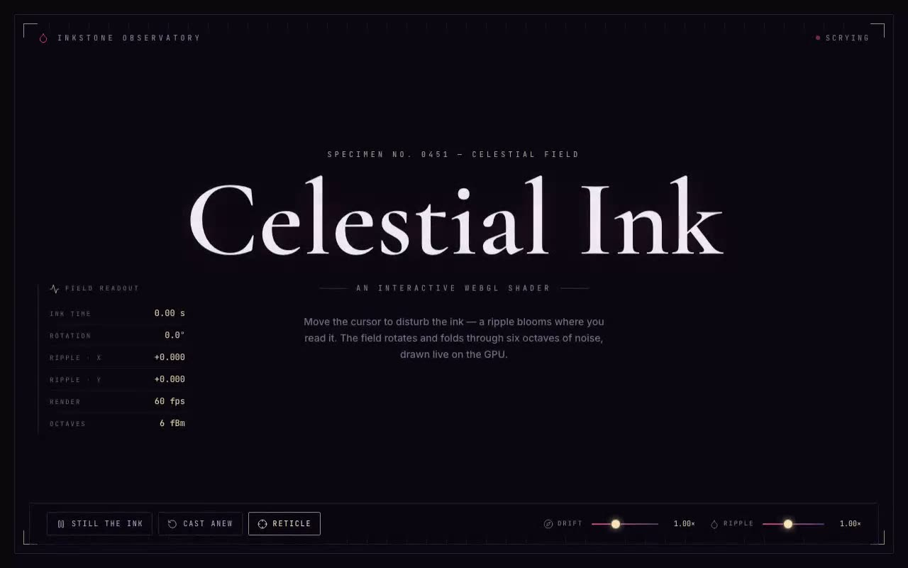

# Celestial Ink Shader — Interactive fBm Ink Field GLSL Background (React + Three.js + Tailwind)

[](./demo.mp4)

An interactive Three.js / WebGL fragment shader rendering a rotating six-octave fBm ink field in deep plum, magenta, and warm gold that ripples around the cursor — framed as an inkstone scrying instrument with live telemetry, cursor-tracking astrolabe reticle, and real-time shader controls. The GLSL is preserved verbatim as a shadcn `@/components/ui` drop-in, with additive props for freeze, ink speed, and ripple gain, making it an atmospheric cursor-reactive hero background or interactive shader showcase. Generated with Claude Fable 5.

The shader component is the brief's drop-in, ported to TypeScript and dropped
into the shadcn `components/ui` folder
(`src/components/ui/celestial-ink-shader.tsx`), imported through the `@/` alias
exactly as the brief expects. The GLSL (vertex, fragment, uniforms, render loop,
cleanup) is preserved verbatim; only a thin control/telemetry seam is added on
top so the surrounding instrument can drive and **read** the shader.

## The integration, per the brief

- **shadcn structure** — `@/` resolves to `src/`; the component lives in
  `src/components/ui/`, with `src/lib/utils.ts` for the `cn` helper. The brief's
  `demo.tsx` is preserved in `src/components/demo.tsx` as the minimal drop-in
  reference; the richer framing is in `src/App.tsx`.
- **Why `/components/ui`** — shadcn resolves every generated/added primitive to
  `components/ui` via the `@/components/ui` alias. Keeping the shader there means
  `import CelestialInkShader from "@/components/ui/celestial-ink-shader"` works
  unchanged across the app, and any future `npx shadcn add` primitives sit
  beside it without import churn.
- **Dependency** — `three`, as specified. `lucide-react` supplies the HUD icons.
- **Image assets** — the brief mentions filling image assets with Unsplash
  stock, but this component is a pure GLSL shader and needs **no images**; there
  are none to vendor. Fonts (Cormorant Garamond / Inter / JetBrains Mono) are
  the only external media and are vendored locally in `public/fonts`, so the
  project runs fully offline.

## What was added on top of the verbatim shader

The brief's shader hides its state inside the GPU pass. The instrument makes it
legible:

- `freeze`, `inkSpeed`, `rippleGain` props promote the shader's baked-in
  constants (clock advance, time scale, ripple strength) to live controls.
- `onFrame` streams the pass's own per-frame state back out — ink time, rotation
  angle, normalised ripple centre, and smoothed fps — which drives the telemetry
  column.
- A cursor-following **astrolabe reticle** (the signature element) sights the
  ripple over the ink.

## Stack

- React 18 + TypeScript + Vite
- Tailwind CSS (shadcn-style structure, `@/` → `src/`)
- Three.js (WebGL shader background)
- lucide-react (HUD icons)
- Cormorant Garamond / Inter / JetBrains Mono — vendored locally in
  `public/fonts`

## Run

```bash
npm install
npm run dev        # http://localhost:5173
npm run build      # type-check + production build
npm run verify     # headless Chromium checks (canvas, ripple, freeze, fader)
```

## Controls

- **Move the cursor** — blooms a ripple in the ink where you read it.
- **Still the ink / Release** — pauses and resumes the ink clock.
- **Cast anew** — resets freeze and both faders to their defaults.
- **Reticle** — toggles the cursor-following astrolabe sight.
- **Drift** — scales the ink's rotation/drift speed.
- **Ripple** — scales the pointer ripple strength.

Everything is self-contained and runs offline — no remote assets.

---

Part of the [Shaders](../) collection in the [claude-directory](../../) — an open-source gallery of AI-generated UI built with Claude Fable 5. [Browse the live gallery](https://pulkitxm.com/claude-directory).
