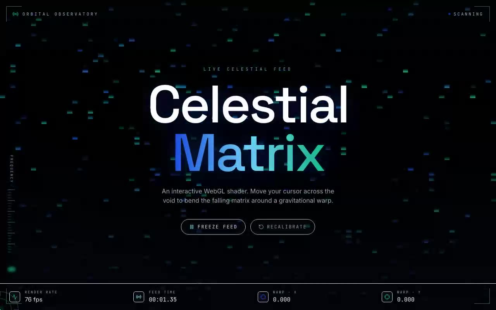

# Celestial Matrix Shader — Interactive Digital Rain WebGL Background with Cursor Warp (React + Three.js + Tailwind)

[](./demo.mp4)

An interactive Three.js / WebGL fragment shader rendering a blue-to-green digital rain field that bends around the cursor through a gravitational warp — framed inside a deep-space signal console with live telemetry and cursor-tracking reticle. The verbatim shadcn `@/components/ui` drop-in makes the shader's hidden cursor interaction legible through a HUD reporting render rate, feed time, and warp coordinates live from the GPU loop — suited to hero sections, dashboards, or interactive landing pages. Generated with Claude Fable 5.

The shader component is the verbatim drop-in from the integration brief
(`src/components/ui/martrix-shader.tsx`), placed in the shadcn `components/ui`
folder and imported through the `@/` alias exactly as the brief expects. The
surrounding HUD makes the shader's hidden interaction legible: a cursor reticle
tracks the warp center, live readouts report render rate / feed time / warp
coordinates, and a frequency rail pulses with the frame rate.

## Stack

- React 18 + TypeScript + Vite
- Tailwind CSS (shadcn-style structure, `@/` → `src/`)
- Three.js (WebGL shader background)
- lucide-react (HUD icons)
- Space Grotesk / Inter / JetBrains Mono — vendored locally in `public/fonts`

## Run

```bash
npm install
npm run dev        # http://localhost:5173
npm run build      # type-check + production build
npm run verify     # headless Chromium checks (canvas, warp, freeze)
```

## Controls

- **Move the cursor** — bends the falling matrix around a gravitational warp.
- **Freeze feed** — pauses the animation clock; the rain holds in place.
- **Recalibrate** — resets the shader clock to zero.

Everything is self-contained and runs offline — no remote assets.

---

Part of the [Shaders](../) collection in the [claude-directory](../../) — an open-source gallery of AI-generated UI built with Claude Fable 5. [Browse the live gallery](https://pulkitxm.com/claude-directory).
