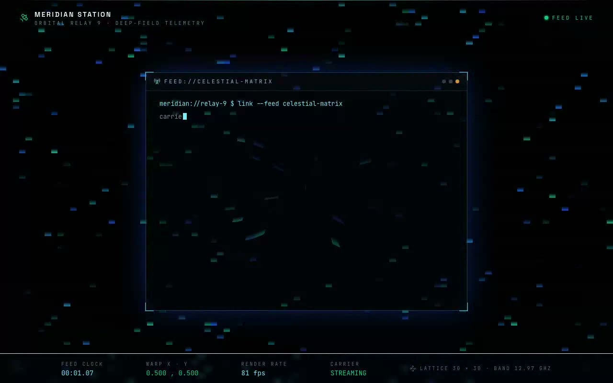

# Celestial Matrix Terminal — Digital Rain WebGL Shader with CRT Boot Sequence (React + Three.js + Tailwind)

[](./demo.mp4)

A shadcn-style integration of the Three.js Celestial Matrix digital rain shader — a blue-to-green field bent by a cursor-driven gravitational warp — reframed as a deep-space relay terminal (Meridian Station · Orbital Relay 9) with a typed CRT login sequence, live telemetry strip, and cursor reticle. The retro-CRT aesthetic, typed boot-to-ACCESS-GRANTED sequence, and real GPU-sampled telemetry make it a distinctive login page, landing moment, or interactive hero background. Generated with Claude Fable 5.

The shader runs full-viewport behind a bracketed CRT terminal that types out a
login handshake, lands on **ACCESS GRANTED**, and reveals the station identity.
A cursor reticle marks the warp lock the lattice falls toward, and the bottom
telemetry strip (feed clock, warp x·y, render rate, carrier state) is sampled
straight off the GPU render loop — not faked.

> The repo already ships a sibling, `shaders/celestial-matrix-shader`, that
> frames the same brief as a "signal console." This experiment is a distinct
> take: a retro-CRT relay **terminal** with a typed boot/login sequence.

## The brief, answered

- **What props will be passed?** The brief's component took none. Here it's
  ported to typed React and given optional props so a console can drive it:
  `frozen` (pause the feed clock), `onSample` (per-frame telemetry callback),
  plus `className` / `style` / `ariaLabel`. With no props it renders exactly the
  brief's fixed, pointer-transparent full-viewport background.
- **State management?** Local React state only — boot transcript progress, a
  freeze toggle, a remount key for "recalibrate," and the latest `MatrixSample`.
  No context or external store needed.
- **Assets?** No images. Fonts (Space Grotesk, Inter, JetBrains Mono) are
  vendored locally under [`public/fonts`](./public/fonts) so the project runs
  fully offline. Icons come from `lucide-react`, as the brief requests.
- **Responsive behavior?** Single viewport, no scroll. The terminal is a
  fluid-width centered card down to mobile; the cursor reticle and a couple of
  status chips hide on small screens where there's no pointer.
- **Best place to use it?** A login / "access" / landing moment where an
  ambient, interactive background should carry the personality.

## shadcn / Tailwind / TypeScript setup

This project is already a Vite + React + TypeScript app wired for the shadcn
convention:

- `@` resolves to `./src` (see [`vite.config.ts`](./vite.config.ts) and the
  `paths` in [`tsconfig.app.json`](./tsconfig.app.json)), so the brief's import
  `@/components/ui/martrix-shader` works exactly as written.
- Tailwind is configured in [`tailwind.config.js`](./tailwind.config.js) with the
  shader's own palette as tokens.
- The component lives at
  [`src/components/ui/martrix-shader.tsx`](./src/components/ui/martrix-shader.tsx).

**Why `components/ui`?** That's the path the shadcn CLI generates and writes to,
and what `components.json` points its `ui` alias at. Keeping primitives there
means any shadcn `add` command lands beside your own pieces, imports stay stable
across machines, and copy-pasted components like this one resolve without
edits.

### Starting from scratch

```bash
npm create vite@latest my-app -- --template react-ts
cd my-app
npm install -D tailwindcss postcss autoprefixer
npx tailwindcss init -p
npx shadcn@latest init        # choose the defaults; sets up components/ui + the "@" alias
npm install three lucide-react
# then drop martrix-shader.tsx into src/components/ui/
```

## Run

```bash
npm install
npm run dev        # http://localhost:5173
npm run build      # type-check (tsc -b) + production build
npm run verify     # headless Chromium checks (see below)
```

## Verification (CLI only)

`npm run verify` boots the production preview, drives headless Chromium, and
asserts:

1. a WebGL `<canvas>` is mounted by the shader component,
2. the WebGL context is real and sized,
3. the matrix is drawing **and** animating (composited frames are heavy and
   differ over time),
4. the boot transcript types out and reaches `ACCESS GRANTED`,
5. moving the cursor changes the live warp telemetry,
6. **Freeze feed** halts the feed clock, and
7. no uncaught runtime errors occur.

## Stack

React 18, TypeScript, Vite, Tailwind CSS, shadcn structure, Three.js,
`lucide-react`. Fonts vendored locally; no network needed at runtime.

---

Part of the [Shaders](../) collection in the [claude-directory](../../) — an open-source gallery of AI-generated UI built with Claude Fable 5. [Browse the live gallery](https://pulkitxm.com/claude-directory).
