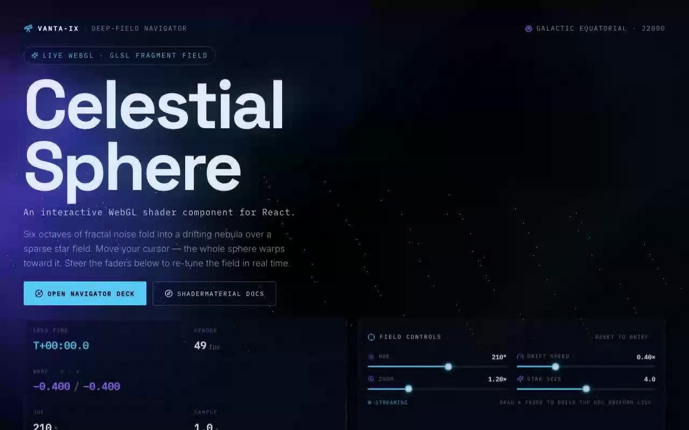

# Celestial Sphere Shader — Interactive Fractal Nebula WebGL Background with Cursor Warp (React + Three.js + Tailwind)

[](./demo.mp4)

An interactive WebGL fragment shader rendering a drifting fractal-noise nebula over a sparse twinkling star field whose entire field warps toward the cursor — integrated as a shadcn `@/components/ui` component and framed as a deep-field navigation console (VANTA-IX) with live telemetry, fader controls, and a cursor-tracking gimbal reticle. The verbatim GLSL is preserved with additive `hue`, `speed`, `zoom`, and `particleSize` props wired to a live control deck, making it a powerful full-bleed interactive hero background for landing pages and portfolios. Generated with Claude Fable 5.

The shader component from the brief is integrated **verbatim** (the vertex /
fragment GLSL, the orthographic full-screen plane, the `requestAnimationFrame`
loop, the mouse-driven `u_mouse` warp, the resize handler and the cleanup are
all unchanged) at `src/components/ui/celestial-sphere.tsx`, the canonical shadcn
`@/components/ui` location. Two additive, backwards-compatible extensions are
layered on top:

- **Live uniform drive** — props are mirrored into refs and pushed onto the
  uniforms each frame, so the control faders re-tune the field in place without
  ever rebuilding the WebGL context. `<CelestialSphere />` with no props behaves
  exactly as the original.
- **`onFrame` telemetry** — the shader emits its own per-frame state (shader
  time, smoothed FPS, the live warp offset, pixel ratio, active uniforms) so the
  surrounding HUD reads the GPU instead of guessing.

The chrome turns the shader into an instrument:

- **Hero lockup** — `Celestial Sphere` set in Space Grotesk with the brief's
  required `An interactive WebGL shader component for React.` lede intact.
- **Cursor-tracking warp reticle (signature element)** — a gimbal reticle
  follows the pointer and a faint vector is drawn from the field center to the
  cursor, visualising the exact direction the shader pushes the cosmos
  (`(u_mouse / u_resolution − 0.5) × 0.8`).
- **Navigator deck** — a live telemetry strip (feed time, render FPS, warp
  x / y, hue, sample rate) beside a control deck of faders that promote the
  brief's props (`hue`, `speed`, `zoom`, `particleSize`) to live GPU uniforms,
  plus a one-click "Reset to brief" back to the demo defaults.

Palette and type are derived from the shader's default HSL hue (≈210° → deep
indigo/blue): void `#04060f`, beam `#5ad1ff`, aurora `#9d6bff`, star `#eaf2ff`.
Type pairing: Space Grotesk (display) · Inter (body) · IBM Plex Mono (data).
Icons from `lucide-react`. The entrance reveal, the cursor ring spin and the
live pulse all respect `prefers-reduced-motion`, and on touch / narrow viewports
the custom cursor falls back to the native pointer.

## Stack

React 18, TypeScript, Vite 6, Tailwind CSS v4 (`@tailwindcss/vite`), Three.js,
`lucide-react`. shadcn-style `@/*` path alias → `./src`.

## Answers to the brief's integration questions

- **What props / data?** `hue`, `speed`, `zoom`, `particleSize` (all numbers,
  defaulting to the brief's values) plus an additive `className` and `onFrame`
  callback. The demo seeds them from the brief's `DemoOne` (`hue 210`,
  `speed 0.4`, `zoom 1.2`, `particleSize 4.0`) and wires them to live faders.
- **State management?** None beyond local React state for the faders/telemetry —
  no context providers or external store needed.
- **Required assets?** None. The visual is generated entirely on the GPU, so
  there are **no image assets** (no Unsplash imagery is required). The only
  assets are the three vendored web fonts.
- **Responsive behavior?** The shader fills the viewport and re-renders on
  resize. The navigator deck is two columns on desktop and collapses to one
  column (then single-column faders) on small screens; the custom cursor reticle
  is replaced by the native pointer on narrow / touch viewports.
- **Best place to use it?** As a full-bleed interactive background behind a hero
  or landing section — which is exactly how the demo frames it.

## Assets

Fully self-contained / offline-ready. The Space Grotesk, Inter and IBM Plex Mono
web fonts (latin subset) are vendored locally to `public/fonts/` and referenced
via `src/fonts.css` — **no remote Google Fonts requests** at runtime. There are
no image assets; the procedural shader is the entire visual.

## Run

```bash
npm install
npm run dev       # dev server
npm run build     # type-check + production build
npm run preview   # serve the production build on :4173
npm run verify    # headless Playwright checks against the preview server
```

## Integration notes (per the prompt)

- **Project structure** — this is a Vite + React + TypeScript app with Tailwind
  CSS v4 and the shadcn `@/components/ui` convention already wired up (the `@`
  alias is configured in both `vite.config.ts` and `tsconfig.json`). If you are
  dropping the component into your own app instead, scaffold with the shadcn CLI
  (`npx shadcn@latest init`), which sets up Tailwind, TypeScript and the
  `components.json` alias map for you. If your project is plain JavaScript,
  add TypeScript with `npm i -D typescript @types/react @types/react-dom` and a
  `tsconfig.json`; add Tailwind with `npm i -D tailwindcss @tailwindcss/vite`.
- **Why `/components/ui`** — shadcn treats `components/ui` as the home for
  primitive, copy-in UI building blocks resolved through the `@/components/ui`
  alias. Keeping the shader there means the import in the brief
  (`@/components/ui/celestial-sphere`) resolves unchanged and the component sits
  alongside the rest of your design-system primitives.
- **Dependencies** — only `three` is required by the component itself;
  `lucide-react` is used by the surrounding demo for icons.

---

Part of the [Shaders](../) collection in the [claude-directory](../../) — an open-source gallery of AI-generated UI built with Claude Fable 5. [Browse the live gallery](https://pulkitxm.com/claude-directory).
