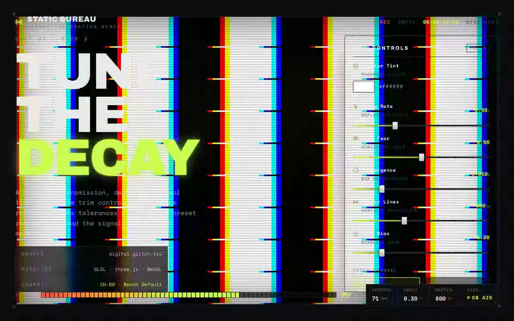

# Digital Glitch — Retro CRT Shader Component (Three.js, WebGL, GLSL, React, TypeScript)

[](./demo.mp4)

A shadcn/ui integration of a retro-CRT glitch fragment shader rendered to a full-screen Three.js quad, featuring tunable block displacement, horizontal tearing, RGB channel shift, and scanlines — all parameterized by GLSL uniforms (`u_glitch_intensity`, `u_rgb_shift`, `u_scanline_density`, `u_scanline_opacity`, `u_base_color`) so the look can be dialed from subtle interference to full broken-signal, with presets including Subtle Interference, Damaged VCR, and Cyberpunk. Built with React + TypeScript + Vite, using `three` and `lucide-react`. Generated with Claude Fable 5.

## Run

```sh
npm install
npm run dev       # dev server
npm run build     # type-check + production build
npm run preview   # serve the production build
npm run verify    # node scripts/verify.mjs
```

See `prompt.md` for the full build spec; `demo.mp4` shows it in motion.

---

Part of the [Shaders](../) collection in the [claude-directory](../../) — an open-source gallery of AI-generated UI built with Claude Fable 5. [Browse the live gallery](https://pulkitxm.com/claude-directory).
