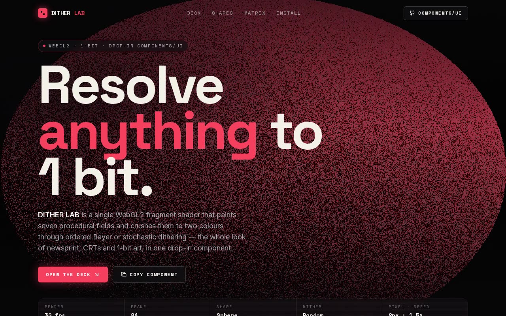

# Dithering Sphere Shader — WebGL2 Dithering Lab with Bayer & Stochastic Modes (React, TypeScript, Vite, Tailwind CSS)

[](./demo.mp4)

An interactive WebGL2 dithering component lab that renders seven procedural shader fields — sphere, ripple, swirl, warp, dots, wave, and simplex — and quantises each to two colours through ordered Bayer (2×2, 4×4, 8×8) or stochastic dithering, with a live FPS telemetry HUD, a full-bleed hero, and a Threshold Matrix panel that visualises the exact Bayer matrices sampled by the GLSL fragment shader. Configured by default as `shape="sphere"`, `type="random"`, rose-on-black, giving a retro 1-bit / newsprint / CRT texture ideal for hero backgrounds or loading states. Generated with Claude Fable 5.

## What's in `components/ui`

| File | Role |
|------|------|
| `dithering-shader.tsx` | The brief's dependency component, ported to TypeScript — one WebGL2 fragment shader, all seven shapes + four dither modes, no deps. |
| `dithering-shader.demo.tsx` | The brief's `demo.tsx`, verbatim — the default export `DemoOne` (the sphere usecase). |
| `sphere.tsx` | The brief's starter `Component` example, kept verbatim. |

`DitheringStage` (`src/components/`) is a thin, app-side responsive wrapper: it measures
its container with a `ResizeObserver` and feeds the size into the fixed-size component, so
the same shader backs a full-bleed hero, a preview tile, or a thumbnail.

## Integration notes (answering the brief)

- **Project structure** — shadcn defaults: aliases `@/components/ui` and `@/lib/utils`
  (`cn` = `clsx` + `tailwind-merge`), Tailwind, TypeScript, Vite. The component lives at
  `@/components/ui/dithering-shader` so the demo's import resolves unchanged. Keeping it in
  `components/ui` matters — that alias is what makes the import work and sits the file with
  the rest of your registry.
- **Props / data** — fully controlled by props (`shape`, `type`, `colorFront`,
  `colorBack`, `pxSize`, `speed`, `width`/`height`, `className`/`style`). No required
  context, store, or provider; the page lifts a single `params` object and shares it across
  hero, deck, matrix and gallery.
- **Assets** — none. The visual is 100% GPU-generated, so no Unsplash imagery is needed.
  The only externals are `lucide-react` icons for the chrome and locally-vendored fonts
  (Space Grotesk / Space Mono / Inter under `public/fonts`), so it runs fully offline.
- **Responsive behaviour** — `DitheringStage` makes the fixed-size component fluid; the
  layout is mobile-first and respects `prefers-reduced-motion`.
- **Best place to use it** — full-bleed hero / section backgrounds, loading states, or any
  surface that wants a retro 1-bit / newsprint / CRT texture.

## Run it

```bash
npm install
npm run dev      # http://localhost:5173
npm run build    # type-check + production build
npm run verify   # headless Playwright check (build → preview → assert)
```

`npm run verify` boots the production build, drives a headless Chromium, and asserts there
are no console errors, the canvas paints rose-dominant pixels, the telemetry HUD advances,
and the control deck mutates the shared params live.

## Stack

React 18, TypeScript, Vite, Tailwind CSS, shadcn/ui structure (`@/components/ui`,
`@/lib/utils`), Lucide icons, raw WebGL2. Fonts are vendored locally under `public/fonts` —
the project runs fully offline.

---

Part of the [Shaders](../) collection in the [claude-directory](../../) — an open-source gallery of AI-generated UI built with Claude Fable 5. [Browse the live gallery](https://pulkitxm.com/claude-directory).
