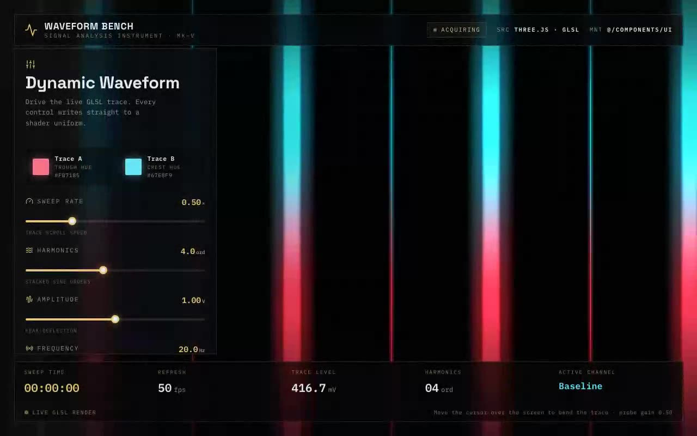

# Dynamic Waveform Shader — Interactive GLSL Waveform Fragment Shader (React + TypeScript + Three.js)

[](./demo.mp4)

A shadcn/ui integration of an animated waveform GLSL fragment shader rendered to a full-screen Three.js quad. The shader builds flowing, layered waveform bands controlled by live uniforms for two colours (`u_color1`, `u_color2`), `u_complexity`, `u_amplitude`, and `u_frequency`, with a `u_mouse` / `u_mouse_distortion` pair that warps the wave field around the pointer for an interactive feel. Comes with a glassmorphic control panel and three built-in presets (Signal Scan, Deep Sea, Vaporwave). Generated with Claude Fable 5.

## Run

```sh
npm install
npm run dev       # dev server
npm run build     # type-check + production build
npm run preview   # serve the production build
npm run verify    # node scripts/verify.mjs
```

See `prompt.md` for the full build spec; `demo.mp4` shows it in motion.

---

Part of the [Shaders](../) collection in the [claude-directory](../../) — an open-source gallery of AI-generated UI built with Claude Fable 5. [Browse the live gallery](https://pulkitxm.com/claude-directory).
