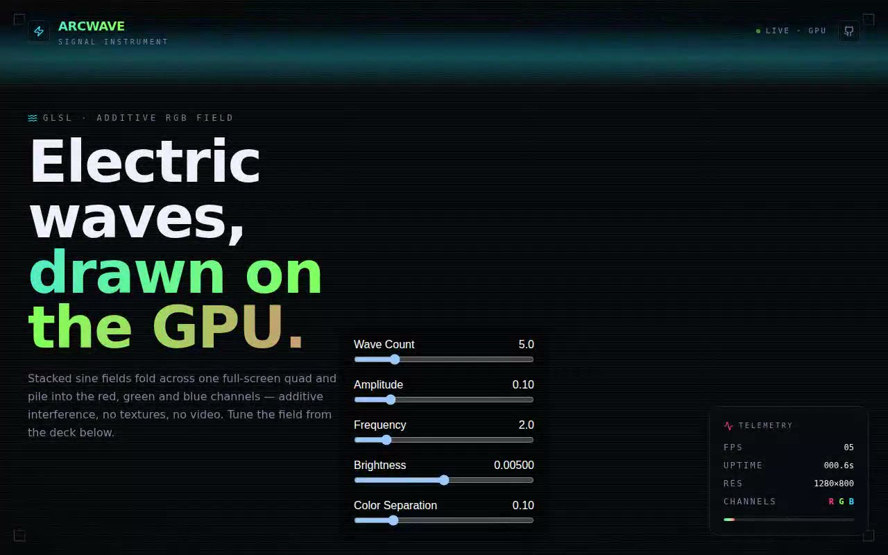

# ARCWAVE — Electric Waves GLSL Shader Instrument (React + TypeScript + Three.js + Tailwind CSS v4)

[](./demo.mp4)

An integration of the `ElectricWavesShader` component into a polished signal instrument called ARCWAVE. The GLSL fragment shader stacks sine fields across a full-screen orthographic quad, folding additive interference into the red, green, and blue channels — pure GPU math, no textures or video. Around it sits dark "instrument glass" chrome: a brand bar, viewfinder corner brackets, CRT scanlines, a sweeping scope line, a five-slider control deck, and a live telemetry HUD (FPS, uptime, drawing-buffer resolution, R/G/B channels) fed straight from the render loop. Generated with Claude Fable 5.

## Stack

- React 18 + TypeScript + Vite 5
- Tailwind CSS **v4** via `@tailwindcss/vite` (+ `tw-animate-css`), tokens in `@theme`
- **Three.js** (`WebGLRenderer` + `ShaderMaterial` on an orthographic full-screen quad)
- `lucide-react` icons, shadcn-style `cn()` + `@/` alias + `components.json`
- System font stacks (sans + mono) — zero runtime font fetches, fully offline

## Project layout (the integration target)

```
src/
  components/ui/colorful-wave-pattern-1.tsx  ← the prompt's component (ported to TS)
  components/ui/demo.tsx                      ← the prompt's demo, verbatim
  lib/utils.ts                                ← shadcn cn() helper
  index.css                                   ← Tailwind v4 tokens + instrument chrome
  App.tsx                                      ← the ARCWAVE surface
```

## Integrating the component (answering the prompt)

This repo already supports the three requirements, so no scaffolding was needed:

- **shadcn structure** — `components.json` + the `@/` alias resolve `@/components/ui/*`.
- **Tailwind** — Tailwind v4 is wired through the Vite plugin; `src/index.css` opens
  with `@import "tailwindcss"`.
- **TypeScript** — strict TS throughout; `npm run build` runs `tsc` first.

**Why `components/ui`?** shadcn treats `components/ui/` as the home for primitive,
copy-in components that you own and edit (as opposed to app-specific composition in
`components/`). Keeping the shader there means the
`@/components/ui/colorful-wave-pattern-1` import in `demo.tsx` resolves with zero
config and the component stays a reusable primitive you can drop into any shadcn app.

Answers to the prompt's integration questions:

- **Props/data** — none. `ElectricWavesShader` self-renders and owns all of its
  parameters internally; you mount `<ElectricWavesShader />` and it paints a fixed,
  full-viewport canvas plus its own control deck.
- **State** — local `useState` only (the five live uniforms: wave count, amplitude,
  frequency, brightness, colour separation). No context, store, or provider is needed;
  a `useEffect` syncs the React state into the Three.js `ShaderMaterial` uniforms.
- **Assets** — none. The brief mentions Unsplash, but this component renders entirely on
  the GPU, so **no image assets** were added. `lucide-react` supplies the chrome icons,
  and fonts are system stacks (no remote requests), so the project runs fully offline.
- **Responsive** — single non-scrolling viewport at every width; the canvas tracks the
  window via the component's `resize` handler and `devicePixelRatio`. The hero text and
  telemetry HUD reflow / hide on small screens so they never collide with the centered
  control deck.
- **Best placement** — as a full-bleed background/hero behind UI chrome (its canvas is
  `position: fixed; z-index: -1`), which is exactly how `App.tsx` uses it.

### TypeScript note

The component is the prompt's source, ported to strict TS: the refs are typed
(`HTMLDivElement`, `THREE.ShaderMaterial`), the renderer is typed, and the inline style
objects are annotated `React.CSSProperties`. The GLSL, uniforms, control deck and
cleanup are unchanged — behaviour is identical to the original.

## Install

```bash
npm install        # includes three + @types/three
```

## Run

```bash
npm run dev
```

## Verify (CLI only)

```bash
npm run build
npm run preview &   # serves dist on :4173
npm run verify      # headless Chromium: WebGL paint, live animation, the five
                    # controls, HUD ticks, no-scroll, system fonts, desktop + mobile
```

---

Part of the [Shaders](../) collection in the [claude-directory](../../) — an open-source gallery of AI-generated UI built with Claude Fable 5. [Browse the live gallery](https://pulkitxm.com/claude-directory).
