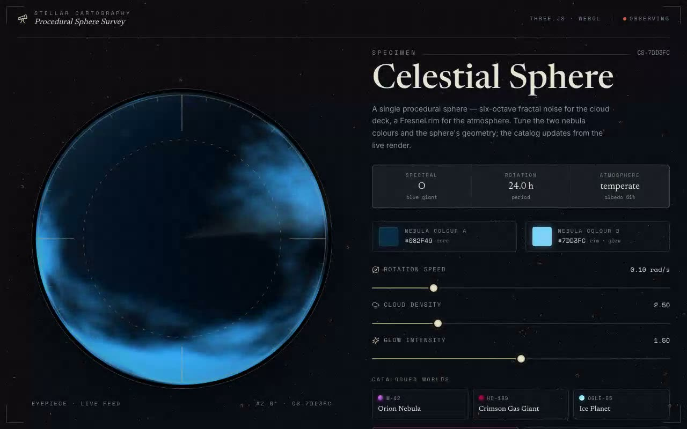

# Exoplanet Survey Shader — Procedural Planetary Sphere (React + TypeScript + Three.js + Tailwind CSS)

[](./demo.mp4)

A procedural 3D sphere rendered with a Three.js `ShaderMaterial` — six-octave fractal Brownian-motion noise for the cloud deck and a Fresnel rim for the atmosphere glow. Framed as a live "Stellar Cartography" exoplanet survey instrument: a circular brass eyepiece with reticle, azimuth ticks, and a slow radar sweep; colour pickers and dials for rotation speed, cloud density, and glow intensity; three preset worlds (Orion Nebula, Crimson Gas Giant, Ice Planet); and a per-frame telemetry strip (mission clock, FPS, sphere longitude). All self-contained and offline-ready. Generated with Claude Fable 5.

## Stack

React 18, TypeScript, Vite 5, Tailwind CSS v3, Three.js, `lucide-react`.
shadcn-style `@/*` path alias → `./src`.

## Assets

Fully self-contained / offline-ready. The Newsreader, Inter and Space Mono web
fonts (latin subset) and the starfield texture (`stardust.png`, the texture the
brief referenced) are vendored locally to `public/fonts/` and `public/assets/`
and referenced via relative paths — no remote Google Fonts or CDN requests at
runtime. The sphere itself is generated entirely on the GPU.

## Run

```bash
npm install
npm run dev       # dev server
npm run build     # type-check + production build
npm run preview   # serve the production build
npm run verify    # headless Playwright checks against the preview server
```

## Integration notes (per the prompt)

- **Project structure** — this is a Vite + React + TypeScript app with Tailwind
  CSS and the shadcn `@/components/ui` convention already wired up (the `@`
  alias is configured in both `vite.config.ts` and `tsconfig.app.json`). If you
  are dropping the component into your own app instead, scaffold/extend with the
  shadcn CLI (`npx shadcn@latest init`), which installs Tailwind + TypeScript
  and writes the `components.json` alias map for you. To add Tailwind and
  TypeScript to a bare Vite app manually:
  `npm i -D tailwindcss postcss autoprefixer typescript && npx tailwindcss init -p`.
- **Why `/components/ui`** — shadcn treats `components/ui` as the home for
  primitive, copy-in UI building blocks resolved through the `@/components/ui`
  alias. Placing the shader there means the brief's import resolves unchanged
  and the component sits alongside the rest of your design-system primitives. If
  your default component path is not `components/ui`, create it: the alias map
  and every copy-pasted shadcn block assume that folder exists.
- **Dependencies** — only `three` is required by the component itself
  (`npm i three`); `lucide-react` is used by the surrounding console for icons.
- **Props / state** — the component's props are the brief's: `color1`, `color2`,
  `cloudDensity`, `glowIntensity`, `rotationSpeed`. Two additive, optional props
  are layered on without changing defaults: `fill` (fill the parent instead of
  the viewport) and `onFrame` (per-frame telemetry). State lives in the console
  (`useState`) — the brief needs no context provider or external store.
- **Responsive behaviour** — the console is a two-column grid on desktop that
  collapses to a single stacked column on small screens; the page scrolls when
  the instrument is taller than the viewport, and the scope stays square at
  every width. A `ResizeObserver` keeps the filled canvas crisp on reflow.
- **Where to use it** — as a full-bleed background (the brief's `demo.tsx`
  usage, preserved in `src/components/demo.tsx`) or, as here, framed inside a
  fixed-size container with `fill` — a hero backdrop, a product "specimen"
  viewer, or a settings playground.
- **Images** — no photographic stock imagery is needed; the only raster asset is
  the vendored `stardust.png` starfield the brief referenced.

---

Part of the [Shaders](../) collection in the [claude-directory](../../) — an open-source gallery of AI-generated UI built with Claude Fable 5. [Browse the live gallery](https://pulkitxm.com/claude-directory).
