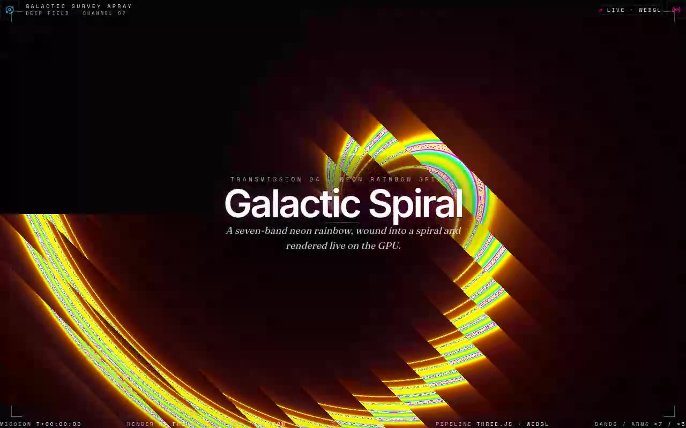

# Galactic Spiral Shader — Neon Rainbow Spiral GLSL Hero (React + TypeScript + Three.js + Tailwind CSS v4)

[](./demo.mp4)

A 7-colour neon rainbow spiral GLSL fragment shader — five interleaved arms wound around a bright core in polar coordinates — rendered full-viewport with Three.js. Framed as a deep-field survey transmission: the "Galactic Spiral" title set over a soft radial legibility scrim, an eyebrow label, a Fraunces italic strapline, a hairline registration frame with corner crops, film-grain grade, and a live telemetry ledger (mission clock, measured FPS, drifting right-ascension / declination coordinates). Fully offline-ready with vendored fonts. Generated with Claude Fable 5.

## Stack

React 18, TypeScript, Vite 6, Tailwind CSS v4 (`@tailwindcss/vite`), Three.js,
`lucide-react`. shadcn-style `@/*` path alias → `./src`, with `components.json`
and `src/lib/utils.ts` (`cn`) wired up.

## Assets

Fully self-contained / offline-ready. The Inter, Space Mono and Fraunces web
fonts (latin subset) are vendored locally to `public/fonts/` and referenced via
`src/fonts.css` — no remote Google Fonts requests at runtime. The visual is
generated entirely on the GPU, so there are no image assets.

## Run

```bash
npm install
npm run dev       # dev server
npm run build     # type-check + production build
npm run preview   # serve the production build on :4173
npm run verify    # headless Playwright checks against the preview server
```

## Integration notes (per the prompt)

- **Project structure** — this is a Vite + React + TypeScript app with Tailwind
  CSS v4 and the shadcn `@/components/ui` convention already wired up (the `@`
  alias is configured in both `vite.config.ts` and `tsconfig.json`, and there's
  a `components.json`). If you are dropping the component into your own app
  instead, scaffold with the shadcn CLI (`npx shadcn@latest init`), which sets
  up Tailwind, TypeScript and the `components.json` alias map for you.
- **Why `/components/ui`** — shadcn treats `components/ui` as the home for
  primitive, copy-in UI building blocks resolved through the `@/components/ui`
  alias. Keeping the shader there means the import in the brief
  (`@/components/ui/spiral-shader`) resolves unchanged and the component sits
  alongside the rest of your design-system primitives.
- **Dependencies** — only `three` is required by the component itself;
  `lucide-react` (icons) and `clsx` + `tailwind-merge` (the `cn` helper) are used
  by the surrounding demo.
- **Props / state** — `ShaderAnimation` takes no props and holds no external
  state; it self-manages its Three.js scene in a `useEffect` and tears it down
  on unmount. It is rendered as a zero-config fixed background. All live state in
  this demo (clock, FPS, coordinates) is owned by the demo, not the shader.
- **Images** — none. The procedural shader is the entire visual, so no Unsplash
  stock imagery is needed.
- **Responsive behaviour** — the canvas tracks its container via a `resize`
  listener and fills the viewport at every size; the telemetry ledger collapses
  to a single-line mobile strip below `md`, and the title scales from
  `text-5xl` to `text-7xl`.
- **Where to use it** — as an immersive full-bleed hero / landing backdrop or a
  splash/loading scene where a living, GPU-cheap background is wanted behind a
  short headline.

---

Part of the [Shaders](../) collection in the [claude-directory](../../) — an open-source gallery of AI-generated UI built with Claude Fable 5. [Browse the live gallery](https://pulkitxm.com/claude-directory).
