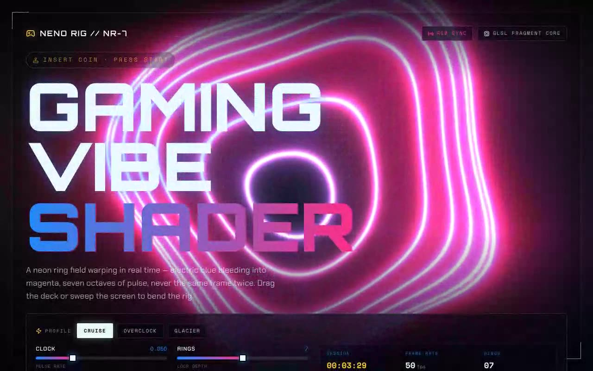

# Gaming Vibe Shader — Neon Ring Field GLSL Background (React + Three.js + Tailwind CSS)

[](./demo.mp4)

A full-bleed neon ring shader component integrated as a shadcn `@/components/ui` primitive and framed as a live arcade boot diagnostic called the *NENO RIG // NR-7*. The GLSL fragment shader produces a warping, breathing, slowly-rotating ring field with electric blue (`#1d8bff`) bleeding into magenta (`#ff2e88`) and a grain pass on top — making it ideal as a gaming, esports, or music-visualiser hero background. Generated with Claude Fable 5.

## Stack

React 18, TypeScript, Vite 6, Tailwind CSS v4 (`@tailwindcss/vite`), Three.js,
`lucide-react`. shadcn-style `@/*` path alias → `./src`.

## Assets

Fully self-contained / offline-ready. The Orbitron, Chakra Petch and Space Mono
web fonts (latin subset) are vendored locally to `public/fonts/` and referenced
via `src/fonts.css` — no remote Google Fonts requests at runtime. The visual is
generated entirely on the GPU, so there are no image assets.

## Run

```bash
npm install
npm run dev       # dev server
npm run build     # type-check + production build
npm run preview   # serve the production build on :4173
npm run verify    # headless Playwright checks against the preview server
```

## Integration notes (per the prompt)

- **Codebase support** — this is a Vite + React + TypeScript app with Tailwind
  CSS v4 and the shadcn `@/components/ui` convention already wired up (the `@`
  alias is set in both `vite.config.ts` and `tsconfig.json`). If you are dropping
  the component into your own app instead, scaffold with the shadcn CLI
  (`npx shadcn@latest init`), which installs Tailwind, configures TypeScript and
  writes the `components.json` alias map. To add the pieces by hand: Tailwind via
  `npm i -D tailwindcss @tailwindcss/vite` (or the PostCSS plugin), TypeScript
  via `npm i -D typescript` + a `tsconfig.json`, and the `@/*` path alias in
  `tsconfig.json` `compilerOptions.paths` plus your bundler's `resolve.alias`.
- **Why `/components/ui`** — shadcn treats `components/ui` as the home for
  primitive, copy-in UI building blocks resolved through the `@/components/ui`
  alias. Putting the shader there keeps the brief's import
  (`@/components/ui/neno-shader`) resolving unchanged and sits the component
  alongside the rest of your design-system primitives, so it can be themed and
  reused like any other `ui/` part instead of becoming a one-off.
- **Dependencies** — only `three` is required by the component itself (install
  with `npm i three` and, for TS, `npm i -D @types/three`). `lucide-react` is
  used by the surrounding rig UI for icons.
- **Props / state** — the brief's `ShaderAnimation` takes no props and is kept
  as a zero-config drop-in. The added `NenoShader` props (`speed`, `rings`,
  `warp`, `hueBlend`, `parallax`, `onFrame`, `className`) are all optional and
  default to the brief's exact behaviour. No global state or context provider is
  needed — the host owns the deck state with plain `useState`, and telemetry is
  pushed back through `onFrame` (throttled to ~15 Hz) so the HUD updates without
  re-rendering on every shader frame.
- **Responsive behaviour** — the shader is a fixed full-bleed background sized to
  the viewport, so it fills any screen; the rig UI reflows from a two-column deck
  to a single stacked column on small screens, and the pointer reticle hides on
  touch-class widths.
- **Images / Unsplash** — none. The procedural shader is the entire visual, so
  no Unsplash stock imagery is required; the prompt's "fill image assets" step
  is intentionally not applicable here.
- **Best place to use it** — as a hero / attract-mode background for anything
  with a gaming, music-visualiser, esports or launch-screen vibe; drop
  `<ShaderAnimation />` behind your own foreground content, or `<NenoShader … />`
  when you want the look to react to controls or the cursor.

---

Part of the [Shaders](../) collection in the [claude-directory](../../) — an open-source gallery of AI-generated UI built with Claude Fable 5. [Browse the live gallery](https://pulkitxm.com/claude-directory).
