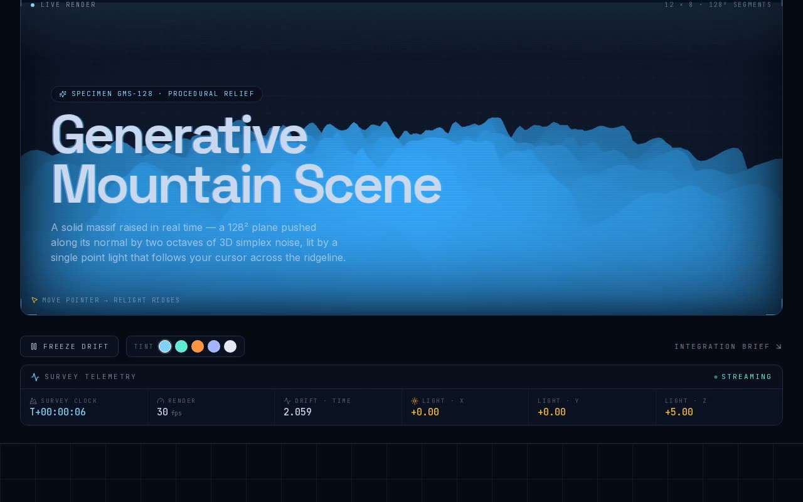

# Generative Mountain Scene — Animated 3D Terrain Shader (React + Three.js + Tailwind CSS)

[](./demo.mp4)

A shadcn/ui integration of a generative mountain landscape rendered in Three.js with a time-driven GLSL shader. A 128×128 `PlaneGeometry` is displaced by a `ShaderMaterial` vertex shader using simplex noise, viewed through a tilted perspective camera, producing an undulating mountain terrain that continuously animates — ideal as a full-screen 3D background for hero sections and immersive landing pages. Generated with Claude Fable 5.

## Run

```sh
npm install
npm run dev       # dev server
npm run build     # type-check + production build
npm run preview   # serve the production build
npm run verify    # node verify.mjs
```

See `prompt.md` for the full build spec; `demo.mp4` shows it in motion.

---

Part of the [Shaders](../) collection in the [claude-directory](../../) — an open-source gallery of AI-generated UI built with Claude Fable 5. [Browse the live gallery](https://pulkitxm.com/claude-directory).
