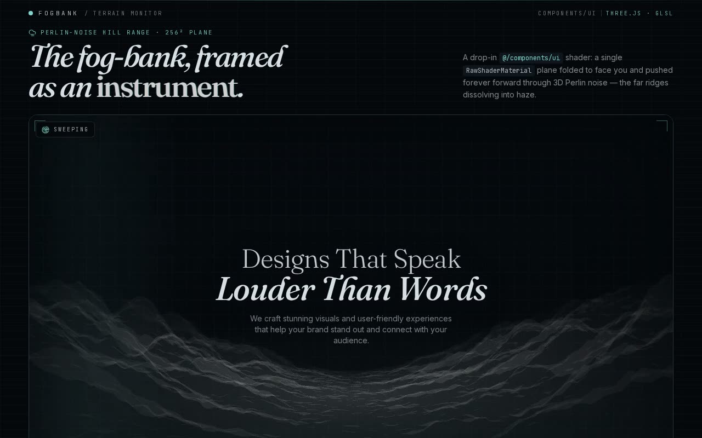

# GLSL Hills Shader — Animated Rolling Terrain Background (React + Three.js + Tailwind CSS)

[](./demo.mp4)

A shadcn/ui integration of an animated rolling-hills terrain built in Three.js with classic Perlin noise (`cnoise`). A large subdivided `PlaneGeometry` is displaced in a `RawShaderMaterial` vertex shader, with the noise field scrolled over `time` so the hills continuously roll toward the camera — perfect as a full-screen GLSL background for landing pages and hero sections. The component accepts `width`, `height`, `cameraZ`, `planeSize`, and `speed` props. Generated with Claude Fable 5.

## Run

```sh
npm install
npm run dev       # dev server
npm run build     # type-check + production build
npm run preview   # serve the production build
npm run verify    # node verify.mjs
```

See `prompt.md` for the full build spec; `demo.mp4` shows it in motion.

---

Part of the [Shaders](../) collection in the [claude-directory](../../) — an open-source gallery of AI-generated UI built with Claude Fable 5. [Browse the live gallery](https://pulkitxm.com/claude-directory).
