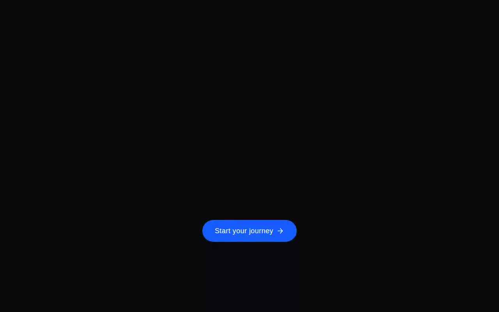

# Hero Button Expandable — Nexus — GodRays Hero with Expanding Modal (React + @paper-design/shaders-react + Framer Motion)

[](./demo.mp4)

A React + TypeScript + Vite + Tailwind CSS v4 hero section integrating a `GodRays`-lit marketing hero whose CTA performs a Framer Motion shared-layout morph — the pill button expands into a full-screen `MeshGradient` modal with an animated "Get a Demo" form featuring `idle → submitting → success` states. Both shaders come from `@paper-design/shaders-react`, making it a compelling above-the-fold landing page component with WebGL backgrounds and smooth layout transitions. Generated with Claude Fable 5.

## Run

```bash
npm install
npm run dev      # http://localhost:5173
npm run build    # type-check (tsc -b) + production build
npm run verify   # headless Playwright check of the full interaction (builds first)
```

> The showcase shell (`index.html`) sets `<html class="dark">` so the GodRays read dramatically
> against `zinc-950`. The component itself supports both themes via Tailwind `dark:` utilities.

## Integration notes (answering the prompt)

This repo already satisfies the required stack, so no project bootstrap was needed:

- **shadcn project structure** — `components.json` is present, the `@` alias resolves to `./src`
  (configured in both `vite.config.ts` and `tsconfig`), the `cn()` helper lives in
  `src/lib/utils.ts`, and UI components live in **`src/components/ui/`**.
- **Tailwind CSS** — Tailwind **v4** via `@tailwindcss/vite`; the entry stylesheet
  `src/index.css` begins with `@import "tailwindcss";` and `@import "tw-animate-css";`, then carries
  the prompt's `@theme inline` token bridge and the full `:root` / `.dark` design-token sets verbatim.
- **TypeScript** — strict mode, project references (`tsconfig.app.json` / `tsconfig.node.json`).

If you were starting from scratch instead, you would:

```bash
npm create vite@latest my-app -- --template react-ts
cd my-app
npm install tailwindcss @tailwindcss/vite tw-animate-css
npx shadcn@latest init          # creates components.json + the @/ alias + src/lib/utils.ts
npm install lucide-react framer-motion @paper-design/shaders-react
```

### Why `components/ui`

shadcn's `components.json` pins the `ui` alias to `@/components/ui`. The CLI (`npx shadcn add …`)
writes generated primitives there, and every component import in the ecosystem is written as
`@/components/ui/<name>`. Keeping this exact folder means the prompt's
`import Hero from "@/components/ui/hero-button-expendable"` resolves unchanged, and any future
`shadcn add` lands its files in the same place without churn. This project's default component path
**is** `src/components/ui`, so the component was copied there verbatim.

> **One TypeScript-correctness tweak:** the snippet typed its submit handler as `React.FormEvent`
> without importing the `React` namespace. Under this project's `verbatimModuleSyntax`, that is a
> compile error, so the import was changed to `import { useState, useEffect, type FormEvent }` and
> the annotation to `FormEvent`. Nothing else in the component was altered. The original filename
> spelling (`hero-button-expendable.tsx`) is preserved so the prompt's import path works as written.

### Component questions

- **Props / data** — `Hero` is self-contained and takes **no props**. All state is local:
  `isExpanded` (toggles the modal) and `formStep` (`"idle" | "submitting" | "success"`). The form
  is uncontrolled and the submit is simulated (`setTimeout`), so wiring it to a real endpoint is a
  one-line change in `handleSubmit`.
- **State management** — local `useState` + one `useEffect` that locks `document.body` scroll while
  the modal is open. No context provider, store, or router is required.
- **Assets** — the component needs **no images**: the GodRays / MeshGradient backgrounds are WebGL,
  every glyph icon is `lucide-react` (`X`, `Check`, `ArrowRight`, `BarChart3`, `Globe2`), and the
  testimonial avatar is a pure CSS gradient with initials. The prompt's "fill image assets with
  Unsplash" step therefore has nothing to fill — there are no `` slots. The only vendored media
  are the three theme fonts (**Oxanium / Merriweather / Fira Code**) saved as local `woff2` under
  `assets/fonts/` and wired via `@font-face`, so the project runs fully offline.
- **Responsive behavior** — full-bleed hero; the headline scales `text-4xl → text-7xl` and the badge
  / paragraph reflow. The modal is `flex-col` on mobile (scrolls vertically) and `lg:flex-row` on
  desktop (testimonials left, form right); the Company/Size row is a 2-col grid; the close button and
  paddings adapt per breakpoint. No horizontal overflow at any width.
- **Best placement** — as the top-of-page hero / primary above-the-fold CTA on a landing or product
  page, where the expand-to-modal interaction replaces a separate "request a demo" route.

## Verification

`scripts/verify.mjs` is a headless check (Playwright + Chromium with WebGL via SwiftShader, run
against the production `vite preview` build) that drives the full interaction and asserts:

1. the hero renders — badge, headline, gradient sub-headline, paragraph, CTA;
2. the **GodRays** background mounts a live WebGL2 canvas with backing pixels that actually paint light;
3. clicking the CTA performs the shared-layout morph into the modal — a second canvas (**MeshGradient**)
   mounts, the "Ready to scale?" panel and "Get a Demo" form render, and body scroll locks;
4. filling + submitting the form reaches the **"Request Received!"** success state;
5. **"Return to Homepage"** closes the modal, restores the CTA, and unlocks scroll;

with **no console or page errors** anywhere in the flow. All **17 checks pass**.

---

Part of the [Shaders](../) collection in the [claude-directory](../../) — an open-source gallery of AI-generated UI built with Claude Fable 5. [Browse the live gallery](https://pulkitxm.com/claude-directory).
