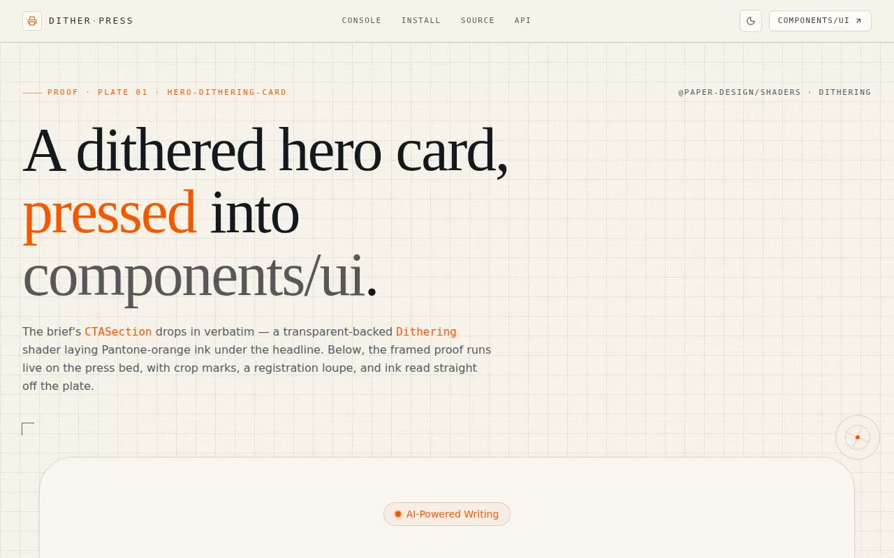

# Dither Press — Hero Dithering Card (@paper-design/shaders-react + React + Tailwind CSS)

[](./demo.mp4)

A print-house proof room built around a shadcn `components/ui` dithering shader card from `@paper-design/shaders-react`. The `CTASection` component drops in untouched — a transparent-backed `Dithering` shader with Pantone-orange ink under an editorial headline and CTA — then is mounted on a press bed with crop marks, an engraved registration grid, a half-tone dot field, a rotating loupe reticle, and a live telemetry strip that reads ink coverage directly off the plate. A second live shader plate is wired to a full control rack. Generated with Claude Fable 5.

## The proof, framed

The hero is the unmodified component. Around it:

- **Crop marks + loupe** — printer's corner ticks and a spinning registration
  target, the press-room motif.
- **Live telemetry** — `fps` and `uptime` read from real `requestAnimationFrame`
  deltas; `frames` counts composited frames; **`ink coverage`** is genuinely
  sampled off the dither `<canvas>` by compositing it to a tiny offscreen buffer
  and averaging opaque, ink-coloured pixels.

## Ink console — the same shader, on the faders

A second live `Dithering` plate is wired to a control rack so you can feel the
shader before shipping it. Every control writes straight to a uniform:

| Control | Prop | Range |
|---------|------|-------|
| **Speed** fader | `speed` | `0 – 1×` (Halt drives it to `0`) |
| **Shape** | `shape` | `warp · simplex · dots · wave · ripple · swirl · sphere` |
| **Dither** | `type` | `random · 2x2 · 4x4 · 8x8` |
| **Ink** swatches | `colorFront` | Pantone Orange · Process Cyan/Magenta · Viridian · Rich Black |

The fader option lists are **derived from the real `Dithering` props**
(`NonNullable<ComponentProps<typeof Dithering>[...]>`), so the console can never
drift out of sync with the shader's accepted values.

## Integration story

The page walks the full shadcn integration: the one install line
(`@paper-design/shaders-react` + `lucide-react`), why the file lives at
`@/components/ui/hero-dithering-card` (the `ui` alias in `components.json`), a
usage snippet, a tabbed **copyable source** panel (component / demo / usage), and
a props table for the `Dithering` shader. A paper ↔ lights-out theme toggle
flips `.dark` on `<html>`; the component's own `dark:` utilities
(`opacity-30`, `mix-blend-screen`) take over.

## Stack

React 19, TypeScript, Vite 7, Tailwind CSS v4, `@paper-design/shaders-react`,
`lucide-react`.

## Design

| Token | Value |
|-------|-------|
| Press ink (accent) | `#EC4E02` — Pantone 021 Orange |
| Paper (light) | warm newsprint `oklch(0.964 0.011 84)` |
| Lights-out (dark) | deep press navy `oklch(0.16 0.012 256)` |
| Display / chrome | Space Grotesk |
| Editorial headline | Instrument Serif |
| Spec data / crop marks | JetBrains Mono |

Signature: the verbatim card seated on a press bed — crop marks, a register
grid, a half-tone dot field, a loupe reticle, and ink coverage read live off the
plate.

## Assets

**Space Grotesk**, **Instrument Serif**, and **JetBrains Mono** are **vendored
locally** under `assets/fonts/*.woff2` and bundled by Vite — the project runs
fully offline, no CDN or remote font calls. Icons are `lucide-react` (no remote
SVGs); the favicon is an inline SVG data URI. No raster image assets are needed.

## Run

```bash
npm install
npm run dev       # dev server
npm run build     # type-check (tsc -b) + production build
npm run preview   # serve the production build
npm run verify    # headless Playwright checks (boots its own dev server)
```

`npm run verify` boots a dev server, drives a headless Chromium with software
WebGL, and asserts: the hero headline renders, both dither canvases mount with a
live WebGL context, the hero shader renders live (a corner of the plate animates
frame-to-frame), the press telemetry advances, the speed fader sweeps
`0.00× → 1.00×`, a shape button latches, the theme toggle flips `.dark`, the
integration/source/API sections render, and no page/console errors fire. It
falls back to a pre-installed Chromium when the Playwright build can't be
downloaded.

---

Part of the [Shaders](../) collection in the [claude-directory](../../) — an open-source gallery of AI-generated UI built with Claude Fable 5. [Browse the live gallery](https://pulkitxm.com/claude-directory).
