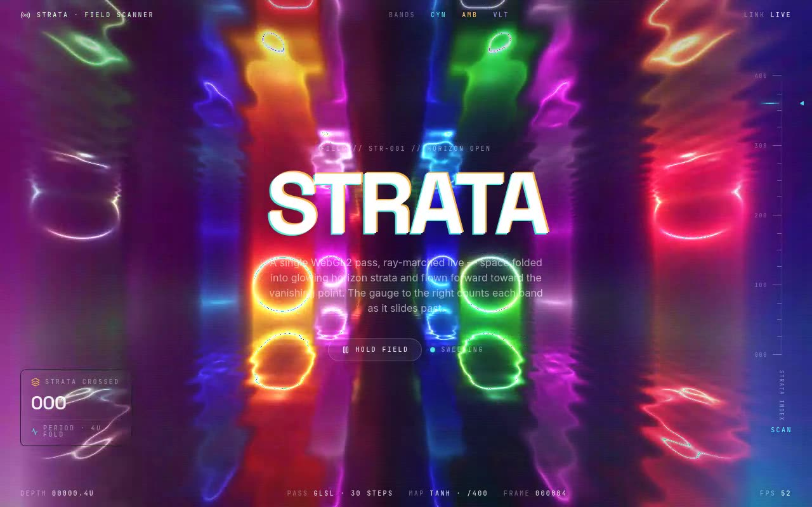

# STRATA — Horizon Field Scanner WebGL2 Shader (React, TypeScript, Vite, Tailwind CSS)

[](./demo.mp4)

A WebGL2 fragment shader that ray-marches 30 steps through repeating horizon strata folded with `mod(d − 2.0, 4.0) − 2.0` over a cosine-tube ground plane, flown toward the vanishing point and tonemapped with `tanh` — framed as a deep-field stratigraphy scanner with a chromatic-split wordmark, a real-time stratigraphy gauge that tracks the shader's marching cadence, live layer readout, GPU-sampled telemetry rail, hold/resume field control, and a CSS fallback for environments without WebGL2. Generated with Claude Fable 5.

## Stack

React 18, TypeScript, Vite 5, Tailwind CSS v3, raw WebGL2 (no Three.js),
`lucide-react`. shadcn-style `@/*` path alias → `./src`.

## Assets

Fully self-contained / offline-ready. The Space Grotesk, Inter and JetBrains Mono
web fonts are vendored locally to `public/fonts/` (Latin subsets) and referenced
from `src/index.css` — no remote font requests at runtime. The visual is generated
entirely on the GPU, so there are no image assets.

## Run

```bash
npm install
npm run dev       # dev server
npm run build     # type-check + production build
npm run preview   # serve the production build
```

## Integration notes (answering the prompt)

- **Project structure** — this is a Vite + React + TypeScript app with Tailwind
  CSS and the shadcn `@/components/ui` convention already wired up (the `@` alias
  is configured in both `vite.config.ts` and `tsconfig.json`, and `components.json`
  records the alias map). To drop the component into your own app instead, scaffold
  with the shadcn CLI: `npx shadcn@latest init` (it installs/wires Tailwind,
  TypeScript and the alias map for you); if you are starting from scratch,
  `npm create vite@latest my-app -- --template react-ts` first, then run the shadcn
  init.
- **Why `/components/ui`** — shadcn treats `components/ui` as the home for
  primitive, copy-in UI building blocks resolved through the `@/components/ui`
  alias. The brief's own `demo.tsx` imports from `@/components/ui/lab`, so placing
  the file there is what makes that import resolve unchanged; it also keeps the
  shader alongside the rest of your design-system primitives. If your default
  components path is not `components/ui`, create it (and point the `ui` alias at
  it) so copy-in components and their documented imports line up across projects.
- **Dependencies** — the shader component needs nothing beyond React; it talks to
  WebGL2 directly. `lucide-react` is used only by the surrounding scanner UI for
  icons. No context providers or custom hooks are required.
- **Props / state** — the original component took no props and is preserved that
  way by default. The added `paused`, `onSample` and `fill` props are optional and
  additive; the host (`App.tsx`) keeps `paused` in React state and derives depth /
  layer / fps readouts from the `onSample` payload.
- **Images** — none. The procedural shader is the entire visual, so no Unsplash
  stock imagery is needed (the prompt's "fill image assets" step does not apply to
  a fully procedural GPU visual).
- **Responsive behaviour** — the canvas fills the viewport at any size and
  re-resolves to device pixels via `ResizeObserver` + DPR clamp. The gauge and the
  layer panel are hidden below the `sm` breakpoint; the centered lockup and
  telemetry rails reflow down to mobile.
- **Best place to use it** — as a full-bleed hero / landing background, a loading
  or "system online" backdrop, or a section divider where a living, depth-marching
  texture is wanted behind foreground content.

---

Part of the [Shaders](../) collection in the [claude-directory](../../) — an open-source gallery of AI-generated UI built with Claude Fable 5. [Browse the live gallery](https://pulkitxm.com/claude-directory).
