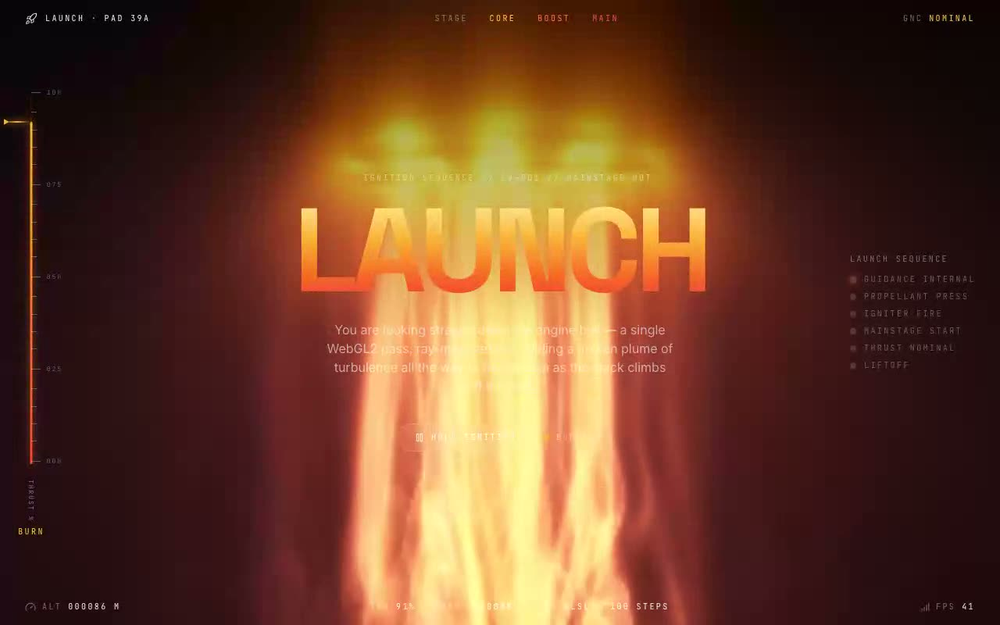

# LAUNCH — Ignition Control — Ray-Marched Molten Plume WebGL2 Shader (React + TypeScript + Vite)

[](./demo.mp4)

A full-screen WebGL2 fragment shader that ray-marches a molten engine plume in real time — hot red/amber colour accumulated across ~100 marching steps and tone-mapped with `tanh` — integrated at the shadcn `@/components/ui` location and framed as a rocket flight-control ignition console. The shader drives a vertical thrust gauge, live telemetry rail, and ignition sequence checklist, with an Ignite/Hold control that pauses and resumes the GPU clock. Built with React 18, TypeScript, Vite 5, and Tailwind CSS v3 using raw WebGL2 — no Three.js required. Generated with Claude Fable 5.

## The instrument

The chrome reads the churning plume as a rocket on the pad:

- **Vertical thrust gauge (signature element)** — a fixed tick ladder whose amber
  reticle and rising heat-fill ride the live throttle percentage, which is sampled off
  the shader clock (`thrust = 89 + sin(t·0.8)·6 + sin(t·2.3)·4`), so it physically
  breathes with the engine instead of running a decorative timer.
- **Heat-glow `LAUNCH` wordmark** — set in Space Grotesk with an amber→ember→red
  vertical gradient fill and a soft bloom halo that echoes the plume's own
  incandescence.
- **Launch sequence rail** — a right-edge ignition checklist
  (`GUIDANCE INTERNAL → … → LIFTOFF`) that arms one step at a time once the engines
  light, and disarms when they are held.
- **Live telemetry rail** — the bottom bar reports the shader's real per-frame state
  sampled off the GPU loop: altitude (derived from `iTime`), throttle %, the live
  `iFrame` counter and smoothed render FPS, plus the static pass facts
  (`GLSL · 100 STEPS`).
- **Ignite / Hold control** — drives the shader's `paused` prop directly, freezing and
  resuming the burn (and the gauge / sequence / telemetry stay in sync).

A launch-pad vignette and faint scanlines pull the eye to the engine bell and read the
whole frame as a flight-control CRT. The entrance reveals respect
`prefers-reduced-motion`.

## Stack

React 18, TypeScript, Vite 5, Tailwind CSS v3, raw WebGL2 (no Three.js),
`lucide-react`. shadcn-style `@/*` path alias → `./src`.

## Assets

Fully self-contained / offline-ready. The Space Grotesk, Inter and JetBrains Mono web
fonts are vendored locally to `public/fonts/` and referenced from `src/index.css` — no
remote font requests at runtime. The visual is generated entirely on the GPU, so there
are **no image assets** (and therefore no Unsplash stock imagery is required — the
brief's "fill image assets" step does not apply to a procedural shader). A small inline
SVG favicon is vendored to `public/favicon.svg`.

## Run

```bash
npm install
npm run dev       # dev server
npm run build     # type-check + production build
npm run preview   # serve the production build
```

## Verification

`scripts/verify.mjs` drives a headless Chromium against the dev server and asserts the
integration actually works: a live WebGL2 context exists and the GLSL compiles + links
with no console errors, the plume renders warm non-black pixels, consecutive frames
change while burning, the Ignite/Hold control freezes (identical frames) and resumes
(frames change) the GPU clock, and the telemetry frame counter + altitude advance.

Because the ~100-step ray-march is heavy, on a *software* WebGL backend (headless CI /
the demo recorder, which run on SwiftShader) the app auto-detects the software renderer
and drops the canvas backing store (≈ 0.2×, upscaled to fill the viewport — the soft
gradient hides it) so the capture stays fluid. Real GPUs report a hardware renderer and
are left at **full native resolution**. An explicit `?res=<0..1>` query param overrides
the auto-detection.

## Integration notes (per the prompt)

- **Project structure** — this is a Vite + React + TypeScript app with Tailwind CSS and
  the shadcn `@/components/ui` convention already wired up (the `@` alias is configured
  in both `vite.config.ts` and `tsconfig.json`, and `components.json` records the alias
  map). To drop the component into your own app instead, scaffold with the shadcn CLI
  (`npx shadcn@latest init`), which installs Tailwind + TypeScript and writes the
  `components.json` alias map for you. If you are starting from nothing:
  `npm create vite@latest my-app -- --template react-ts`, then
  `npm i -D tailwindcss postcss autoprefixer && npx tailwindcss init -p`, then
  `npx shadcn@latest init`.
- **Why `/components/ui`** — shadcn treats `components/ui` as the home for primitive,
  copy-in UI building blocks resolved through the `@/components/ui` alias. Keeping the
  shader there means the import in the brief (`@/components/ui/launch`) resolves
  unchanged, the component sits alongside the rest of your design-system primitives, and
  any future `npx shadcn add` writes land in the same place. If your default components
  path is *not* `/components/ui`, create it (and point the `ui` alias at it in
  `components.json`) so these conventions and the brief's import path line up.
- **Dependencies** — the shader component itself needs **nothing beyond React**; it
  talks to WebGL2 directly (no Three.js, no context providers, no hooks to install).
  `lucide-react` is used only by the surrounding console for icons.
- **Props / state** — the original component took no props and is preserved that way by
  default. The optional `paused`, `onSample`, `pixelRatio` and `className` props are
  additive and default to the brief's behaviour. There is no global state requirement —
  the only state is the host page's local `useState` for the paused flag and the
  telemetry readouts.
- **Responsive behaviour** — the canvas is `position: fixed; inset: 0` and fills the
  viewport at any size; the `ResizeObserver` keeps the backing store in sync. The chrome
  is responsive: the thrust gauge appears at `sm+`, the launch-sequence rail at `lg+`,
  and the wordmark/telemetry scale fluidly with `clamp()`.
- **Best place to use it** — as a full-bleed hero / landing background, a product or
  launch teaser, a loading / "ignition" splash, or any section that wants a living,
  GPU-driven molten backdrop behind foreground copy.
- **Images** — none. The procedural shader is the entire visual.

---

Part of the [Shaders](../) collection in the [claude-directory](../../) — an open-source gallery of AI-generated UI built with Claude Fable 5. [Browse the live gallery](https://pulkitxm.com/claude-directory).
