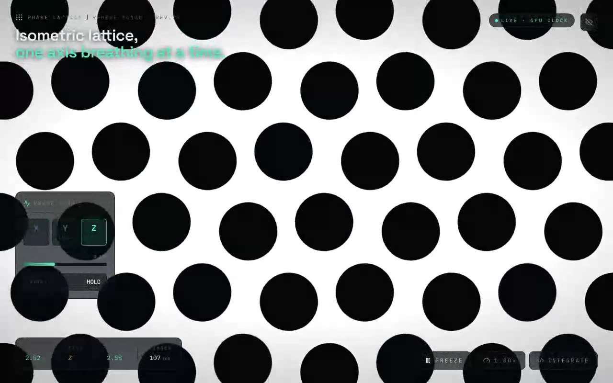

# Moving Circles Shader — Animated Full-Screen GLSL Background (React Three Fiber + Vite + Tailwind CSS)

[](./demo.mp4)

A shadcn/ui integration of a full-screen GLSL fragment shader rendered through React Three Fiber. A fullscreen plane carries a `ShaderMaterial` whose fragment shader animates a field of moving circles driven by `uTime` and `uResolution` uniforms (updated each frame via `useFrame`), with depth test/write disabled so it draws as a flat full-bleed background. Built with React + TypeScript + Vite + Tailwind CSS, using `three` and `@react-three/fiber`. Generated with Claude Fable 5.

## Run

```sh
npm install
npm run dev       # dev server
npm run build     # type-check + production build
npm run preview   # serve the production build
```

See `prompt.md` for the full build spec; `demo.mp4` shows it in motion.

---

Part of the [Shaders](../) collection in the [claude-directory](../../) — an open-source gallery of AI-generated UI built with Claude Fable 5. [Browse the live gallery](https://pulkitxm.com/claude-directory).
