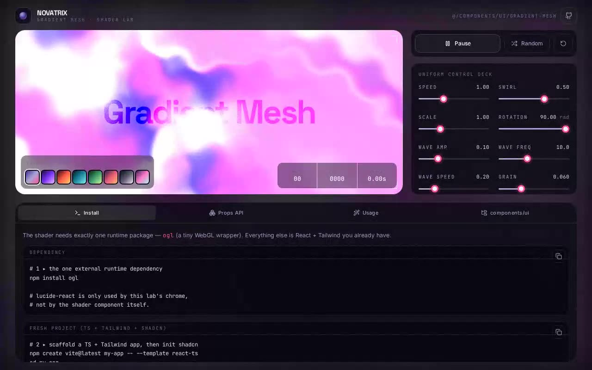

# NOVATRIX — Gradient Mesh Shader Studio (ogl + React + Vite + Tailwind CSS v4)

[](./demo.mp4)

An interactive palette and uniform studio built around the **Novatrix** `ogl` gradient mesh WebGL shader — a water-distorted fractal gradient field rendered on the GPU through three colour stops mixed via a distortion loop, sine/cosine ripples, radial swirl, and colour-dodge film grain. The prompt's `demo.tsx` headline ("Gradient Mesh" in `mix-blend-overlay`) sits verbatim on top of the live field; surrounding monochrome glass chrome keeps the shader as the sole colour source with a uniform control deck, eight curated palettes, a live telemetry HUD, and a tabbed docs dock. Built with React 18 + TypeScript + Vite 5 + Tailwind CSS v4 on a shadcn-style project structure. Generated with Claude Fable 5.

## Stack

- React 18 + TypeScript + Vite 5
- Tailwind CSS **v4** via `@tailwindcss/vite` (+ `tw-animate-css`), tokens in `@theme`
- [`ogl`](https://github.com/oframe/ogl) — the shader's one runtime dependency (WebGL)
- `lucide-react` icons, shadcn-style `cn()` + `@/` alias + `components.json`
- Self-hosted Space Grotesk / Inter / JetBrains Mono (latin woff2, vendored locally)

## Project layout (the integration target)

```
src/
  components/ui/gradient-mesh.tsx   ← the prompt's component (verbatim shader + lifecycle)
  components/ui/demo.tsx            ← the prompt's demo, verbatim
  components/Slider.tsx             ← the fader used by the control deck
  components/TelemetryHud.tsx       ← independent rAF FPS/frame/clock readout
  components/DocsDock.tsx           ← Install / Props / Usage / components-ui tabs
  components/CodeBlock.tsx          ← copy-to-clipboard code surface
  components/palettes.ts            ← the eight 3-stop palettes
  lib/utils.ts                      ← shadcn cn() helper
  index.css                         ← Tailwind v4 + design tokens + slider styling
  App.tsx                           ← the NOVATRIX studio surface
```

## Integrating the component (answering the prompt)

This repo already supports the three requirements, so no scaffolding was needed:

- **shadcn structure** — `components.json` + the `@/` alias resolve `@/components/ui/*`.
- **Tailwind** — Tailwind v4 is wired through the Vite plugin; `src/index.css` opens
  with `@import "tailwindcss"`.
- **TypeScript** — strict TS throughout; `npm run build` runs `tsc` first.

If a target repo did **not** have these, you would bootstrap them first:

```bash
npm create vite@latest my-app -- --template react-ts   # TypeScript
npm install -D tailwindcss @tailwindcss/vite            # Tailwind v4
npx shadcn@latest init                                  # components.json + @/ alias
npm install ogl                                         # the shader dependency
```

**Why `components/ui`?** shadcn treats `components/ui/` as the home for the primitive,
copy-in components you own and edit (app-specific composition lives in `components/`).
It is also the exact path `components.json`'s `"ui"` alias resolves to — so the
`import { GradientMesh } from "@/components/ui/gradient-mesh"` line in the prompt's
`demo.tsx` resolves with **zero edits**, the shadcn CLI can update the file in place,
and the shader sits beside the rest of your owned primitives. Drop it anywhere else and
that import path breaks.

Answers to the prompt's integration questions:

- **Props/data** — none are required (it self-renders with sensible defaults). The full
  surface is `colors`, `distortion`, `swirl`, `speed`, `scale`, `offsetX`, `offsetY`,
  `rotation`, `waveAmp`, `waveFreq`, `waveSpeed`, `grain`. `App.tsx` lifts all of these
  into local state and drives them live; `colors` takes the first three hex stops.
- **State** — local `useState` only; no context or store needed. The component owns its
  own `requestAnimationFrame` loop and GL context, and tears both down on unmount
  (verified clean under React StrictMode's double-mount).
- **Assets** — the prompt mentions filling image assets from Unsplash, but this shader
  renders **entirely on the GPU and uses no images** — so none were added (forcing
  unused stock photos in would be noise). The only vendored assets are the three
  self-hosted fonts. Icons come from `lucide-react`, per the prompt.
- **Responsive** — single non-scrolling viewport at every width; the canvas tracks its
  container size on `resize`; the studio collapses from a two-column plate+rail layout
  to a stacked one on mobile (verified at 390 px — no horizontal scroll).
- **Best placement** — as a full-bleed hero/background behind UI chrome, exactly how the
  prompt's `demo.tsx` (and `App.tsx`) use it.

> Note on the one annotation: the prompt's file imports `React`, which the modern JSX
> transform leaves unused under `noUnusedLocals`. Rather than delete prompt code, the
> only change is a faithful `: React.ReactElement` return-type annotation on the
> `GradientMesh` function — the shader, uniforms and lifecycle are byte-for-byte the
> prompt's.

## Run

```bash
npm install
npm run dev
```

## Verify (CLI only)

```bash
npm install
npm run build
npm run preview &   # serves dist on :4173
npm run verify      # headless Playwright: GLSL paint (colourful, non-black),
                    # HUD ticks + pause-freeze, palette swap changes the field,
                    # docs tabs, reset, no-scroll, vendored fonts, desktop + mobile
```

All 20 checks pass.

---

Part of the [Shaders](../) collection in the [claude-directory](../../) — an open-source gallery of AI-generated UI built with Claude Fable 5. [Browse the live gallery](https://pulkitxm.com/claude-directory).
