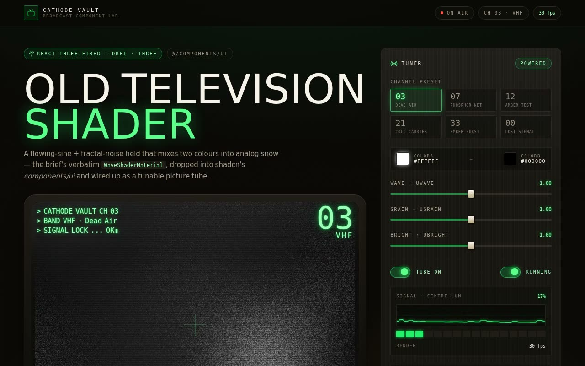

# Old Television Shader — Analog CRT Static GLSL Background (React Three Fiber + drei + Vite + Tailwind CSS)

[](./demo.mp4)

A React Three Fiber fragment shader where flowing sines and a 4-octave fractal noise (FBM) mix two colours into rolling analog snow on a drei `shaderMaterial` quad, wrapped in a **Cathode Vault** broadcast showcase. The shader is the live picture tube of a vintage CRT cabinet; scanline/shadow-mask/vignette glass, a self-typing on-screen channel readout, six tunable channel presets, faders, toggles, and a phosphor signal meter compose a calm broadcast control desk. Built with React + TypeScript + Vite + Tailwind CSS on a shadcn project structure. Generated with Claude Fable 5.

> The component file is named `old-television-shader.tsx`, and the inline
> comments mislabel its colours "orange / pink" — but the actual uniforms are
> `#ffffff → #000000`. Mixed through flowing noise under a film-grain overlay,
> that is exactly old-TV static, so the whole experiment leans into the CRT.

Built with **React + TypeScript + Vite + Tailwind CSS** following the **shadcn**
project structure, exactly as the brief requires. The brief's original
`PolishedShader` default export is preserved as a drop-in; a named
`OldTelevisionShader` export adds the typed, controllable props.

```bash
npm install
npm run dev      # http://localhost:5173
npm run build    # tsc -b && vite build
```

## Design notes

- **Subject:** an imaginary broadcast monitor ("Cathode Vault · Model OT-23").
  The shader *is* the hero — no stock photography needed.
- **Type:** Anton (heavy condensed display, the broadcast wordmark + section
  slates), VT323 (pixel CRT face, the on-screen channel readout), Space Grotesk
  (UI body), IBM Plex Mono (telemetry / code). All four are **vendored locally**
  (latin woff2 in `src/fonts/`) so the project runs fully offline.
- **Signature element:** the `SignalMeter` maps the tube's true centre-pixel
  luminance — read straight off the GPU via `gl.readPixels` in the shader's
  `onSample` callback — to a rolling waveform trace and a 16-segment VU
  bargraph. Nothing is faked; the meter breathes with the picture.
- **Live controls:** the channel presets and three faders drive the component's
  props; `uWave` / `uGrain` / `uBright` promote the shader's previously
  hard-coded constants to live uniforms, and a power switch replays a CRT
  degauss flash (kept as an overlay so it can never resize the WebGL canvas).
- **Palette:** a warm `cabinet` plastic, a `phosphor` green ramp, and `signal`
  amber / red / cyan accents.
- Respects `prefers-reduced-motion`; keyboard focus is visible on all controls.

---

# Integration guide (answering the brief)

The brief is a shadcn-style "integrate this component" task. Here are the answers
it asks for — the live app reproduces all of this below the fold.

## 1. Project prerequisites (shadcn + Tailwind + TypeScript)

This project already ships the required stack. To drop the component into a
**fresh** app instead, set the stack up first:

```bash
# Vite + React + TypeScript
npm create vite@latest cathode-vault -- --template react-ts
cd cathode-vault

# Tailwind CSS
npm install -D tailwindcss postcss autoprefixer
npx tailwindcss init -p

# shadcn (creates components.json, the @/* alias, and lib/utils.ts)
npx shadcn@latest init      # TypeScript · CSS variables · neutral base
```

Make sure your `tsconfig.json` and bundler resolve the `@/*` alias to `src/*`
(see `tsconfig.json` + `vite.config.ts` here for the exact wiring) — the
component imports `cn` from `@/lib/utils`.

## 2. Why `/components/ui`

The brief asks the component be placed in `/components/ui`. That folder is the
shadcn convention for **primitive, reusable UI building blocks**, resolved by
the `ui` alias in `components.json`. Keeping the shader there means:

- the `@/components/ui/old-television-shader` import path stays stable, so the
  shadcn CLI and any other component can reference it the same way (it matches
  the brief's `demo.tsx` import verbatim);
- the shadcn CLI can update sibling primitives without touching app code;
- design-system primitives stay cleanly separated from feature/page code, which
  keeps the dependency direction clean (pages import UI, never the reverse).

If your default components path is **not** `/components/ui`, create it (or
repoint the `ui` alias) before pasting the file. Here the resolved paths are:
components → `src/components`, ui → `src/components/ui`, utils →
`src/lib/utils`, styles → `src/index.css`.

## 3. Dependencies

The shader is built on **react-three-fiber**, a **drei** `shaderMaterial`, and
**three**:

```bash
npm install three @react-three/fiber @react-three/drei
npm install -D @types/three   # TypeScript types
```

No other runtime context, store, or provider is required. `lucide-react` is used
by the surrounding showcase for icons, per the brief's guideline; the shader
itself does not require it.

## 4. Component contract — props & state

The brief's component hard-coded its look and used untyped refs plus a
`useMemo`-wrapped event listener that never actually ran its cleanup. It has been
ported to a typed, **controllable** primitive — the shader math and the original
resting behaviour are preserved as the defaults (`#ffffff → #000000`, all
intensities `1`), while the cabinet drives the props:

| Prop              | Type                          | Default     | Purpose |
|-------------------|-------------------------------|-------------|---------|
| `colorA`          | `string`                      | `"#ffffff"` | Bright phosphor the snow mixes toward (`uColorA`). |
| `colorB`          | `string`                      | `"#000000"` | Dark colour between scanlines (`uColorB`). |
| `waveIntensity`   | `number`                      | `1`         | Rolling-picture displacement amplitude (`uWave`). |
| `grainIntensity`  | `number`                      | `1`         | Procedural snow / static strength (`uGrain`). |
| `brightnessPulse` | `number`                      | `1`         | Slow brightness-breathing depth (`uBright`). |
| `mouseInfluence`  | `number` (0–1)                | `0.05`      | Cursor → `uMouse` lerp factor (the original wiring). |
| `paused`          | `boolean`                     | `false`     | Freeze the animation clock on a held frame. |
| `onSample`        | `(lum: number) => void`       | —           | Per-frame centre-pixel luminance (0–1), read off the GPU. |
| `sampleEveryMs`   | `number`                      | `120`       | Throttle for `onSample`, in ms. |
| `className`       | `string`                      | —           | Extra classes on the canvas container. |

State is internal: the animation clock, mouse position, and pixel buffer live in
the component's refs, and `useFrame` reads the latest prop values without
rebuilding the WebGL context. No context providers or external state libraries
are needed — the host just holds prop state with `useState` (this demo uses a
channel-preset object).

## 5. Assets

None required by the component — it draws procedurally, so there are **no
images** to fill in. (The brief's "fill image assets with Unsplash" step does not
apply: a generated static field needs no photography, and vendoring fonts keeps
the project self-contained. Icons come from `lucide-react`, per the guideline.)

## 6. Responsive behaviour

The R3F canvas fills its container at any size and tracks `window` resolution via
the `uResolution` uniform. The CRT tube holds a 4:3 face; the surrounding chrome
reflows from a two-column desk to a single column on small screens, and the
broadcast-bar chips and footer collapse below their breakpoints.

## 7. Where to use it

It's an ambient **full-page background** for a hero or login screen, a "dead-air"
**404 / maintenance** page, or — as here — the live surface of a media /
broadcast product. The brief's `PolishedShader` default export mounts it
full-screen with zero props; layer your real content above at a higher
`z-index`. For a tunable instance, use the named `OldTelevisionShader` export.

## Files

```
src/
  components/
    ui/
      old-television-shader.tsx   # the integrated component (the brief's payload)
      button.tsx · badge.tsx      # small shadcn primitives
    crt-screen.tsx                # the CRT cabinet that frames the live tube
    signal-meter.tsx              # signature live GPU readout (waveform + VU)
    broadcast-controls.tsx        # faders / toggles / colour chips
    code-block.tsx · api-table.tsx
  hooks/use-typewriter.ts         # on-screen channel readout typing
  lib/utils.ts                    # shadcn cn() helper
  lib/channels.ts                 # channel presets (live prop bundles)
  demo.tsx                        # DemoOne — the integration in use
  App.tsx · main.tsx · index.css
  fonts/                          # vendored woff2 (offline)
```

---

Part of the [Shaders](../) collection in the [claude-directory](../../) — an open-source gallery of AI-generated UI built with Claude Fable 5. [Browse the live gallery](https://pulkitxm.com/claude-directory).
