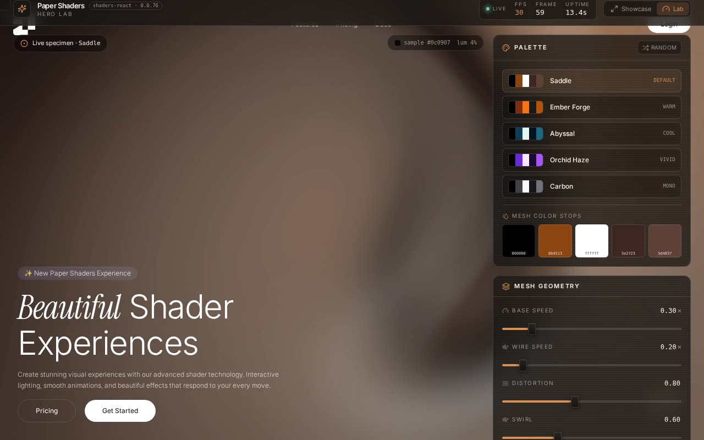

# Paper Shaders Hero Lab — Interactive Mesh Gradient Shader Hero with Control Deck (React + Vite + Tailwind CSS + @paper-design/shaders-react)

[](./demo.mp4)

A full-bleed, above-the-fold landing hero that frames the 21st.dev "Beautiful Shader Experiences" component — two stacked `@paper-design/shaders-react` `MeshGradient` layers, a rainbow `PulsingBorder` ring, and an orbiting marquee — as a dark instrument console. A tabbed Lab view exposes live GLSL controls (colour stops, base/wire speed, distortion, swirl, wire opacity, wireframe, pulse speed, glow) and documents the props API, install snippet, and responsive behaviour in real time. The hero is GPU-procedural: no images, no external network calls, fully offline. Generated with Claude Fable 5.

## The integration questions, answered

The prompt asks five questions before integrating. Here are the answers this
build is based on:

- **What data / props does the component take?** The drop-in takes *no* props —
  every value (the two 5-/4-stop colour arrays, `speed`, `distortion`, the
  rainbow `PulsingBorder` palette, the orbital text) is baked in. `ShaderBackground`
  takes a single `children` slot. To make any of it tunable, this project adds a
  **parameterised sibling**, `shaders-hero-lab.tsx`, that promotes those constants
  to a `config` / `pulse` props object (every default equals the verbatim value,
  so it boots pixel-identical). See the **Props API** dock tab.
- **State management?** None external — the component is self-contained. It uses
  local `useState`/`useRef`/`useEffect` only (an `isActive` hover flag and the
  shader canvases). No context, store, or provider is required. The lab shell adds
  its own local React state for the controls; nothing global.
- **Required assets?** None shipped with the component — the visuals are 100 %
  GPU-procedural, so there are **no images**. The only assets are typefaces; the
  component uses an `.instrument` display class, which we satisfy with vendored
  **Instrument Serif** (+ **Inter** for the body), both bundled locally (see
  *Assets*). Icons in the lab chrome are `lucide-react`.
- **Expected responsive behaviour?** The hero is a `min-h-screen w-full` stage
  with `absolute inset-0` shader layers that repaint to any viewport; the headline
  scales `text-5xl → md:text-6xl`; the corner `Header` / `HeroContent` /
  `PulsingCircle` stay pinned via `absolute` insets. The lab chrome is the
  responsive part — the deck sits beside the stage on `lg+` and stacks under it on
  mobile; rails wrap with `flex-wrap`. See the **Responsive** dock tab.
- **Best place to use it?** As a full-bleed, above-the-fold **landing/marketing
  hero** — a product launch, a waitlist page, a docs splash. It owns the viewport,
  so it belongs at the top of a route, not inside a card.

## What's wired up (Lab view)

| Control | Drives | Range |
|---------|--------|-------|
| **Palette presets** | the whole base + wire `colors[]` sets and the pulse-ring palette | 5 curated + Random |
| **Mesh color stops** | each base `colors[i]` (native swatch pickers) | live, per-stop |
| **Base Speed** | `config.baseSpeed` — primary mesh time multiplier | `0 – 2×` |
| **Wire Speed** | `config.wireSpeed` — wireframe overlay multiplier | `0 – 2×` |
| **Distortion** | `config.distortion` — organic noise warp | `0 – 2` |
| **Swirl** | `config.swirl` — vortex warp | `0 – 2` |
| **Wire Opacity** | `config.wireOpacity` — opacity of the second mesh layer | `0 – 1` |
| **Wireframe** | `config.wireframe` — mount the overlay layer at all | toggle |
| **Pulse Speed** | `pulse.speed` — `PulsingBorder` animation speed | `0 – 4×` |
| **Glow Intensity** | `pulse.intensity` — `PulsingBorder` glow | `0 – 10` |

A live telemetry strip across the top reads real **FPS · frame · uptime** off
`requestAnimationFrame`; a stage chip reads the **mean colour sampled straight off
the live shader canvas** (the "the readout is driven by the shader itself" loop);
the verbatim CTA buttons increment an on-stage **CTA fired ×N** counter; and the
**Usage** tab emits a ready-to-paste call that reflects the current deck.

## A note on the component API (and why the verbatim file isn't edited)

The drop-in targets a newer `@paper-design/shaders-react` than the pinned
**`0.0.76`**, so three of its props are **accepted but not consumed** at this
version and leak onto the host `<div>`:

- `<MeshGradient backgroundColor … wireframe="true">` — neither is read at 0.0.76,
- `<PulsingBorder spotsPerColor={5}>` — the consumed prop is `spots`.

Two deliberate choices keep the project both faithful **and** console-clean:

1. **The verbatim file stays byte-for-byte** as the prompt supplied it (the literal
   copy-paste artifact). The three unknown props are typed via a small module
   augmentation in `src/types/paper-shaders.d.ts` so the drop-in compiles under
   `strict` **without editing it**.
2. **The live plate renders the parameterised sibling** (`shaders-hero-lab.tsx`),
   which re-exports the verbatim `Header` / `HeroContent` and reuses the same
   shader setup, but omits the two no-op `MeshGradient` props and uses `spots`
   instead of `spotsPerColor` — so the running app logs **zero** console warnings
   (asserted by `npm run verify`).

The only non-cosmetic touch on the verbatim file is `data-active={isActive}` on its
root `<div>` — the original tracks an `isActive` hover flag through `mouseenter` /
`mouseleave` handlers but never consumes it; reflecting it onto the DOM completes
the component's own intent and satisfies `noUnusedLocals` without changing render.

## shadcn / Tailwind / TypeScript setup

This is a fresh **Vite + React + TypeScript** project, set up to match the shadcn
structure the prompt asks for. To reproduce that scaffold from scratch:

```bash
# 1. Vite + React + TypeScript
npm create vite@latest my-app -- --template react-ts
cd my-app

# 2. Tailwind CSS v4 (Vite plugin)
npm i tailwindcss @tailwindcss/vite
#    add `@import "tailwindcss";` to your global stylesheet
#    add the tailwindcss() plugin to vite.config.ts

# 3. shadcn-style structure + the @/ alias
npx shadcn@latest init        # writes components.json and the @/* path alias

# 4. the component's runtime deps
npm i @paper-design/shaders-react framer-motion lucide-react
```

### Why `/components/ui`

shadcn/ui doesn't ship a runtime package — its CLI **copies source into your
repo**, and the convention is `@/components/ui`, resolved through a `@/*` path
alias declared in both `tsconfig` (`paths`) and `vite.config.ts`
(`resolve.alias`). Putting the component there means:

- `npx shadcn@latest add …` drops new primitives in the same predictable place;
- the import `@/components/ui/shaders-hero-section` resolves no matter how deeply
  nested the importing file is — no `../../../` chains;
- owned UI primitives stay separate from app/feature components — easy to find,
  easy to theme and audit.

This project mirrors that exactly: the alias lives in `tsconfig.app.json` +
`vite.config.ts`, the verbatim component lives at
`src/components/ui/shaders-hero-section.tsx`, and its parameterised sibling at
`src/components/ui/shaders-hero-lab.tsx`.

## Stack

React 19, TypeScript, Vite 7, Tailwind CSS v4, `@paper-design/shaders-react`,
`framer-motion`, `lucide-react`.

## Design

| Token | Value |
|-------|-------|
| Carbon console | `#0c0a09` / raised `#1a1714` |
| Hairline | `#ffffff1f` |
| Warm ember signal (echoes the hero's saddle-brown) | `#d99054` / deep `#a8632e` |
| Cool accent (live dot) | `#6fcfba` |
| Near-white ink | `#f5f1ea` |
| Display type | Instrument Serif (vendored) |
| UI / body type | Inter Variable (vendored) |

A dark instrument console that defers to the near-black shader plate it frames.
Signature: the live hero seated in a registration-bracketed plate with an inner
vignette and a faint drifting scanline, a pulsing live tally, a colour chip
sampled off the shader itself, and a travelling ember signal-sweep on the bottom
bus.

## Assets

- **Fonts.** The component's `.instrument` class wants a display serif; we vendor
  **Instrument Serif** (SIL OFL) for it and **Inter** (SIL OFL) for the body, both
  as subsetted `.woff2` under `assets/fonts/` and registered at runtime via the
  JS FontFace API in `main.tsx` — **no remote font calls**, fully offline. See
  `assets/fonts/OFL.txt`.
- **Icons.** `lucide-react` (no remote SVGs). The verbatim `Header` keeps its
  original inline 21st-logo SVG, exactly as shipped.
- **Images.** **None** — the hero is GPU-procedural, so the project is fully
  self-contained and runs offline. (The prompt mentions Unsplash stock images as a
  fallback "if the component requires them"; this one doesn't.)

## Run

```bash
npm install
npm run dev       # dev server
npm run build     # type-check (tsc -b) + production build
npm run preview   # serve the production build
npm run verify    # headless Playwright checks (boots its own dev server)
```

`npm run verify` boots a dev server, drives a headless Chromium with software
WebGL, and asserts: the header and the verbatim hero copy render, the hero
wordmark uses the vendored Instrument Serif face, all **three** shader canvases
(2 × `MeshGradient` + `PulsingBorder`) mount with live WebGL contexts, the Lab
view reveals the deck, a palette preset re-tints the live shader (canvas pixels
change), the Base Speed fader sweeps `0.00 → 2.00`, the wireframe toggle flips,
the docs dock renders the Props API table, and **no page or console errors fire**.

---

Part of the [Shaders](../) collection in the [claude-directory](../../) — an open-source gallery of AI-generated UI built with Claude Fable 5. [Browse the live gallery](https://pulkitxm.com/claude-directory).
