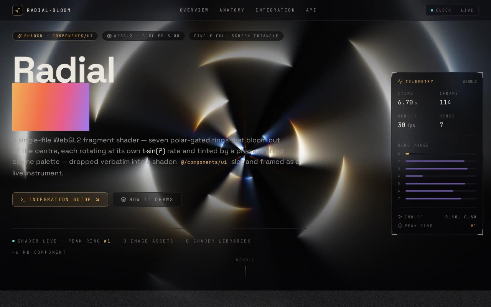

# Radial Shader — Full-Screen WebGL2 Rotating Burst Fragment Shader (React + TypeScript + Vite + Tailwind CSS)

[](./demo.mp4)

A shadcn/ui integration of a full-screen WebGL2 fragment shader rendered on a fullscreen triangle. The Shadertoy-style GLSL shader builds a radial, rotating burst: it works in polar coordinates (`atan(p.y, p.x)`) and accumulates colour across a short loop, gating each spoke with a time- and angle-driven `smoothstep`/`cos` term so the pattern spins and pulses. Standard `iResolution` / `iTime` / `iFrame` / `iMouse` uniforms drive the animation. The runtime is a self-contained React canvas component with WebGL context-loss handling and DPR-aware sizing, with no Three.js dependency. Generated with Claude Fable 5.

## Run

```sh
npm install
npm run dev        # dev server
npm run build      # type-check + production build
npm run preview    # serve the production build
npm run typecheck  # tsc -b --noEmit
```

See `prompt.md` for the full build spec; `demo.mp4` shows it in motion.

---

Part of the [Shaders](../) collection in the [claude-directory](../../) — an open-source gallery of AI-generated UI built with Claude Fable 5. [Browse the live gallery](https://pulkitxm.com/claude-directory).
