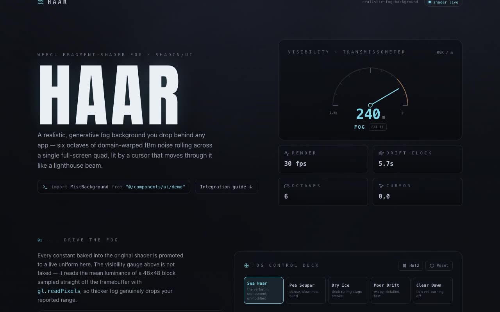

# HAAR — Realistic Fog Background — WebGL GLSL fBm Sea Fog Instrument (React + Vite + Tailwind CSS v4)

[](./demo.mp4)

A shadcn-style integration of a WebGL GLSL realistic fog background component — six octaves of domain-warped fBm noise on a single full-screen quad, with a cursor "lighthouse beam" glow — framed as a sea-fog observation instrument named HAAR (after the cold North Sea haar fog). A visibility gauge driven by actual mean shader luminance sampled live from the framebuffer reports runway visual range in metres; the cursor beam sweeps the needle toward the amber hazard end as it lights the fog. A control deck promotes shader constants to faders and ships five patch presets spanning MIST through THICK FOG. Fully procedural — no image assets. Generated with Claude Fable 5.

> *haar* — the cold sea fog that rolls in off the North Sea.

## What's here

- **`src/components/ui/demo.tsx`** — the verbatim `MistBackground`, untouched. Mount it and
  the fog runs, fixed and full-viewport at `z-[-1]`, with zero runtime dependencies.
- **`src/components/ui/realistic-fog-background.tsx`** — the verbatim `Component` example from
  the brief.
- **`src/components/ui/mist-field.tsx`** — a parameterized variant of the same shader: every
  baked constant (density, drift, octaves, warp, accent, beam, exposure) is promoted to a live
  uniform, and the render loop reads a 48×48 centre block back with `gl.readPixels` for telemetry.

## The signature

A **visibility gauge** — a transmissometer dial reading runway visual range in metres. It is
driven by the *actual* mean luminance the shader paints, sampled straight off the framebuffer,
so thicker fog genuinely drops the reported range and the cursor beam sweeps the needle toward
the dense (amber hazard) end as it lights the fog up close.

The control deck promotes the shader's constants to faders and ships a five-patch bank — **Sea
Haar** (the verbatim default), **Pea Souper**, **Dry Ice**, **Moor Drift**, **Clear Dawn** — that
spans the gauge from MIST through FOG to THICK FOG.

## Stack

React · TypeScript · Vite · Tailwind CSS v4 · shadcn/ui structure · WebGL · GLSL fBm · Lucide.
Fonts (Anton, Inter, Space Mono) are vendored locally in `public/fonts`. The fog is fully
procedural — no image assets.

## Run

```bash
npm install
npm run dev      # http://localhost:5173
npm run build    # tsc -b && vite build
npm run verify   # headless Playwright checks (needs a running dev server on $URL)
```

---

Part of the [Shaders](../) collection in the [claude-directory](../../) — an open-source gallery of AI-generated UI built with Claude Fable 5. [Browse the live gallery](https://pulkitxm.com/claude-directory).
