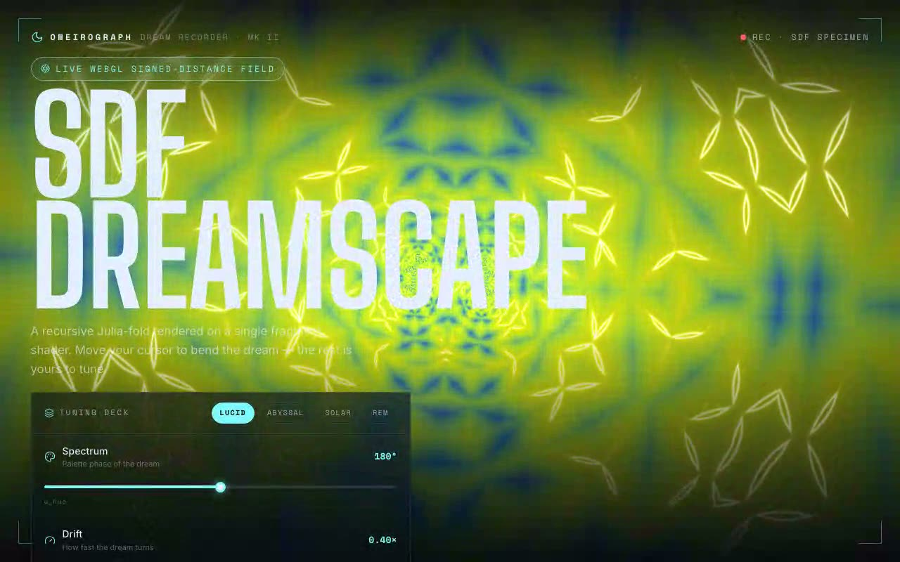

# SDF Dreamscape — WebGL Fractal Signed-Distance-Field Shader Hero (React + Vite + Tailwind CSS v4 + WebGL)

[](./demo.mp4)

A full-viewport WebGL fractal signed-distance-field (SDF) shader — a recursive Julia-fold ringed by a glowing palette and bent in real time by the cursor — rendered on a single GLSL fragment shader and framed as the Oneirograph dream-recorder console. The shader component is integrated at the shadcn `@/components/ui/sdf-dreamscape` location as a reusable `ShaderCanvas`/`useShaderAnimation` primitive plus the original self-contained `ShaderComponent`. The chrome includes a hero lockup, corner bracket registration frame, a tuning deck with four controls (Spectrum/Drift/Recursion/Lens), four dream-state presets, and a live telemetry strip reading frame rate through an `onFps` callback. No Three.js — native WebGL only. Generated with Claude Fable 5.

## Stack

React 18, TypeScript, Vite 6, Tailwind CSS v4 (`@tailwindcss/vite`),
`lucide-react`, native WebGL (no 3D library). shadcn-style `@/*` path alias →
`./src`.

## Assets

Fully self-contained / offline-ready. The Big Shoulders Display, Inter and Space
Mono web fonts (latin subset) are vendored locally to `public/fonts/` and
referenced via `src/fonts.css` — no remote Google Fonts requests at runtime. The
visual is generated entirely on the GPU, so there are no image assets.

## Run

```bash
npm install
npm run dev       # dev server
npm run build     # type-check + production build
npm run preview   # serve the production build on :4173
npm run verify    # headless Playwright checks against the preview server
```

## Integration notes (per the prompt)

- **Project structure** — this is a Vite + React + TypeScript app with Tailwind
  CSS v4 and the shadcn `@/components/ui` convention already wired up (the `@`
  alias is configured in both `vite.config.ts` and `tsconfig.json`). If you are
  dropping the component into your own app instead, scaffold with the shadcn CLI
  (`npx shadcn@latest init`), which sets up Tailwind, TypeScript and the
  `components.json` alias map for you.
- **Why `/components/ui`** — shadcn treats `components/ui` as the home for
  primitive, copy-in UI building blocks resolved through the `@/components/ui`
  alias. Keeping the shader there means the import in the brief
  (`@/components/ui/sdf-dreamscape`) resolves unchanged and the component sits
  alongside the rest of your design-system primitives.
- **Dependencies** — the component itself needs nothing beyond React (it talks to
  the native WebGL API directly); `lucide-react` is used by the surrounding
  console for icons.
- **Props / state** — the original widget was fully self-contained with internal
  `useState` for the four params. `ShaderCanvas` exposes those same four values
  as props plus an additive `className` and `onFps` callback, all defaulting to
  the brief's behavior, so the host can wrap its own UI around the live canvas.
- **Images** — none. The procedural shader is the entire visual, so no Unsplash
  stock imagery is needed.

---

Part of the [Shaders](../) collection in the [claude-directory](../../) — an open-source gallery of AI-generated UI built with Claude Fable 5. [Browse the live gallery](https://pulkitxm.com/claude-directory).
