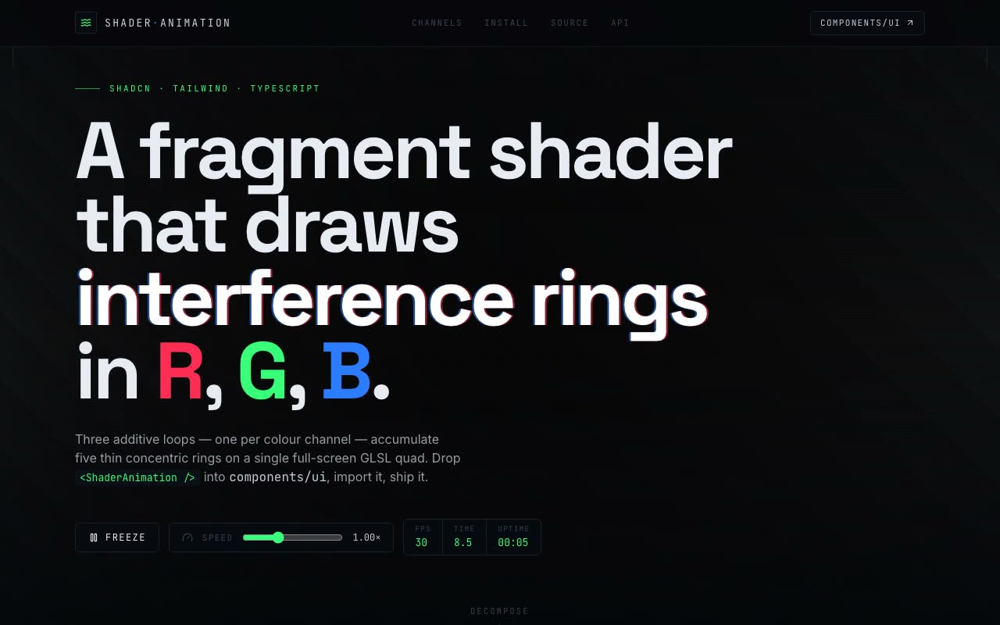

# Shader Flow Field Rings — Three.js Additive RGB Interference Ring Showcase (React + Vite + Tailwind CSS + Three.js)

[](./demo.mp4)

A full-viewport signal/oscilloscope laboratory showcasing the `ShaderAnimation` Three.js component — a GLSL fragment shader drawing additive R/G/B interference rings on a single full-screen quad: three loops (one per colour channel), each accumulating five thin concentric rings whose radii drift over time, summing to white at the centre bloom. The page's palette is pulled directly from the shader's own three channels — vermilion `#FF2D55` (R), phosphor-green `#39FF7A` (G), signal-blue `#2D7BFF` (B) — over phosphor-black instrument panels. The signature element is a live channel decomposition that draws each colour accumulator as its own rolling sparkline sampled from the running shader. Integrated as a shadcn `@/components/ui` drop-in with TypeScript. Generated with Claude Fable 5.

## Design

**A signal/oscilloscope laboratory.** Instead of the default "dark page, one accent," the
palette is pulled straight from the shader's own three channels — vermilion `#FF2D55` (R),
phosphor-green `#39FF7A` (G), signal-blue `#2D7BFF` (B) — over phosphor-black instrument
panels. Type pairs `Space Grotesk` (display), `Inter` (body), and `JetBrains Mono` (the
technical/telemetry register).

The **signature element** is the live **channel decomposition** (`#lab`): the shader is
literally three shaders stacked in one pass, so the page draws each `color[j]` accumulator
as its own rolling sparkline and numeric readout, sampled live from the running quad. The
RGB structure of the shader becomes the organizing metaphor for the whole page.

## What was built on top of the drop-in

The component in `components/ui/shader-animation.tsx` is the prompt's component, faithful
to its vertex/fragment shaders and its `time += 0.05` loop. It adds **optional** props that
leave the default visual identical:

- `speed` — scales the per-frame time step (1 = canonical look)
- `paused` — freezes the loop, keeping the last frame on screen
- `onFrame(frame)` — per-frame telemetry (`time`, `fps`, `uptime`, per-channel intensity)
- `className` / `style` — so it can embed in a card, not just full-bleed

It also resizes against its container (via `ResizeObserver`) instead of only the window,
caps the pixel ratio at 2, and cleans up its WebGL context on unmount.

## Stack

- React 18, TypeScript (strict), Vite 5
- Tailwind CSS 3 (+ `cn` helper, shadcn-style `@/` alias, `components.json`)
- Three.js (`three` + `@types/three`) — the only runtime dependency
- `lucide-react` for icons
- Fonts vendored locally (`public/fonts/*.woff2`) — runs fully offline

## Structure (shadcn convention)

```
src/
  components/
    ui/
      shader-animation.tsx   # the reusable drop-in component (the prompt's component)
    channel-scope.tsx        # live RGB channel decomposition (signature element)
    code-block.tsx           # copy-to-clipboard source surface
  lib/
    utils.ts                 # cn() — clsx + tailwind-merge
  demo.tsx                   # the prompt's DemoOne, wired into the showcase
  source-snippets.ts         # verbatim copyable source/install strings
  App.tsx                    # the showcase page
  main.tsx
  index.css                  # Tailwind + instrument chrome
public/fonts/                # vendored Space Grotesk / Inter / JetBrains Mono
components.json              # shadcn config (aliases ui -> @/components/ui)
```

The component lives in `@/components/ui` — the folder shadcn's `components.json` aliases to
`ui` — so `import { ShaderAnimation } from "@/components/ui/shader-animation"` resolves
exactly as the demo writes it, with no path rewrites.

## Run

```bash
npm install
npm run dev        # http://localhost:5173
npm run build      # tsc -b && vite build (strict type-check + production build)
npm run verify     # headless Playwright checks (see below)
```

## Verification

`npm run verify` builds the app, serves `vite preview`, and drives headless Chromium to
assert: the WebGL canvas is present and painting a non-black ring field that blooms toward
the centre; live telemetry advances; the channel scope streams three numeric readouts;
freeze halts the loop and resume restarts it; the install / `components/ui` / source / API
sections all render; and there are zero console or page errors.

## Setting it up from scratch (shadcn CLI)

If you're starting cold rather than dropping into an existing app:

```bash
# 1. A Vite + React + TypeScript app
npm create vite@latest my-app -- --template react-ts && cd my-app

# 2. Tailwind
npm install -D tailwindcss postcss autoprefixer && npx tailwindcss init -p

# 3. shadcn (sets up components.json, the @/ alias, and components/ui)
npx shadcn@latest init

# 4. The component's only runtime dependency
npm install three && npm install -D @types/three

# 5. Drop the file into the path shadcn manages
#    -> src/components/ui/shader-animation.tsx
```

---

Part of the [Shaders](../) collection in the [claude-directory](../../) — an open-source gallery of AI-generated UI built with Claude Fable 5. [Browse the live gallery](https://pulkitxm.com/claude-directory).
