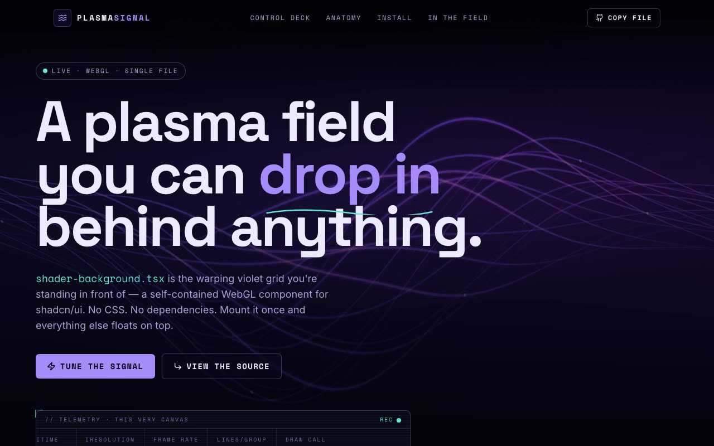

# PlasmaSignal — WebGL Plasma-Grid Background Shader Component for shadcn (React + TypeScript + Raw WebGL)

[](./demo.mp4)

A shadcn-structured Vite + TypeScript + Tailwind showcase for `shader-background.tsx`, a drop-in raw WebGL plasma-grid background component. The warping violet field is a single GLSL fragment shader (~90 lines, one draw call): animated grid lines with sinusoidal warp, flowing plasma curves, and orbiting highlight circles. The project frames it as a "Signal Lab" — a live oscilloscope HUD pulls real `iTime`, FPS, and `iResolution` from the running WebGL context, and a control deck of faders promotes the shader's baked-in constants to live uniforms so you can re-tint and re-shape the field in real time. Generated with Claude Fable 5.

## What's in `components/ui`

| File | Role |
|------|------|
| `shader-background.tsx` | The brief's component, verbatim, ported to TypeScript. Fixed, full-screen, `-z-10`, no props, no deps. |
| `shader-background.demo.tsx` | The brief's `demo.tsx` — one usecase export (`DemoOne`). |
| `shader-background-pro.tsx` | Parametric build used by the live demo: the constants become uniforms and it streams telemetry back. |

## Run it

```bash
npm install
npm run dev      # http://localhost:5173
npm run build    # type-check + production build
npm run verify   # headless Playwright check (build → preview → assert)
```

## Stack

React 18, TypeScript, Vite, Tailwind CSS, shadcn/ui structure (`@/components/ui`,
`@/lib/utils`), Lucide icons, raw WebGL. Fonts (Space Grotesk / Space Mono / Inter) and
all imagery (Unsplash) are vendored locally under `public/fonts` and `assets/` — the
project runs fully offline.

---

Part of the [Shaders](../) collection in the [claude-directory](../../) — an open-source gallery of AI-generated UI built with Claude Fable 5. [Browse the live gallery](https://pulkitxm.com/claude-directory).
