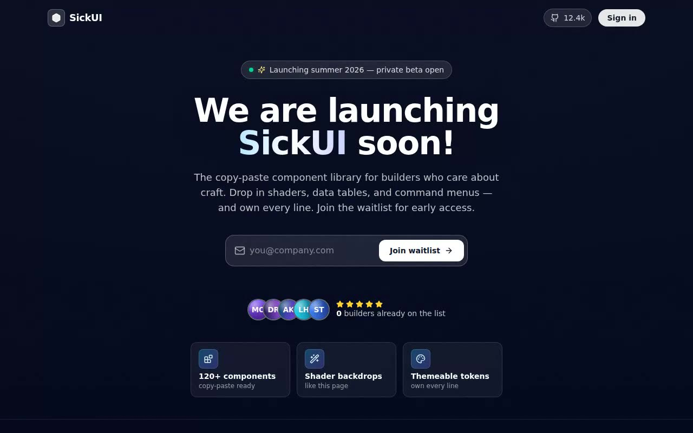

# SickUI Waitlist — Mesh-Gradient Shader Launch Page (React 19 + @paper-design/shaders-react + Tailwind CSS v4)

[](./demo.mp4)

A shadcn-style waitlist launch page whose backdrop is a flowing `@paper-design/shaders-react` `MeshGradient` in deep editorial blues. The verbatim `background-shader.tsx` component is copied into `src/components/ui/` and the bare launch headline is grown into a real product launch page: a frosted-glass email-capture card with validation and success state, animated social proof, a "what's shipping" feature grid, plus nav and footer — all sitting on the same living mesh-gradient shader. Built with React 19, TypeScript, Vite 7, and Tailwind CSS v4 in a shadcn-structured project. Generated with Claude Fable 5.

## The integration, exactly as asked

The prompt was a shadcn component-integration task. Here's how each instruction
was met:

| Prompt instruction | What this project does |
|---|---|
| Support shadcn structure, Tailwind, TypeScript | Fresh **Vite + React 19 + TS** app, Tailwind v4, the `@/*` alias in `tsconfig` + `vite.config.ts` — the shadcn scaffold. |
| Copy the component into `/components/ui` | `src/components/ui/background-shader.tsx` and `src/components/ui/demo.tsx` are the prompt's code, **byte-for-byte** (the original `font-sansking-tight` typo included). |
| Install `@paper-design/shaders-react` | Pinned at **`0.0.76`**; every prop the component passes (`distortion`, `swirl`, `offsetX/Y`, `scale`, `rotation`, `speed`, `colors`) exists in that version, so it runs unedited. |
| Fill image assets with Unsplash | This sandbox **blocks `images.unsplash.com`** (`host_not_allowed`), so rather than ship a broken hotlink we synthesise polished, deterministic gradient-monogram avatars locally (`scripts/gen-avatars.mjs`) — fully offline. See **Assets**. |
| Use lucide-react for icons | Every glyph (mail, arrow, spinner, stars, feature tiles, social) is `lucide-react`. No remote SVGs. |

### The questions the prompt asks, answered

- **What props/data does the component take?** `MeshGradient` props only —
  `colors[]`, `distortion`, `swirl`, `offsetX/Y`, `scale`, `rotation`, `speed`,
  plus an inline `style`. It holds no internal state. The surrounding waitlist
  owns the only real state: the email field, the submit status
  (`idle → loading → success/error`), and the live signup tally.
- **State management?** Local `useState` + a small `useCountUp` rAF hook. No
  global store or context provider is needed — deliberately dependency-light.
- **Required assets?** A sans typeface (vendored **Onest**, mapped to Tailwind's
  `font-sans` the component uses) and the social-proof avatars (vendored SVGs).
- **Responsive behaviour?** Mobile-first. The hero, form, social proof, and the
  1→2→3-column feature grid all reflow; verified at 390 px and 1280 px.
- **Best place to use it?** As a full-bleed launch / waitlist landing — the
  shader owns the viewport behind a legibility scrim, with the product copy and
  CTA floating over it.

## shadcn / Tailwind / TypeScript setup

This project is already wired to match the shadcn structure. To reproduce the
scaffold from scratch:

```bash
# 1. Vite + React + TypeScript
npm create vite@latest my-app -- --template react-ts
cd my-app

# 2. Tailwind CSS v4 (Vite plugin)
npm i tailwindcss @tailwindcss/vite
#    add `@import "tailwindcss";` to your global stylesheet
#    add the tailwindcss() plugin to vite.config.ts

# 3. shadcn-style structure + the @/ alias
npx shadcn@latest init        # writes components.json and the @/* path alias

# 4. the component's runtime deps
npm i @paper-design/shaders-react lucide-react
```

### Why the component goes in `/components/ui`

shadcn/ui doesn't ship a runtime package — its CLI **copies source into your
repo**, and the convention is `@/components/ui`, resolved through a `@/*` path
alias declared in both `tsconfig` (`paths`) and `vite.config.ts`
(`resolve.alias`). Putting the component there means:

- `npx shadcn@latest add …` drops new primitives in the same predictable place;
- the import `@/components/ui/background-shader` resolves no matter how deeply
  nested the importing file is;
- owned UI primitives stay separate from app/feature components — easy to find,
  easy to theme.

This project mirrors that exactly: the alias lives in `tsconfig.app.json` +
`vite.config.ts`, the verbatim component sits at
`src/components/ui/background-shader.tsx`, and the page-level feature components
(form, social proof, grid, nav, footer) live one level up in `src/components/`.

## Stack

React 19, TypeScript, Vite 7, Tailwind CSS v4, `@paper-design/shaders-react`,
`lucide-react`.

## Design

| Token | Value |
|-------|-------|
| Canvas / void | `#040a1e` |
| Mesh stops | `hsl(216 90% 27%)` · `hsl(243 68% 36%)` · `hsl(205 91% 64%)` · `hsl(211 61% 57%)` |
| Surfaces | frosted `white/6–12%` glass on a darkened mesh |
| Accent | sky→indigo gradient text + amber rating stars |
| Type | Onest Variable (vendored locally) |

A deep-blue editorial launch page: the verbatim `MeshGradient` churns full-bleed
behind a radial + bottom legibility scrim and a faint CSS film grain, with all UI
rendered as frosted glass so the shader reads through. Signature touches: the
gradient "SickUI" wordmark, a pulsing "private beta open" status pill, an
animated signup tally that eases up on load and bumps when you join, and a
success state that confirms the captured email.

## Assets

- **Font.** The verbatim component uses Tailwind's `font-sans`. We vendor
  **Onest** (SIL OFL, `assets/fonts/Onest-OFL.txt`) under
  `assets/fonts/Onest-Variable.woff2` and register it at runtime as the
  `font-sans` family via the JS FontFace API — **no remote font calls**.
- **Avatars.** The prompt asked for Unsplash stock photos, but this environment
  blocks `images.unsplash.com` at the network egress layer
  (`Host not in allowlist`), so a hotlink would 403 and break offline. Instead,
  `scripts/gen-avatars.mjs` synthesises five deterministic gradient-monogram
  avatars as self-contained SVGs (`assets/avatars/*.svg`) — the same idiom as
  Linear/Vercel placeholder faces. **This is the one place the literal "Unsplash"
  instruction is substituted, for the offline/self-contained requirement.**
- **Icons.** `lucide-react` (no remote SVGs).
- **Everything is local** — the project clones and runs fully offline.

## Run

```bash
npm install
npm run dev       # dev server
npm run build     # type-check (tsc -b) + production build
npm run preview   # serve the production build
npm run verify    # headless Playwright checks (boots its own dev server)
node scripts/gen-avatars.mjs   # regenerate the vendored avatar SVGs
```

`npm run verify` boots a dev server, drives a headless Chromium with software
WebGL, and asserts: the nav and the verbatim launch headline render in the
vendored font, the `MeshGradient` canvas mounts with a real WebGL context, all
five vendored avatars load, the waitlist form rejects an invalid email and
accepts a valid one (reaching the success state), the feature grid renders, the
page is scrollable, and no page/console errors fire.

---

Part of the [Shaders](../) collection in the [claude-directory](../../) — an open-source gallery of AI-generated UI built with Claude Fable 5. [Browse the live gallery](https://pulkitxm.com/claude-directory).
