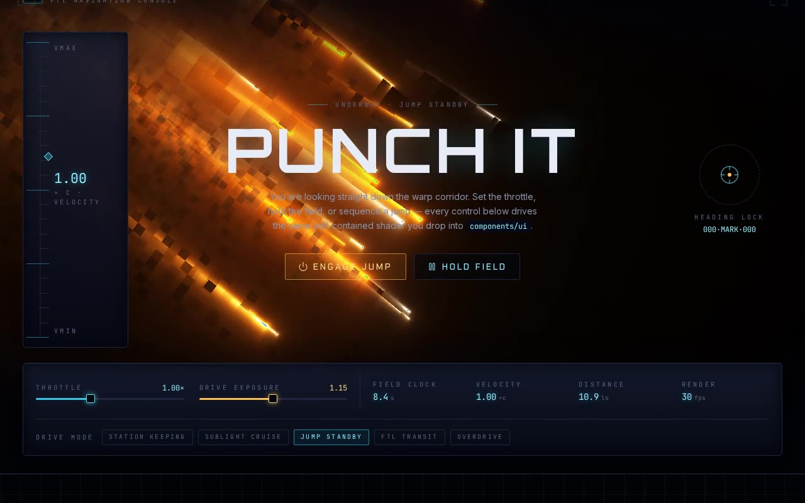

# Starship Shader — Full-Screen GLSL Space Animation (React Three Fiber, three.js, TypeScript)

[](./demo.mp4)

A full-screen animated GLSL fragment shader rendered through React Three Fiber that produces a dramatic starship/space visual effect. A fullscreen plane carries a `ShaderMaterial` fed `iTime`, `iResolution`, and an `iChannel0` noise texture — a 256×256 `DataTexture` of random values with repeat wrapping generated at startup — which the fragment shader samples to drive the animated deep-space starship effect. Uniforms are updated each frame via `useFrame`, integrated into a shadcn/ui project structure with Tailwind CSS and TypeScript. Generated with Claude Fable 5.

## Run

```sh
npm install
npm run dev       # dev server
npm run build     # type-check + production build
npm run preview   # serve the production build
```

See `prompt.md` for the full build spec; `demo.mp4` shows it in motion.

---

Part of the [Shaders](../) collection in the [claude-directory](../../) — an open-source gallery of AI-generated UI built with Claude Fable 5. [Browse the live gallery](https://pulkitxm.com/claude-directory).
