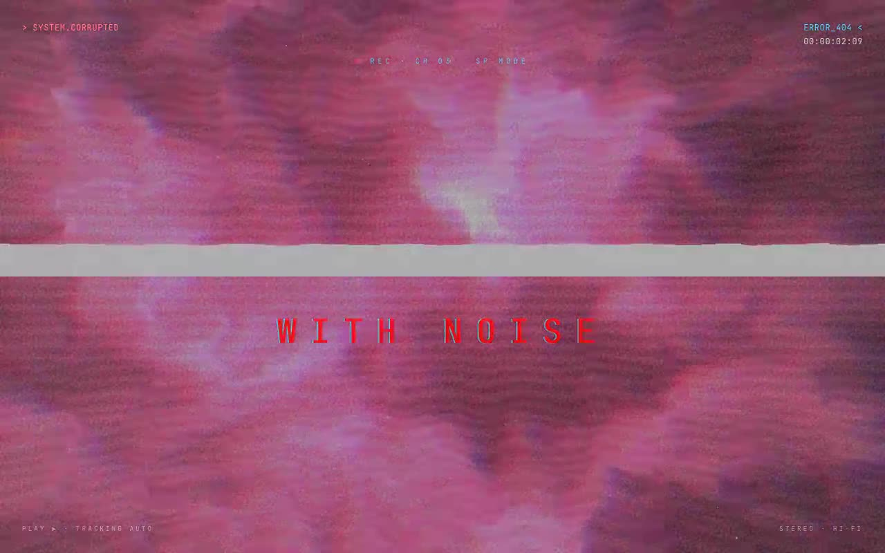

# VHS Noise Distortion Hero — Corrupted VHS-Grade Hero Section (React Three Fiber + GSAP + Tailwind CSS)

[](./demo.mp4)

A full-screen VHS-grade hero section with a procedural GLSL fbm domain-warp background shader, 800 chaotic noise particles, glitch text animation, and a GSAP entrance timeline — built as a shadcn/Tailwind/TypeScript component for React. The background uses a `planeGeometry(25×25, 100×100)` carrying a six-octave fractal noise shader with edge-growing chromatic aberration, a sweeping horizontal tracking-error band, per-frame glitch sparks, scanlines, film grain, and a vignette; on top, red/white/cyan noise particles drift and repel from the cursor. A `GlitchText` primitive scrambles headline characters and pulses an RGB text-shadow via GSAP, while a mouse-parallax tilt and looping hue-shift glitch round out the cinematic effect. Generated with Claude Fable 5.

## What's inside

- **`src/components/ui/vhs-hero-section.tsx`** — the integrated component, exporting `GlitchText`, the default `DistortHero`, and the named `Component` exactly as the prompt specifies. The original `import { Button } from "/src/components/ui/button"` is corrected to the project alias `@/components/ui/button`.
- **`src/components/ui/button.tsx`** — the shadcn `Button` dependency.
- **`src/components/demo.tsx`** — the prompt's `DemoOne`, rendering `<Component />`.
- A running **VHS timecode** (`HH:MM:SS:FF`), `REC · CH 03 · SP MODE` status, flickering `SYSTEM.CORRUPTED` tag, transport labels, and CRT scanline/noise overlays round out the deck.

## Integration notes (answering the prompt)

- **Stack:** the project already supports the shadcn structure, Tailwind CSS, and TypeScript. The default component path resolves to **`@/components/ui`** (configured in `components.json` + the `@/*` alias in `tsconfig`/`vite.config.ts`). Keeping shared primitives in `/components/ui` is what lets the `@/components/ui/...` import alias used by the component and by `shadcn add` resolve consistently.
- **Props:** `GlitchText` takes `text`, `fontSize`, `fontFamily`, `fontWeight`, `color`, `glitchIntensity`, `glitchFrequency`, `className`. `DistortHero`/`Component` take no props — drop them in as a full-bleed `min-h-screen` section.
- **State:** local only — cursor position (drives the shader `uMouse` uniform and particle repulsion), a load flag that gates the entrance timeline, and the timecode counter. No providers required.
- **Assets:** none external — the background is fully procedural GLSL; the noise overlay is an inline SVG `feTurbulence`. Fonts (JetBrains Mono, Space Grotesk) are vendored locally in `public/fonts`.
- **Responsive:** the headline uses `clamp()` and the canvas is full-viewport, so it scales from mobile to ultrawide.

## Dependencies

`gsap`, `three`, `@react-three/fiber`, `@radix-ui/react-slot`, `class-variance-authority` (plus `clsx` + `tailwind-merge` for `cn`).

## Run

```bash
npm install
npm run dev      # http://localhost:5173
npm run build    # tsc -b && vite build
```

Stack: React, TypeScript, Vite, Tailwind CSS, shadcn/ui, Three.js, React Three Fiber, GSAP.

---

Part of the [Shaders](../) collection in the [claude-directory](../../) — an open-source gallery of AI-generated UI built with Claude Fable 5. [Browse the live gallery](https://pulkitxm.com/claude-directory).
