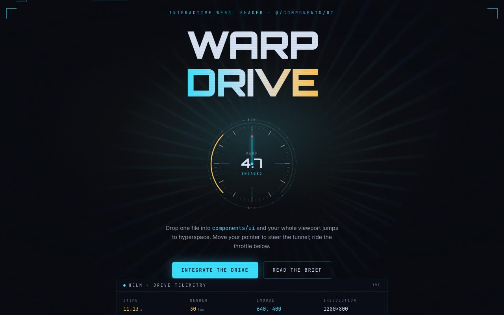

# Warp Drive Shader Bridge — Hyperspace Tunnel WebGL Shader with Starship Console (React + Three.js + Tailwind CSS)

[](./demo.mp4)

A full-screen pointer-steered hyperspace tunnel WebGL shader integrated as a shadcn/Tailwind/TypeScript drop-in, presented as an immersive starship-bridge navigation console. The `<WarpDriveShader />` component renders a chromatic-aberration tunnel effect via Three.js GLSL — red/green/blue filaments converging on a vanishing point, steered by `iMouse` — fixed behind a cold-cockpit UI. The signature NavReticle gauge locks to the tunnel's vanishing point with a heading needle, warp-factor dial, and amber FPS indicator, all driven by the shader's per-frame `onFrame` callback. A helm console surfaces live `iTime`/`iMouse`/`iResolution` uniforms and a warp throttle. Generated with Claude Fable 5.

## Design

**Warp Drive** is framed as a starship FTL navigation console. The cold-cockpit
palette lifts its accents straight off the shader's own RGB chromatic aberration
— the red/green/blue tunnel filaments become the console's helm (cyan `#38e1ff`),
warp (amber `#ffc24b`), and alert (magenta `#ff3d8b`) — over a deep-space void.
Type pairs `Orbitron` (display / instrument lettering), `Inter` (body), and
`JetBrains Mono` (all telemetry and code).

The **signature element** is the `NavReticle` gauge locked to the tunnel's
vanishing point: a heading needle steered by `iMouse`, a warp factor derived
from `iTime`, and an amber FPS dial — all SVG, all driven by the shader's
per-frame `onFrame` callback, so the instrument proves the canopy is a live
WebGL program, not a video loop. A docked **helm console** surfaces the raw
`iTime` / `iMouse` / `iResolution` uniforms and a warp throttle that drives the
component's optional `warpSpeed` prop.

## Stack

- React 18, TypeScript (strict), Vite 5
- Tailwind CSS 3 (+ `cn` helper, shadcn-style `@/` alias)
- Three.js (`three`) — the one runtime dependency the shader needs
- `lucide-react` for icons
- Fonts (Orbitron, Inter, JetBrains Mono) vendored locally — no CDN at runtime

## Structure (shadcn convention)

```
src/
  components/
    ui/
      warp-drive-shader.tsx   # the drop-in component (the prompt's shader, verbatim GLSL)
    nav-reticle.tsx           # the signature helm/warp gauge (reads onFrame)
    helm-console.tsx          # live uniforms telemetry + warpSpeed throttle
    showcase-sections.tsx     # brief / setup / usage / API sections
  lib/
    utils.ts                  # shadcn cn() helper
  demo.tsx                    # the bridge page = the prompt's DemoOne, live
  main.tsx
```

## The component API

`<WarpDriveShader />` works bare, exactly as the brief writes it. The additive,
optional props let a host drive it without touching the GLSL:

| Prop | Type | Default | Purpose |
|------|------|---------|---------|
| `warpSpeed?` | `number` | `1` | Multiplies the shader clock (1 = the brief's `iTime · 0.5` cadence). |
| `onFrame?` | `(f: WarpDriveFrame) => void` | — | ~20 Hz telemetry: `{ time, mouse, size, fps }`. |
| `className?` | `string` | `"shader-container"` | Re-layout the canvas container. |
| `style?` | `CSSProperties` | fixed · 100vw/vh · z-index -1 | Replace the default full-bleed styling. |

## Run it

```bash
npm install
npm run dev      # http://localhost:5173
npm run build    # tsc -b && vite build
npm run verify   # headless Chromium checks (see below)
```

## Verification

`npm run verify` boots the Vite preview server and drives headless Chromium
(`verify.mjs`) to assert, CLI-only:

1. the shader `<canvas>` has a live WebGL context and backing pixels;
2. it paints a non-black tunnel (lit + bright pixels read back from a frame);
3. the live telemetry HUD's `iTime` readout advances over time;
4. the warp throttle changes the `warpSpeed` prop readout;
5. the shadcn / Tailwind / TypeScript integration story renders below the fold;
6. no console or page errors (including shader compile/link failures).

All 12 checks pass.

---

Part of the [Shaders](../) collection in the [claude-directory](../../) — an open-source gallery of AI-generated UI built with Claude Fable 5. [Browse the live gallery](https://pulkitxm.com/claude-directory).
