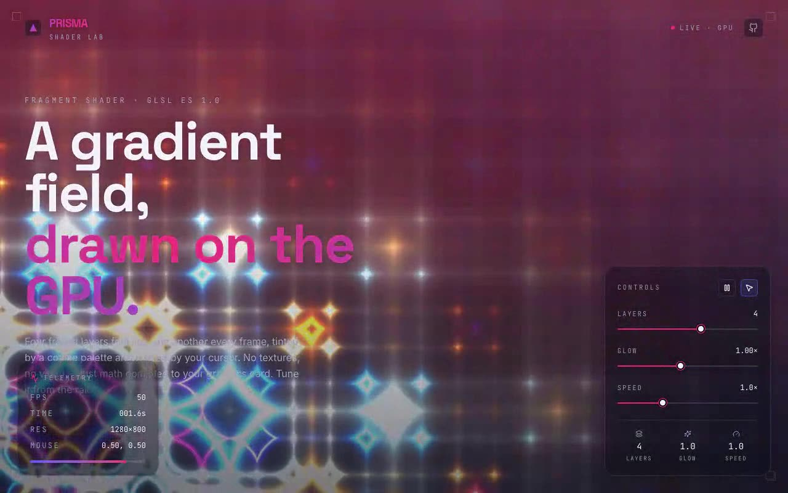

# PRISMA Shader Lab — WebGL Flowing-Gradient Shader (React + Vite + Tailwind CSS v4 + Raw WebGL)

[](./demo.mp4)

A full-screen WebGL generative graphics tool built as a shadcn-structured React app, showcasing a GLSL fragment shader that folds four fractal layers with a cosine palette and cursor-driven ripples — pure GPU math, no images or video. The surrounding UI is monochrome glass chrome: a brand bar, viewfinder corner brackets, a control rail (layers, glow, speed, interactive/static toggle, and pause), and a live telemetry HUD displaying FPS, elapsed time, drawing-buffer resolution, and normalized cursor position — all fed straight from the WebGL render loop. Generated with Claude Fable 5.

## Stack

- React 18 + TypeScript + Vite 5
- Tailwind CSS **v4** via `@tailwindcss/vite` (+ `tw-animate-css`), tokens in `@theme`
- `lucide-react` icons, shadcn-style `cn()` + `@/` alias + `components.json`
- Raw WebGL (GLSL ES 1.0) — no Three.js, no shader libraries
- Self-hosted Space Grotesk / Inter / JetBrains Mono (latin woff2, vendored locally)

## Project layout (the integration target)

```
src/
  components/ui/shader-animation.tsx   ← the prompt's component (typed, controllable)
  components/ui/demo.tsx               ← the prompt's demo, verbatim
  components/Slider.tsx                ← lab-instrument slider used by the rail
  lib/utils.ts                         ← shadcn cn() helper
  index.css                            ← Tailwind v4 + fadeInUp/gradientShift keyframes
  App.tsx                              ← the PRISMA Shader Lab surface
```

## Integrating the component (answering the prompt)

This repo already supports the three requirements, so no scaffolding was needed:

- **shadcn structure** — `components.json` + the `@/` alias resolve `@/components/ui/*`.
- **Tailwind** — Tailwind v4 is wired through the Vite plugin; `src/index.css` opens
  with `@import "tailwindcss"`.
- **TypeScript** — strict TS throughout; `npm run build` runs `tsc` first.

**Why `components/ui`?** shadcn treats `components/ui/` as the home for primitive,
copy-in components that you own and edit (as opposed to app-specific composition in
`components/`). Keeping the shader there means the `@/components/ui/shader-animation`
import in `demo.tsx` resolves with zero config and the component stays a reusable
primitive you can drop into any shadcn app.

Answers to the prompt's integration questions:

- **Props/data** — none are required (it self-renders). The component is also
  controllable: `interactive`, `paused`, `layers`, `intensity`, `speed`, `fill`,
  `showOverlay`, and an `onTelemetry` callback. With no props it behaves exactly like
  the original, including the `🖱️ Interactive` / `🚫 Static` overlay toggle.
- **State** — local `useState` only; no context or store needed. `App.tsx` lifts the
  controls into its own state and reads telemetry via the callback (kept out of React
  state to avoid re-rendering 60×/sec).
- **Assets** — the prompt mentions Unsplash, but this component renders entirely on the
  GPU and has **no image assets**, so none were added. The only vendored assets are the
  three self-hosted fonts.
- **Responsive** — single non-scrolling viewport at every width; the canvas is
  DPR-aware (capped at 2×) and resizes with the window; the rail/HUD reflow on mobile.
- **Best placement** — as a full-bleed background/hero behind UI chrome, which is
  exactly how `App.tsx` uses it.

## Run

```bash
npm install
npm run dev
```

## Verify (CLI only)

```bash
npm run build
npm run preview &   # serves dist on :4173
npm run verify      # headless Playwright: WebGL paint, HUD ticks, controls, pause,
                    # cursor toggle, no-scroll, vendored fonts, desktop + mobile
```

---

Part of the [Shaders](../) collection in the [claude-directory](../../) — an open-source gallery of AI-generated UI built with Claude Fable 5. [Browse the live gallery](https://pulkitxm.com/claude-directory).
