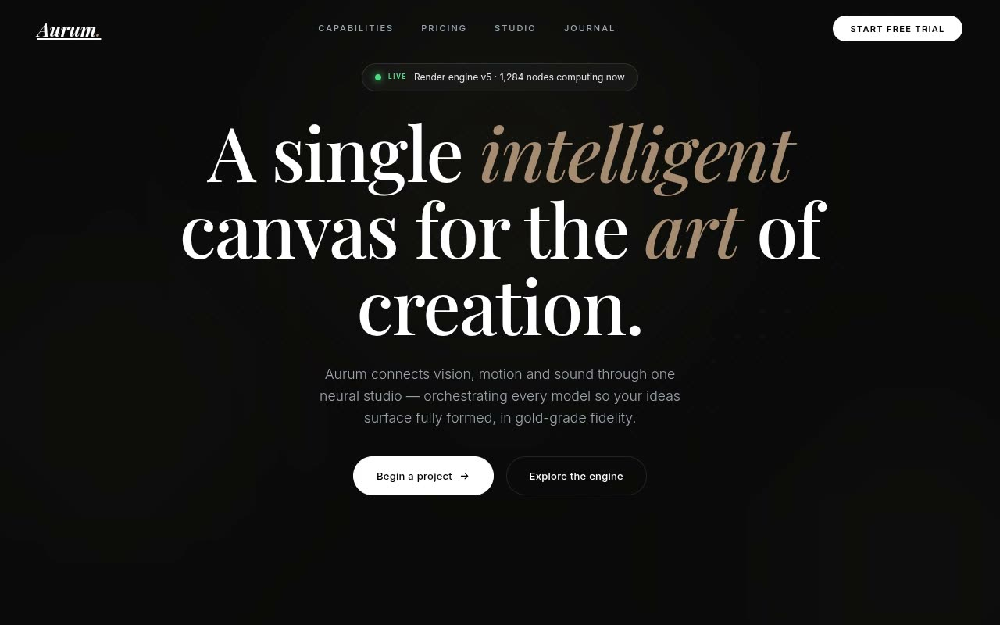

# Aurum — Neural-Network Luxury AI Landing Page (Vanilla HTML + CSS + JS, Glassmorphism)

[](./demo.mp4)

A dark-mode, single-page luxury landing page for a high-end AI creative tool — built on a monochromatic black base (`#0A0A0A`) with a gold-and-bronze accent palette and a radial dot-grid overlay. Glassmorphism cards (`rgba(255,255,255,0.03)` background, 10px backdrop blur, 1px white/10 border) carry a floating hero node surrounded by satellite media cards connected by dynamic SVG bezier curves with pulsing-branch animations; satellite cards transition grayscale to color and lift on hover. Typography mixes Playfair Display italic for editorial headings with Inter for UI precision and wide-tracked uppercase labels. Sections include a glassmorphic features grid, three-tier pricing with a monthly/annual toggle, a two-column team section with grayscale-to-color hover, a live notification pill with a breathing dot, and a multi-column footer. Generated with Claude Fable 5.

## Run

This is a static project — open `index.html` in a browser, or serve the folder:

```sh
python3 -m http.server 8000
```

See `prompt.md` for the full build spec; `demo.mp4` shows it in motion.

---

Part of the [Templates](../) collection in the [claude-directory](../../) — an open-source gallery of AI-generated UI built with Claude Fable 5. [Browse the live gallery](https://pulkitxm.com/claude-directory).
