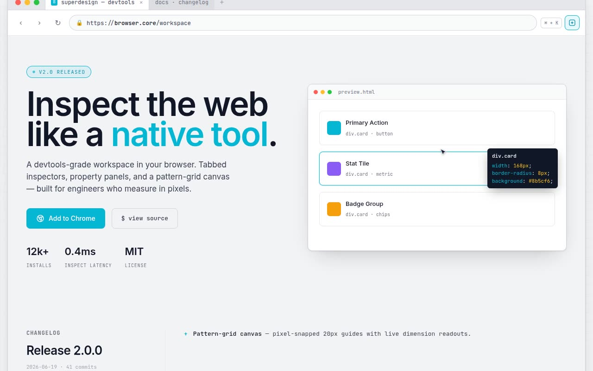

# Browser-Core Modernism — DevTools Workspace Landing Page (Vanilla HTML + CSS + JS)

[](./demo.mp4)

A high-density technical landing page that simulates a full browser workspace — the entire site lives inside a macOS-style browser frame with traffic lights, an active tab, and an address bar. The palette is "browser-core modernism": gray-and-white panels (`#F3F4F6` background, white panels, `#E5E7EB` borders) with sharp cyan highlights (`#06B6D4`), a 20px pattern-grid background, and custom 10px UI scrollbars. Typography uses Inter for headings and JetBrains Mono for all technical labels on a strict 4px/8px spacing grid. The hero splits a 72px technical headline (with a pulsing `v2.0 RELEASED` tag) against a simulated UI window where a CSS-driven fake cursor loops between cards, triggering a dark inspector tooltip displaying CSS props in cyan mono. Further sections include a changelog with cyan `+` bullets, a three-panel IDE-style workspace with a property inspector and cyan selection box, a dark GitHub-README manifesto, and a `<details>`-based technical FAQ. Generated with Claude Fable 5.

## Run

This is a static project — open `index.html` in a browser, or serve the folder:

```sh
python3 -m http.server 8000
```

See `prompt.md` for the full build spec; `demo.mp4` shows it in motion.

---

Part of the [Templates](../) collection in the [claude-directory](../../) — an open-source gallery of AI-generated UI built with Claude Fable 5. [Browse the live gallery](https://pulkitxm.com/claude-directory).
