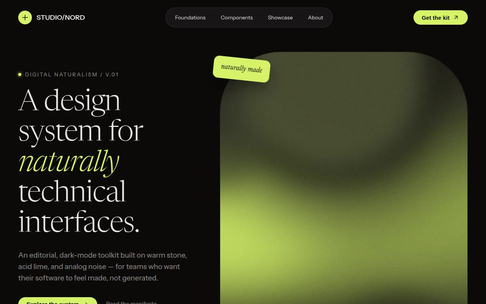

# Editorial Naturalism — Dark-Mode Design System Landing Page (Vanilla JS, Tailwind CSS tokens, Newsreader serif)

[](./demo.mp4)

A high-contrast dark-mode design system showcase branded **STUDIO/NORD** that blends "digital naturalism" with brutalist technicality. Built as a single self-contained static page with no build step required, it uses a stone-tinted black (`#0C0A09`), warm charcoal surfaces, off-white stone text, and a signature acid-lime accent (`#D4F268`), with a fixed 4%-opacity fractal-noise overlay to keep dark surfaces from reading flat. Signature touches include serrated postage-stamp edge dividers, a glassmorphism pill nav, an arched hero image container with a rotated lime sticky-note badge, folder-style tabbed content, a grayscale-to-color showcase grid with one offset card, and scroll-reveal animations. Fully offline with locally vendored Newsreader and Instrument Sans fonts. Generated with Claude Fable 5.

## Run

This is a static project — open `index.html` in a browser, or serve the folder:

```sh
python3 -m http.server 8000
```

See `prompt.md` for the full build spec; `demo.mp4` shows it in motion.

---

Part of the [Templates](../) collection in the [claude-directory](../../) — an open-source gallery of AI-generated UI built with Claude Fable 5. [Browse the live gallery](https://pulkitxm.com/claude-directory).
