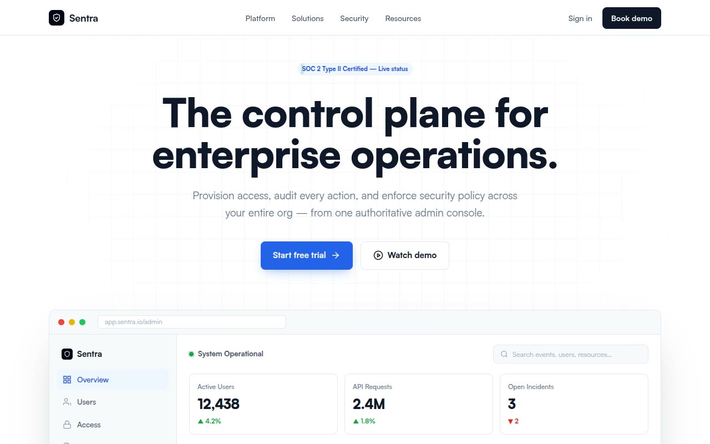

# Sentra — Enterprise Admin & Security SaaS Landing Page (Vanilla JS, Satoshi, CSS Grid)

[](./demo.mp4)

A clean, authoritative single-page landing for the fictional enterprise admin and security SaaS **Sentra**. The corporate-professional aesthetic is built on a strict 40px grid with the Satoshi typeface (weights 400–900), a slate-and-blue palette (slate-950 `#020617`, primary blue `#2563EB`), 12px card radii, 8px button radii, and subtle `#E2E8F0` borders — green, amber, and red are reserved strictly for status indicators. Features a simulated browser dashboard preview with a sticky-header audit log table, a 3-column module grid, a dark stats section with concentric rings and KPI count-ups, glass-morphism policy toggles, a threat-blocked alert card, and an FAQ accordion — making it a complete enterprise SaaS marketing template. Generated with Claude Fable 5.

## Run

This is a static project — open `index.html` in a browser, or serve the folder:

```sh
python3 -m http.server 8000
```

See `prompt.md` for the full build spec; `demo.mp4` shows it in motion.

---

Part of the [Templates](../) collection in the [claude-directory](../../) — an open-source gallery of AI-generated UI built with Claude Fable 5. [Browse the live gallery](https://pulkitxm.com/claude-directory).
