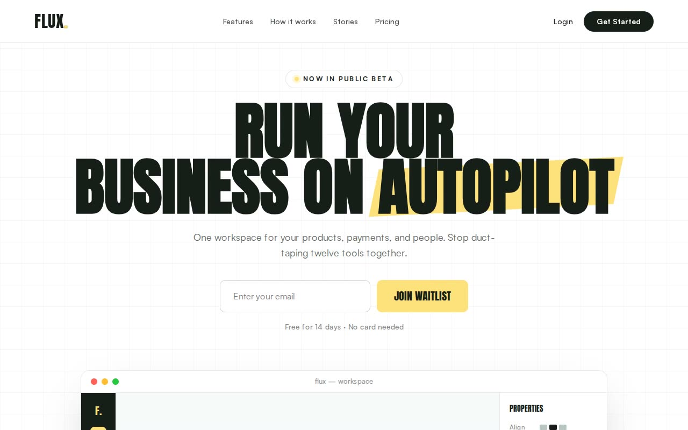

# Flux — High-Contrast Editorial B2C SaaS Landing Page (Anton, Satoshi, Vanilla JS)

[](./demo.mp4)

A bold, high-contrast editorial landing page for the fictional creator and small-business OS SaaS **Flux**. The brutalist-lite SaaS aesthetic pairs massive Anton display type (uppercase, 0.9 line-height) with Satoshi body text, a golden-yellow accent (`#FFE17C`) against charcoal (`#171E19`) and white, a 40px grid background, and a signature 15-degree rotated yellow highlight bar behind key headline words — purpose-built as a conversion-focused SaaS marketing template. The page runs a full funnel: grid-pattern hero with waitlist form and abstract browser-style UI mockup, a high-contrast "Old Way vs. Flux Way" problem/solution split, a bento feature grid with spanning cards and embedded UI elements, a sticky-titled numbered "How It Works" section with giant fading numerals, alternating light/dark testimonial cards with oversized yellow stars, a high-energy yellow final CTA, and a charcoal footer. Generated with Claude Fable 5.

## Run

This is a static project — open `index.html` in a browser, or serve the folder:

```sh
python3 -m http.server 8000
```

See `prompt.md` for the full build spec; `demo.mp4` shows it in motion.

---

Part of the [Templates](../) collection in the [claude-directory](../../) — an open-source gallery of AI-generated UI built with Claude Fable 5. [Browse the live gallery](https://pulkitxm.com/claude-directory).
