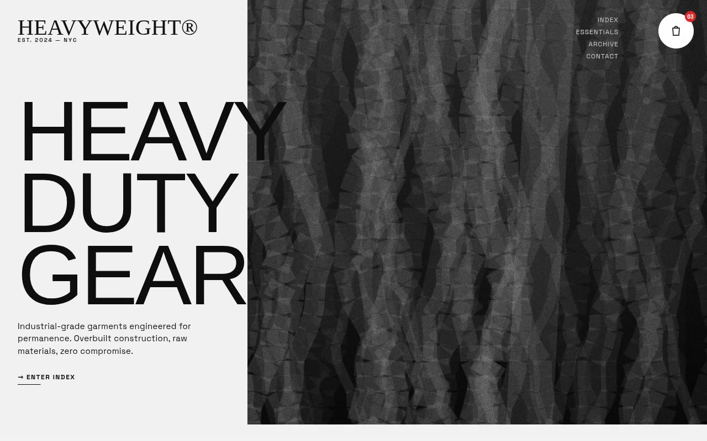

# Heavyweight — Brutalist Industrial Apparel Storefront (Anton, Space Grotesk, mix-blend-difference)

[](./demo.mp4)

A minimalist yet high-impact brutalist industrial design system and storefront for the fictional technical-apparel label **Heavyweight®**. The store template runs on a "concrete" (`#F2F2F2`) and "ink" (`#0A0A0A`) palette with a persistent 4%-opacity film-grain overlay, grayscale imagery that reveals color on hover over 700ms, and `mix-blend-difference` on the fixed header so text stays legible over any background — with red (`#DC2626`) reserved strictly for live status dots and the cart badge. Anton drives massive uppercase headlines at 0.85 leading while Space Grotesk handles technical, monospace-style metadata with line-through hover links. The intentionally asymmetrical layout features a non-standard header with elements pushed to extreme corners, a split hero with off-screen-cropped image and rotated section label, a snap-scrolling horizontal product strip, a 12-column technical info grid with sticky left column, a "broken" live inventory grid with ticking stock counters, a rotated-poster masonry social-proof wall, and a utility footer anchored by a `10vw` ghost word. Generated with Claude Fable 5.

## Run

This is a static project — open `index.html` in a browser, or serve the folder:

```sh
python3 -m http.server 8000
```

See `prompt.md` for the full build spec; `demo.mp4` shows it in motion.

---

Part of the [Templates](../) collection in the [claude-directory](../../) — an open-source gallery of AI-generated UI built with Claude Fable 5. [Browse the live gallery](https://pulkitxm.com/claude-directory).
