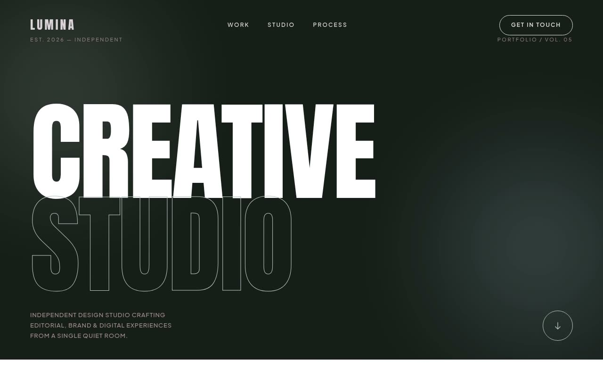

# Lumina — Editorial Portfolio Template (Anton, Plus Jakarta Sans, mix-blend-difference Nav)

[](./demo.mp4)

A high-end, premium portfolio template for a fictional design studio, **Lumina**, blending brutalist typography with luxury minimalism on a dark navy base (`#171E19`) with sage (`#B7C6C2`), cyan (`#D5F4F9`), and taupe (`#9F8D8B`) accents. Generous negative space, high-contrast alternating dark-and-light sections, and an editorial cinematic feel define the layout. Anton (uppercase, heavy, 18vw in the hero) handles all primary headings; Plus Jakarta Sans covers body text. The page flows through a full-viewport hero with two floating 120px-blur ambient orbs and a sage text-outline second line, an asymmetric 2-column masonry "Selected Works" grid with even cards pushed down 4rem, a featured project section with an offset cyan square behind a grayscale image, a 12-column capabilities list with growing line prefixes, a charcoal testimonial carousel with a giant background quote glyph, and a massive "Let's Create" footer. Signature mechanics include a `mix-blend-difference` fixed nav that inverts over light/dark sections, circular hover-reveal "VIEW" badges, 1.1x image scales, and 1000ms scroll reveals on `cubic-bezier(0.16, 1, 0.3, 1)`. Generated with Claude Fable 5.

## Run

This is a static project — open `index.html` in a browser, or serve the folder:

```sh
python3 -m http.server 8000
```

See `prompt.md` for the full build spec; `demo.mp4` shows it in motion.

---

Part of the [Templates](../) collection in the [claude-directory](../../) — an open-source gallery of AI-generated UI built with Claude Fable 5. [Browse the live gallery](https://pulkitxm.com/claude-directory).
