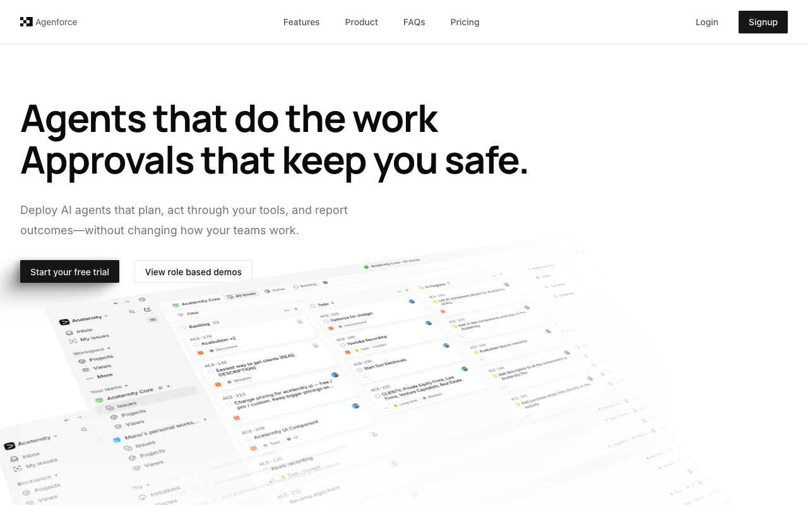

# Agenforce — AI Agent SaaS Marketing Template (Vanilla HTML/CSS/JS)

[](./demo.mp4)

Agenforce is a full multi-page marketing site for an AI agent platform, cloned pixel-faithfully from the Aceternity UI Pro Agenforce template. It ships a home page, dedicated pricing page, login, and signup — all built as plain HTML, CSS, and vanilla JavaScript with no build tools required. Standout techniques include CSS 3D perspective transforms for layered hero screenshots and tilted feature cards, a `@keyframes orbit` animation that revolves brand logos around a center hub, Intersection Observer scroll-triggered logo fade-ins with blur, a typewriter animation in the activity log, an FAQ accordion with `max-height` transitions, and a mobile sidebar drawer. Fonts (Manrope for headings, Inter for body) and all images are served locally.

## Pages

| File | Route |
|---|---|
| `index.html` | Home / landing page |
| `pricing.html` | Dedicated pricing page |
| `login.html` | Sign-in form |
| `signup.html` | Account creation form |

## Run

No build step. Serve the folder with any static server:

```sh
python3 -m http.server 8080
```

Then open `http://localhost:8080` in a browser. Alternatively open `index.html` directly in your browser (some relative-asset paths may require a server).

## Notable techniques

- **CSS 3D perspective** — hero screenshots and feature cards use `transform: perspective() rotateX() rotateY() rotateZ()` for depth without any JS 3D library.
- **`@keyframes orbit`** — brand icons orbit a central hub using CSS custom properties (`--initial-position`, `--translate-position`, `--orbit-duration`) set inline per icon so a single animation drives all four.
- **`mask-image` fades** — screenshots dissolve into the white background at their edges via `mask-image: linear-gradient(...)`.
- **Intersection Observer logos** — logo cloud items animate in with opacity + blur + translateY as they scroll into view; the initial state is visible so the page renders correctly without JS.
- **Typewriter effect** — activity-log descriptions reveal one character at a time using `@keyframes fadeInChar` on each `<span>` with a staggered `animation-delay`.
- **Crosshatch background** — role-based access bento cells use `repeating-linear-gradient` for the hatched pattern texture.
- **Light / dark theme** — a footer sun/moon toggle switches the whole site between light and dark via a `.dark` design-token override, persists the choice in `localStorage`, and applies it in a no-flash inline boot script before first paint.

## Build spec and demo

`PROMPT.md` contains the full specification used to build this template. `demo.mp4` shows the complete page in motion including animations, scroll behavior, and mobile menu.

## Credits

Original design: [Agenforce Marketing Template](https://ui.aceternity.com/template-preview/agenforce-marketing-template) by [Aceternity UI](https://ui.aceternity.com). This is a non-commercial, educational clone built to demonstrate vanilla HTML/CSS/JS recreation of a premium Next.js + Tailwind template.

---

Part of the [Templates](../) collection in the [fable](../../../) gallery. [Browse the live gallery](https://pulkitxm.com/claude-directory).
