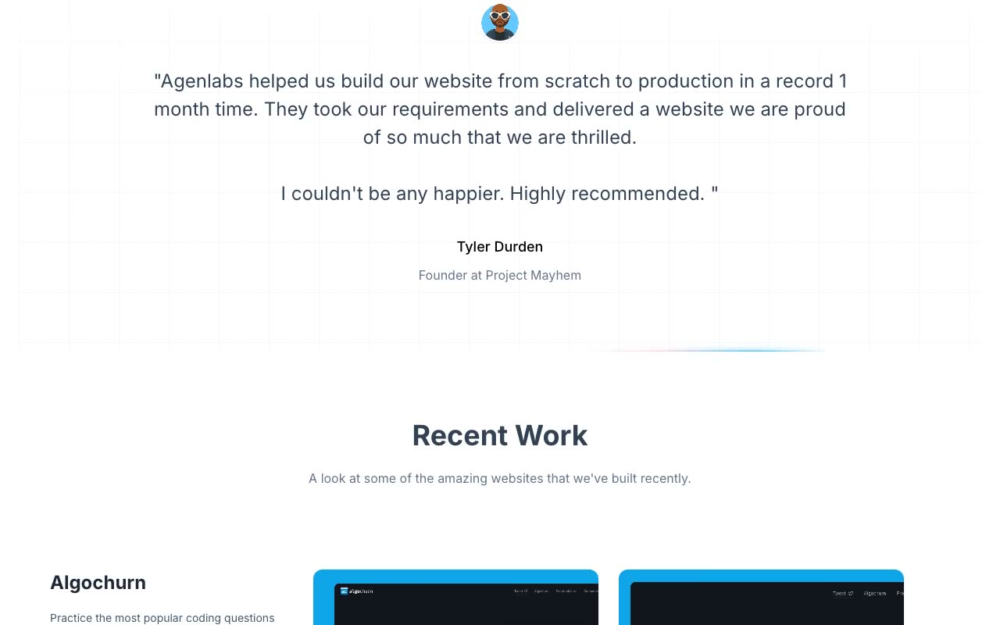

# Agenlabs Agency Template — Pixel-Faithful HTML Clone

[](./demo.mp4)

A pixel-faithful, self-contained clone of the **Agenlabs Agency Template** by Aceternity UI — a minimal, clean agency website showcasing portfolio work, services, pricing packages, and blog content. Built as plain HTML + CSS + vanilla JavaScript with all assets vendored locally. No build step required.

## Features

- **5 fully responsive pages**: Home, Work, Packages, Templates, Blog
- **Gradient text accents**: Purple-to-pink gradient on headings throughout
- **Animated glow button**: "Explore Work" CTA with gradient blur animation
- **Interactive service cards**: Mouse-tracking radial gradient hover reveal on all 6 service cards
- **Testimonial sections**: Grid background with blue/pink decorative blur line
- **Project portfolio rows**: 4 real project showcases with dual screenshot images
- **Dark CTA block**: Slate-800 with grid overlay pattern
- **Mobile-responsive**: Hamburger menu, responsive grid layouts
- **Assets vendored**: All images downloaded locally, no external image dependencies

## Pages

| Page | File | Description |
|------|------|-------------|
| Home | `index.html` | Hero, testimonials, work showcase, services grid, CTA |
| Work | `work.html` | Full portfolio project listing |
| Packages | `packages.html` | Pricing packages with feature list |
| Templates | `templates.html` | Website templates for sale |
| Blog | `blog.html` | 3-column blog post grid |

## Running Locally

Open any HTML file directly in a browser, or serve with a local static server:

```bash
# Python (built-in)
python3 -m http.server 8080

# Then open http://localhost:8080/index.html
```

No build step, no dependencies, no configuration needed.

## Verifying the Clone

```bash
# Start server
python3 -m http.server 8765

# Scrape with the repo's recon tool
node /path/to/fable/scripts/record-demos/scrape-ref.mjs \
  "http://localhost:8765/index.html" \
  "/tmp/clone-agenlabs"
```

## Design Tokens

| Token | Value |
|-------|-------|
| Primary font | Inter (100–900) |
| Body background | `#ffffff` |
| Zinc-700 | `#3f3f46` |
| Slate-700 | `#334155` |
| Slate-800 | `#1e293b` |
| Gradient accent | `from-purple-700 to-pink-500` |
| Contact button | `from-rgba(5,45,255,.6) to-rgba(62,243,255,.6)` |
| Service card hover | `from-#D7EDEA to-#F4FBDF` |

## Credits

Faithful clone of an existing design, recreated for study/learning. All credit for the original design goes to its creators.

**Original:** Aceternity UI — https://ui.aceternity.com/template-preview/agenlabs-agency-template

---

[Back to Aceternity templates](../) · [All premium templates](../../) · [Templates gallery](../../../) · [Fable root](../../../../)
