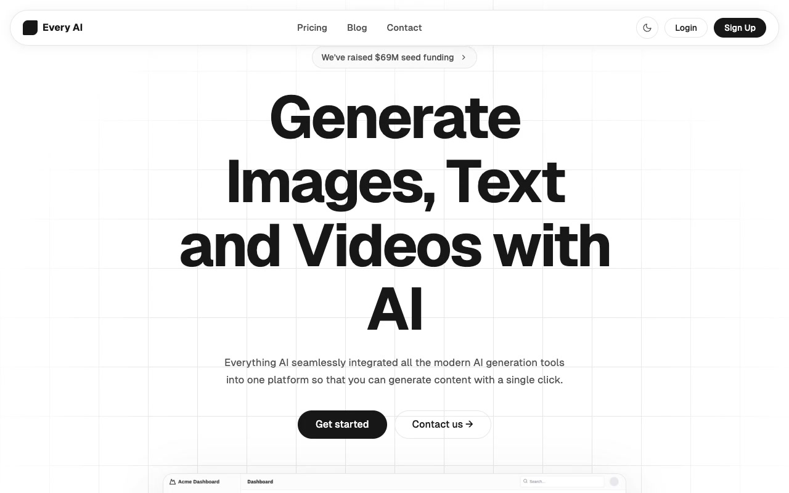

# AI SaaS Template

Pixel-faithful clone of Aceternity UI's "Every AI" AI SaaS Template — a 6-page multi-page marketing site for a fictional AI platform on a clean white/black dual-theme palette with Geist Sans typography; an animated column-beam grid hero, company logo strip, dual feature cards with chat UI mockups, an LLM timeline panel, an infinite tech-stack marquee, a 4-column developer feature grid, masonry testimonials, a join-waitlist CTA with giant gradient text, a 4-tier pricing table with monthly/yearly toggle and comparison matrix, a blog listing, a contact form, and auth pages (login/signup); full light/dark theme via CSS custom properties persisted in localStorage with a no-flash boot script, scroll-reactive navbar, mobile hamburger menu; Geist fonts and all assets vendored locally, no build step, fully offline.

## Sections

- **Navbar** — Fixed floating pill navbar with logo, nav links, dark-mode toggle, Login + Sign Up
- **Hero** — Column-beam animated grid background, funding badge, large heading, subtitle, dual CTAs, dashboard mockup image
- **Trusted By** — Grayscale company logos (Netflix, Google, Meta, OnlyFans)
- **Features** — Two feature cards with chat UI mockups (image generation + chatbot)
- **LLM Support** — Timeline panel listing supported AI models
- **Tech Marquee** — Infinite scrolling tech stack logos strip
- **Developer Grid** — 4-column feature cards grid
- **Testimonials** — Masonry-style testimonial card grid
- **CTA** — Join Waitlist section with giant gradient "EVERY AI" footer text
- **Pricing** — 4-tier cards + monthly/yearly toggle + full comparison matrix
- **Blog** — Article listing with author avatars and tags
- **Contact** — Contact form with social proof panel
- **Login / Signup** — Centered auth cards with GitHub OAuth option

## Features

- 6 pages: `index.html`, `pricing.html`, `blog.html`, `contact.html`, `login.html`, `signup.html`
- Shared `styles.css` with full CSS custom property theming system
- Light/dark mode with `prefers-color-scheme` support + localStorage persistence
- Animated column beam hero background (CSS keyframes)
- Infinite CSS marquee animation for tech stack
- Pricing monthly/yearly toggle (vanilla JS)
- Mobile-responsive with hamburger menu
- All assets vendored locally (Geist fonts + images)
- No build step required

## Credits

Faithful clone of an existing design, recreated for study/learning. All credit for the original design goes to its creators.

**Original:** Aceternity UI — https://ui.aceternity.com/template-preview/ai-saas-template
