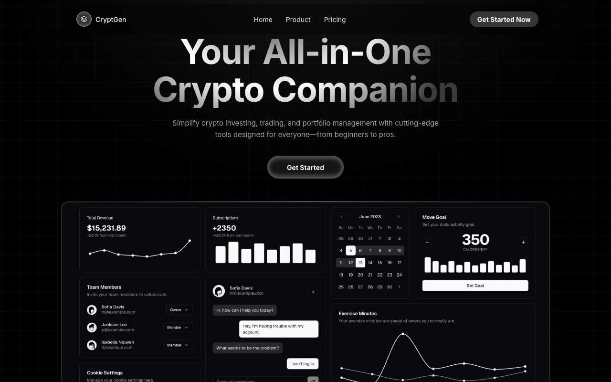

# CryptGen Marketing — Dark Crypto/Fintech Single-Page Marketing Site (Vanilla HTML/CSS/JS)

[](./demo.mp4)

Pixel-faithful clone of the Aceternity UI CryptGen Marketing template — a dark-themed, single-page crypto and fintech marketing website. The site features a floating glassmorphic navbar with backdrop blur, an animated hero section, a bento-grid features layout with rotating icon orbit animation and conic-gradient glow borders, a social proof logo strip, testimonial cards, a three-tier pricing table, an FAQ accordion, and a multi-column footer. Interactions — mobile menu, FAQ accordion, scroll-triggered fade-up animations via `IntersectionObserver`, smooth anchor scrolling, and a scroll-aware navbar — are handled in plain vanilla JavaScript with no framework dependency. Styles are authored with CSS custom properties (design tokens) and the vendored Inter font. Built with Vanilla HTML/CSS/JS.

## Run

No build step required. Open `index.html` directly in a browser, or serve the folder with any static file server:

```sh
# Python (built-in)
python3 -m http.server

# Node (npx)
npx serve .
```

Then visit `http://localhost:8000` (or the port your server reports).

## Notes

- All assets are self-contained: the Inter typeface is vendored at `assets/fonts/inter.woff2`, the dashboard screenshot at `assets/images/dashboard.webp`, and avatar/company-logo images under `assets/images/`.
- The rotating icon orbit in the Features section is driven by a pure CSS `@keyframes` animation — no JavaScript required for that effect.
- The FAQ accordion uses exclusive-open logic: opening one item closes all others.
- Scroll animations use `IntersectionObserver` with a 500 ms fallback that marks all elements visible, keeping the page usable for crawlers and screenshots.
- `prompt.md` holds the full build specification; `demo.mp4` shows the finished site in motion.

## Credits

Faithful clone of an existing design, recreated for study/learning. All credit for the original design goes to its creators.

**Original:** Aceternity UI — https://ui.aceternity.com/template-preview/cryptgen-marketing-aceternity

---

Part of the [Templates](../../../) collection in the [Fable directory](../../../../). [Browse the live gallery](https://pulkitxm.com/claude-directory).
