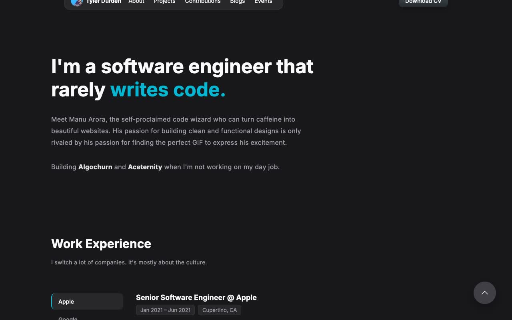

# DevPro Portfolio Template — Multi-page Developer Portfolio Template Clone (Vanilla HTML/CSS/JS, no build)

[](./demo.mp4)

A self-contained, pixel-faithful clone of the Aceternity DevPro Portfolio Template — a dark-themed, zinc-based multi-page developer portfolio originally built by Manu Arora. It reproduces all six pages (Home, About, Projects, Contributions, Blogs, Events), the shared inline pill navbar (avatar, nav links, and a gradient "Download CV" button) with mobile hamburger menu, and a shared footer with social links. Standout features include a JS tab switcher for the Work Experience section (Apple, Google, Microsoft, Netflix), a GitHub contributions grid with Show More, project cards in a three-column grid, a detailed timeline on the About page, and a floating scroll-to-top button — all rendered with the zinc-900 dark palette and cyan-500 accent highlights, using Inter from Google Fonts. Built as plain HTML + CSS + vanilla JS with no build step. Generated with Claude Fable 5.

## Run

No build step — serve the folder with any static server and open `index.html`:

```sh
python3 -m http.server 8080
```

Then visit `http://localhost:8080`. You can also open `index.html` directly in a browser.

The six pages are:

- `index.html` — Home: hero, work experience tab switcher, projects grid, contributions grid, blogs, footer
- `about.html` — Bio with side-by-side avatar layout and a detailed timeline (2015–2022)
- `projects.html` — Full project cards grid with hover tooltips
- `contributions.html` — Complete GitHub open-source contributions grid
- `blogs.html` — Blog posts list with dates
- `events.html` — Speaking events and talks list

The full build specification lives in `prompt.md`, and `demo.mp4` shows the template in motion.

## Credits

Faithful clone of an existing design, recreated for study/learning. All credit for the original design goes to its creators.

**Original:** Aceternity UI — https://ui.aceternity.com/template-preview/devpro-portfolio-template

---

Part of the [Templates](../../../) collection in the [claude-directory](../../../../) — an open-source gallery of AI-generated UI built with Claude Fable 5. [Browse the live gallery](https://pulkitxm.com/claude-directory).
