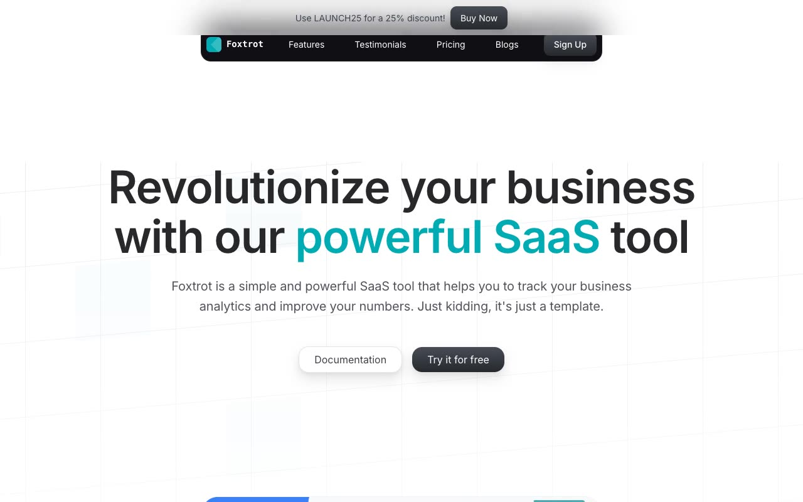

# Foxtrot Marketing Template — Aceternity UI Clone

[](./demo.mp4)

A pixel-faithful, self-contained clone of the **Foxtrot SaaS Marketing Template** by Aceternity UI. Foxtrot is a clean, modern marketing site for a SaaS analytics product — featuring a dark pill navbar, teal primary accent color (#00ABB3), grid pattern hero background, masonry testimonials, a three-tier pricing section, and a dark CTA banner. Built with plain HTML, CSS custom properties, and vanilla JavaScript — no build step required, fully offline-capable.

## Pages

| File | Description |
|------|-------------|
| `index.html` | Home / landing page — hero, features, testimonials, pricing, CTA |
| `blogs.html` | Blog listing — two blog post cards with thumbnails |
| `blog-what-is-a-website-template.html` | Blog post — "What is a website template" article with hero image, author, prose, and code snippet |
| `blog-what-is-a-blog-anyway.html` | Blog post — "What is a blog anyway" article with hero image, author, and prose |
| `signup.html` | Sign-up form — email/password fields + social sign-in options |

## Features Reproduced

- Fixed announcement banner with backdrop blur
- Centered dark-pill navbar with Foxtrot logo and Sign Up CTA
- Mobile hamburger menu with slide-in drawer
- SVG grid pattern hero background with perspective-transformed product screenshot
- Features section (zinc-900 dark) with teal icon boxes and blur glow effect
- Masonry-columns testimonials grid with avatar photos
- Monthly/Yearly pricing toggle with three pricing cards (featured center card in teal)
- Dark CTA banner with dot-grid pattern overlay
- Shared footer with social links (Twitter, LinkedIn, GitHub)
- All assets vendored locally in `assets/`

## Run Locally

No build step required. Just open `index.html` in any browser:

```bash
# Option 1 — open directly
open index.html

# Option 2 — serve locally (avoids CORS for fonts/images)
python3 -m http.server 8080
# then visit http://localhost:8080
```

Or use any static file server (Live Server VS Code extension, `npx serve`, etc.).

## Tech Stack

- Plain HTML5 + CSS3 (custom properties / CSS variables for all design tokens)
- Vanilla JavaScript (mobile menu toggle, pricing toggle)
- Google Fonts: Inter
- All images vendored locally in `assets/images/`
- No frameworks, no build tools, no dependencies

## Design Tokens

| Token | Value | Usage |
|-------|-------|-------|
| Primary | `#00ABB3` | Logo, feature icons, featured pricing card |
| Vulcan-800 | `#111014` | Navbar background |
| Vulcan-700 | `#15141a` | CTA banner background |
| Zinc-900 | `#18181b` | Features section background |
| Font | Inter, sans-serif | Body text |
| Mono Font | UI-Monospace | Logo wordmark |

## Credits

Faithful clone of an existing design, recreated for study/learning. All credit for the original design goes to its creators.

**Original:** Aceternity UI — https://ui.aceternity.com/template-preview/foxtrot-marketing-template

---

[Back to Aceternity templates](../../README.md) · [All premium templates](../../../README.md) · [Fable gallery](../../../../README.md)
