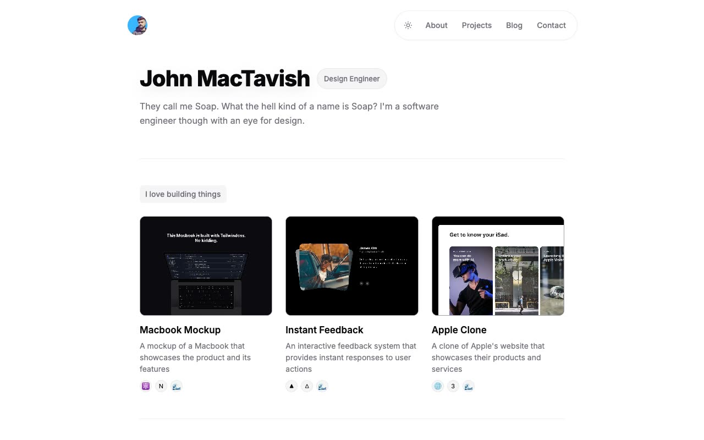

# Minimal Portfolio Template — Personal Portfolio & Blog Clone (Vanilla HTML/CSS/JS)

[](./demo.mp4)

A faithful, pixel-level clone of the "Minimal Portfolio Template", rebuilt as a self-contained static site in plain HTML, CSS, and vanilla JavaScript with no build step and all assets vendored locally so it runs offline. This neutral, typography-first personal portfolio for a software engineer persona uses a floating circular avatar in the top-left and a floating pill-shaped navigation bar in the top-right (with a light/dark theme toggle), a single-column centered content layout, and thin horizontal rules separating sections. It spans all 12 pages of the template: home, about, projects, blog index, seven blog post detail pages, and a contact page.

## Features

- **Light & dark mode** — CSS custom properties drive every color, toggled via a sun/moon icon button, persisted to `localStorage`, and applied before first paint via an inline boot script to avoid any flash of the wrong theme. Respects `prefers-color-scheme` on first visit.
- **Home** — hero introduction, a preview grid of projects, a preview list of recent blog posts, a "worked at reputed firms" experience timeline with company logos, a horizontally scrolling testimonials strip, and an inline "get in touch" call to action.
- **About** — bio, a fanned "polaroid" travel photo gallery, and a year-grouped achievements timeline (2020–2025).
- **Projects** — full six-project grid with dark preview thumbnails, descriptions, and tech-stack chip rows.
- **Blog** — a seven-post index list plus full article detail pages with cover images, metadata, headings, ordered lists, and dark, monospace code blocks.
- **Contact** — a bordered contact form (name, email, message) with client-side submit handling and a success message, no backend required.

## Run

This project has no build step — it is a set of static files. Serve the folder over HTTP (so relative asset and page links resolve) and open `index.html`:

```sh
python3 -m http.server 8000
# then open http://localhost:8000/index.html
```

Any static file server works; you can also open `index.html` directly, though a local server is recommended so cross-page navigation, fonts, and images load reliably.

Pages:

- `index.html` (home), `about.html`, `projects.html`, `blog.html`, `contact.html`
- `blog/advanced-css-techniques.html`, `blog/introduction-to-nextjs.html`, `blog/mastering-react-hooks.html`, `blog/state-management-react.html`, `blog/tailwindcss-basics.html`, `blog/typescript-best-practices.html`, `blog/web-performance-optimization.html`

Shared design tokens (colors, fonts, spacing, radii, shadows, and transition easings) live in `assets/css/styles.css`, with light values as the default `:root` and dark overrides under `:root.dark`. Theme boot logic is in `assets/js/theme-boot.js`, and interactive behavior (theme toggle, form handling) is in `assets/js/main.js`. Fonts, images, and logos are vendored under `assets/`.

The full build spec is in `prompt.md`, and `demo.mp4` (with `poster.jpg`) shows the template in motion.

## Credits

Faithful clone of an existing design, recreated for study/learning. All credit for the original design goes to its creators.

**Original:** Aceternity — <https://ui.aceternity.com/template-preview/minimal-portfolio-template>

---

Part of the [Templates](../../../) collection in the [claude-directory](../../../../) — an open-source gallery of UI templates.
