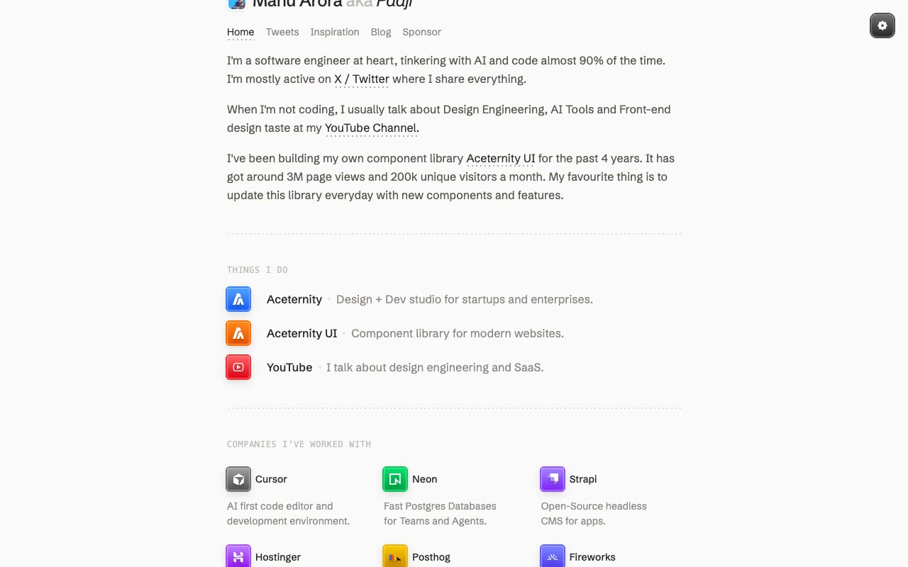

# Minimalist Portfolio Template — Aceternity

[](./demo.mp4)

A pixel-faithful clone of the **Minimalist Portfolio Template** by Manu Arora (Aceternity). A clean, typography-first developer portfolio site built with plain HTML, CSS, and vanilla JavaScript — no build step required, opens directly in any browser.

## Features

- **4 fully reproduced pages** — Home, Tweets (masonry card grid), Inspiration (curated list), Blog (with live search filter)
- **Minimalist design** — light stone (#fafaf9) background, Schibsted Grotesk typeface, dotted SVG underlines and dividers throughout
- **Theme toggle** — light/dark mode switcher (settings gear icon, top-right), persisted to `localStorage`, `prefers-color-scheme` honoured on first load
- **Colored icon tiles** — gradient-background app icon tiles (blue, orange, red, green, violet, purple, yellow, indigo, emerald) with inset ring shadows for "Things I do", "Companies I've worked with", and "Work with me" sections
- **SVG dotted underlines** — inline links and active nav items use a repeating-dot SVG pattern underline; hover reveals the same pattern on inactive nav links
- **Responsive layout** — single-column on mobile, wider grid on desktop (≥768px)
- **Blog search** — client-side title filter with instant results
- **Vendored assets** — avatar photo and inspiration person images downloaded locally; fonts loaded from Google Fonts CDN

## Pages

| File | Page |
|------|------|
| `index.html` | Home — bio, things I do, companies, work with me, writing |
| `tweets.html` | Tweets — masonry grid of tweet cards |
| `inspiration.html` | Inspiration — curated list of people and tools |
| `blog.html` | Blog — searchable list of posts |

## Run Locally

No build step or server required:

```bash
# Option 1 — open directly
open index.html

# Option 2 — serve with Python (recommended to avoid CORS on assets)
python3 -m http.server 8080
# then open http://localhost:8080
```

## Tech Stack

- Plain HTML5 / CSS3 / Vanilla JavaScript
- [Schibsted Grotesk](https://fonts.google.com/specimen/Schibsted+Grotesk) via Google Fonts
- SVG dot-pattern underlines (no external library)
- `localStorage` for theme persistence

## Design Tokens

| Token | Value |
|-------|-------|
| Background (light) | `#fafaf9` (stone-50) |
| Foreground text | `#57534d` (stone-600) |
| Primary / active | `#292524` (stone-800) |
| Background (dark) | `#1c1917` (stone-900) |
| Font | Schibsted Grotesk, 400 / 500 / 600 |
| Section headings | `ui-monospace`, 12px, uppercase, letter-spacing 0.05em |

## Credits

Faithful clone of an existing design, recreated for study/learning. All credit for the original design goes to its creators.

**Original:** Manu Arora (Aceternity) — <https://ui.aceternity.com/template-preview/minimalist-portfolio-template>

---

Part of the [Aceternity templates](../../README.md) collection · [All templates](../../../../README.md)
