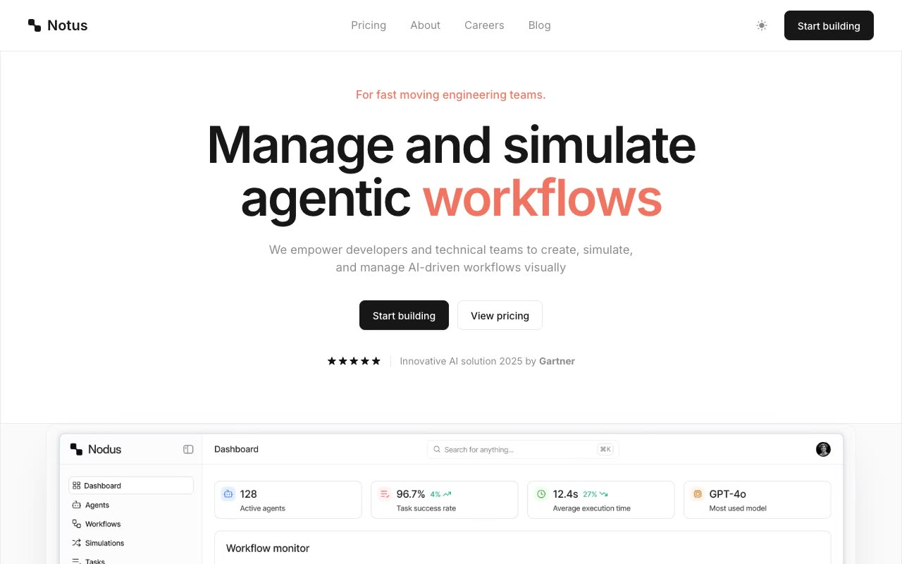

# Nodus Agent Template — Aceternity AI Agentic-Workflow Landing Page Clone (Vanilla HTML/CSS/JS)

[](./demo.mp4)

A faithful, same-to-same clone of the Aceternity "Nodus Agent" marketing template (branded "Notus" in the live build), rebuilt as a self-contained static site in plain HTML, CSS, and vanilla JavaScript with no build step. This is the full multi-page marketing site for an AI agentic-workflow SaaS — a platform to "manage and simulate agentic workflows" — spanning a long-form home page, pricing, about, careers, a blog index with seven article pages, contact, sign-up, and sign-in. It recreates the clean monochrome aesthetic with the coral `#f17463` accent, the centered sticky navigation with a light/dark theme toggle, dotted-grid decorative panels, the connected-tools and native-integration diagrams, the monthly/yearly pricing toggle with a full comparison table, the accordion FAQ, the testimonial and security bands, and the shared header/footer used across every page.

The original is a Next.js + Tailwind CSS v4 app. This clone preserves the same design tokens (palette, type scale, radii, easings) as CSS custom properties, drives both light and dark themes through those variables with `prefers-color-scheme` plus a `localStorage`-persisted theme toggle and a no-flash boot script, self-hosts Inter and DM Mono via the font CDN, vendors every image, icon, and logo locally so it runs offline, and reproduces the interactions (theme toggle, FAQ accordion, monthly/yearly pricing switch, hover states, mobile menu) with an IntersectionObserver scroll-reveal system and native vanilla JavaScript.

## Run

This is a plain static site — no build, no dependencies. Serve the folder over HTTP so the vendored fonts, images, and stylesheets load correctly:

```sh
python3 -m http.server 8000
```

Then open <http://localhost:8000/index.html>.

## Pages

- `index.html` — the long-form home page (hero, dashboard shot, trusted-by logo wall, how-it-works, agentic-intelligence features, native-tools integration, use cases, benefits, testimonial, pricing, security, FAQ, CTA).
- `pricing.html` — pricing hero with monthly/yearly toggle, three plan cards, and the full feature comparison table.
- `about.html` — company story, stats and values, "Team of Industry Leaders" grid, open positions, and investors.
- `careers.html` — careers hero, image collage, categorized open-roles list, and "Why Work at Nodus?" value cards.
- `blog.html` — blog index with three featured posts and a dated post list.
- `blog-*.html` — seven blog article pages with cover, byline, and prose body.
- `contact.html`, `sign-up.html`, `sign-in.html` — form pages paired with the testimonial glow card.
- `privacy-policy.html`, `terms-of-service.html`, `cookie-policy.html` — reproduce the original's not-found (404) state for these unimplemented legal routes.

## Structure

- `tokens.css` — light/dark design tokens as CSS custom properties.
- `styles.css` — shared layout, components, and responsive rules.
- `app.js` — theme toggle, FAQ accordion, pricing toggle, mobile menu, and IntersectionObserver scroll reveals.
- `assets/` — vendored logos, team photos, avatars, blog covers, illustrations, the dashboard image, and Unsplash photography so the clone runs fully offline.

`prompt.md` holds the full style and layout breakdown (palette, typography, per-page sections), and `demo.mp4` shows the site in motion.

## Credits

Faithful clone of an existing design, recreated for study/learning. All credit for the original design goes to its creators.

**Original:** Aceternity UI — https://ui.aceternity.com/template-preview/nodus-agent-template

---

Part of the [Templates](../../../) collection in the [claude-directory](../../../../) — an open-source gallery of UI templates and experiments. [Browse the live gallery](https://pulkitxm.com/claude-directory).
